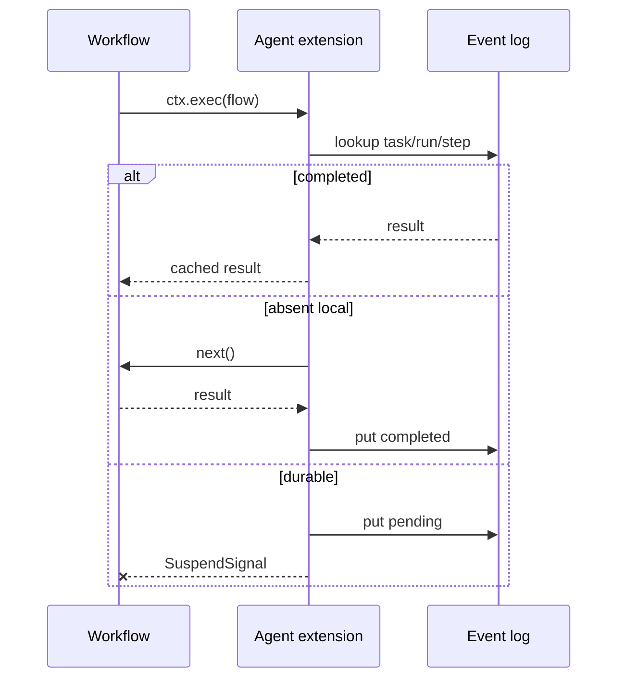

# Agent SDK Patterns

Use this package as a small convention layer over `@pumped-fn/lite`. If a use case can be expressed with `flow`, `atom` or `service`, `tag`, and `ctx.exec`, do that before adding another primitive.

## 1. Workflow Flow

Use a workflow flow when code chooses order, branching, retries, and fan-out.

```ts
export const processPr = flow({
  name: "process_pr",
  parse: typed<PrEvent>(),
  tags: [workflowTag(true)],
  factory: async (ctx) => {
    const lint = await delegate(ctx, "lint", { sha: ctx.input.sha })
    if (lint.failed) return { status: "lint-failed" }

    const [tests, security] = await Promise.all([
      delegate(ctx, "test", { sha: ctx.input.sha }),
      delegate(ctx, "security", { sha: ctx.input.sha }),
    ])

    return { status: "ok", tests, security }
  },
})
```

Why: normal TypeScript control flow stays visible. Replay still works because expensive work is behind `ctx.exec()` through `delegate()`.

## 2. Worker Flow

Use a worker flow for one executable unit. Tags say how it may run.

```ts
export const lint = flow({
  name: "lint",
  parse: typed<{ sha: string }>(),
  tags: [remoteTag(true), workerKindTag("code"), timeoutTag(30_000)],
  factory: async (ctx) => runLinter(ctx.input.sha),
})
```

`remoteTag(true)` means the extension may route it to a worker runner. Without a remote runner, the default test helper runs it locally through `next()`.

## 3. LLM Provider Atom

Prefer AI provider as an atom or service. The flow owns prompt shape and output parsing.

```ts
interface Model {
  complete(input: { system: string; prompt: string }): Promise<string>
}

export const model = atom<Model>({
  factory: () => new ClaudeModel(),
})

export const classify = flow({
  name: "classify",
  parse: typed<{ text: string }>(),
  deps: { model },
  tags: [workerKindTag("llm")],
  factory: async (ctx, { model }) => {
    const raw = await model.complete({
      system: "Return JSON only.",
      prompt: ctx.input.text,
    })
    return JSON.parse(raw) as { label: string }
  },
})
```

Test by preset, not by special agent hooks:

```ts
const scope = createScope({
  presets: [preset(model, { complete: async () => '{"label":"test"}' })],
})
```

## 4. CLI Worker Adapter

Use CLI helpers when the runtime must call real local tools like Claude or Codex.

```ts
const review = codexCliWorker({
  name: "codex-review",
  sandbox: "workspace-write",
  timeoutMs: 120_000,
})

const plan = claudeCliWorker({
  name: "claude-plan",
  timeoutMs: 120_000,
})
```

Keep CLI workers at the edge. Stable domain tests should use provider atoms and presets.

## 5. Durable Step

Use `durableTag(true)` for a step that should suspend until another process resolves it.

```ts
const approve = flow({
  name: "approve",
  parse: typed<{ title: string }>(),
  tags: [durableTag(true)],
  factory: () => {
    throw new Error("durable step should be resolved externally")
  },
})
```

First run writes a pending log entry and throws `SuspendSignal`. Replay returns the resolved value and continues.

## 6. Remote Runner

Remote routing belongs in `AgentRemoteRunner`, not inside workflow code.

```ts
const extension = createAgentExtension({
  log,
  remoteRunner: {
    run: async (event, next) => {
      if (canRoute(event.target)) return publishAndAwaitReply(event)
      return next()
    },
  },
})
```

The runner may short-circuit before worker dependencies resolve. If it calls `next()`, the worker runs locally.

## 7. Materials

Use materials for task state the workflow or workers must patch.

```ts
const inventory = material("inventory", {
  kind: "json",
  initialState: { items: [] as string[] },
})

await patchMaterial(ctx, inventory, [
  { op: "add", path: "/items/-", value: "typescript" },
])
```

Use derived materials for pure projections:

```ts
const count = derivedMaterial("inventory-count", inventory, (state) => state.items.length, {
  kind: "json",
})
```

## 8. Event Log Boundary

The event log key is `(taskId, runId, step)`. The step increments in `wrapExec`.



Because lite wraps the full executable step, cached replay and remote routing skip both dependency resolution and factory execution.

## 9. Failure Ownership

| Failure | Owner |
|---|---|
| Parse error | Flow boundary |
| Missing worker | `WorkerRegistry` / caller setup |
| CLI exit or timeout | `cliWorker()` |
| Material revision mismatch | Material writer |
| Pending durable step | Resolver / event log |
| Replay mismatch | Workflow determinism and event log |

Tests should prove the owning layer. Do not hide a missing dependency by adding a broad fake runner. Make the fake prove the exact behavior under test.

## 10. Add No Primitive Unless Forced

Before adding an agent SDK primitive, ask:

1. Can this be a `flow` tag?
2. Can this be an atom/service dependency?
3. Can this be a `ctx.exec()` helper?
4. Can this be an extension policy?

Only add a primitive when all four answers are no and the new concept has its own lifecycle or type boundary.
