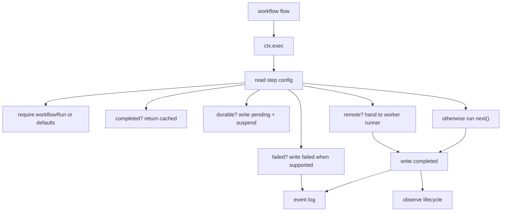

# @pumped-fn/agent-sdk

Agent helpers for `@pumped-fn/lite` workflows.

This package adds agent worker, material, and CLI conventions on top of `@pumped-fn/lite-extension-workflow`. Workflow primitives are re-exported for compatibility.

| Lite primitive | Agent SDK use |
|---|---|
| `flow()` + `step({ workflow: true })` | Workflow boundary |
| `flow()` | Worker, durable step, CLI-backed LLM call |
| state/service | Provider, config, registry, model client, material state |
| typed tag | Routing config and ambient run data |
| `ctx.exec()` | Step boundary for replay, remote routing, timeout, suspend, and stable keys |
| `workflowExtension()` | Re-exported workflow replay, suspend, timeout, failure, observation, and event-log policy |
| `extension()` | Agent remote-routing policy |

The core idea: author orchestration as normal TypeScript `flow()` code. Put every side effect behind `ctx.exec()`. Then an extension can replay, memoize, route, or suspend those steps without changing workflow code.



## What Is In This Package

- Re-exports from `@pumped-fn/lite-extension-workflow`: `workflow`, `workflowRun()`, `workflowExtension()`, `workflowExtensionUnits()`, `step()`, `eventLog()`, `observer()`, `units()`, `runDefaults()`, `abortSignal`, and workflow event-log types.
- `extension()` for agent remote dispatch.
- `remoteRunner()` tag for the agent remote transport seam.
- `agent` runtime tag for named worker delegation.
- `WorkerRegistry` for named worker calls through `agent.delegate()`.
- `material()`, `patchMaterial()`, and `derivedMaterial()` for small task-scoped JSON materials.
- `cliWorker()`, `claudeCliWorker()`, and `codexCliWorker()` for real CLI-backed work.

`step()` is one defaulted config tag. Flow tags set defaults. Exec tags override per call.

Transport is outside this core package. Tests use `@pumped-fn/agent-sdk-test` with an in-memory event log. A NATS package can implement the same `WorkflowEventLog` and `AgentRemoteRunner` contracts. Production logs can optionally add `putFailed()` and `list()` for operator views; workflow code does not depend on those capabilities.

`workflowExtension()` is a preset over composable suspense units from `@pumped-fn/lite-extension-workflow`. Use `workflowExtensionUnits()` directly with `@pumped-fn/lite-extension-suspense` when another package or runtime wants to assemble the workflow policy itself.

## Standalone Suspense

Suspense is the reusable substrate under the workflow extension. It only knows about `(taskId, runId, step)`, an event log, and `ctx.exec()`. Mark replayable steps with `replay(true)` and externally resolved steps with `suspend(true)`.

```ts
import { createScope, flow } from "@pumped-fn/lite"
import {
  eventLog,
  extension,
  suspend,
  taskId,
  runId,
  stepCounter,
} from "@pumped-fn/lite-extension-suspense"

const externalSync = flow({
  name: "external-sync",
  tags: [suspend(true)],
  factory: () => "unreachable until resolved",
})

const log = makeEventLog()
const scope = createScope({
  tags: [eventLog(log)],
  extensions: [extension()],
})

const ctx = scope.createContext({
  tags: [
    taskId("doc-1"),
    runId("sync-1"),
    stepCounter({ next: 0 }),
  ],
})

await ctx.exec({ flow: externalSync })
```

First run writes a pending entry and throws `SuspendSignal`. A resolver writes the value into the log, then replay returns the resolved value and continues. Sync can use the same shape for "wait until remote commit arrives", "wait until peer state catches up", or "resume after external acknowledgement".

## Minimal Workflow

```ts
import { createScope, flow, tags, typed } from "@pumped-fn/lite"
import {
  agent as agentRuntime,
  eventLog,
  extension,
  remoteRunner,
  workflowRun,
  workflow as workflowRuntime,
  workflowExtension,
  step,
  workerRegistry,
  workers,
} from "@pumped-fn/agent-sdk"

const summarize = flow({
  name: "summarize",
  parse: typed<{ text: string }>(),
  tags: [step({ kind: "llm" })],
  factory: async (ctx) => `summary: ${ctx.input.text}`,
})

const processIssue = flow({
  name: "process_issue",
  parse: typed<{ body: string }>(),
  tags: [
    step({ workflow: true }),
    workers(workerRegistry([summarize])),
  ],
  deps: {
    workflow: tags.required(workflowRuntime),
    agent: tags.required(agentRuntime),
  },
  factory: async (ctx, { workflow, agent }) => {
    const summary = await agent.delegate<string, { text: string }>("summarize", {
      text: ctx.input.body,
    })
    return { taskId: workflow.taskId, summary }
  },
})

const log = makeEventLog()
const runner = makeRemoteRunner()
const scope = createScope({
  tags: [
    eventLog(log),
    remoteRunner(runner),
  ],
  extensions: [
    workflowExtension(),
    extension(),
  ],
})

const ctx = scope.createContext({
  tags: [workflowRun({
    taskId: "issue-123",
    runId: "run-1",
  })],
})

const result = await ctx.exec({ flow: processIssue, input: { body: "..." } })
```

`workflowRun()` is a tag and belongs in `createContext({ tags: [...] })`. A workflow step must have `workflowRun()` or a `runDefaults()` tag/explicit extension defaults; otherwise the extension rejects the run instead of silently sharing a default log key. `agent.delegate()` is just `ctx.exec({ flow, input })` plus a registry lookup. Supply that registry through a `workers(registry)` flow or context tag. `workflow` and `agent` are required deps; if the matching extension is missing, dependency resolution fails before the factory runs.

## AI Is Just A Provider

Claude, Codex, Anthropic SDK, OpenAI SDK, local model, and test fake should all fit behind the same shape: a flow calls an injected provider or a CLI helper.

```ts
import { createScope, flow, preset, service, typed, type Lite } from "@pumped-fn/lite"
import { step } from "@pumped-fn/agent-sdk"

interface Model {
  complete(ctx: Lite.ExecutionContext, prompt: string): Promise<string>
}

const model = service<Model>({
  factory: () => ({
    complete: async (_ctx, prompt) => runRealModel(prompt),
  }),
})

export const classify = flow({
  name: "classify",
  parse: typed<{ text: string }>(),
  deps: { model },
  tags: [step({ kind: "llm" })],
  factory: async (ctx, { model }) => {
    const answer = await model.complete(ctx, `Classify:\n${ctx.input.text}`)
    return JSON.parse(answer) as { label: string }
  },
})

const fakeModel: Model = {
  complete: async () => JSON.stringify({ label: "test" }),
}

const testScope = createScope({
  presets: [preset(model, fakeModel)],
})
```

The CLI helpers are convenience adapters:

```ts
import { claudeCliWorker, codexCliWorker } from "@pumped-fn/agent-sdk"

const codex = codexCliWorker({ name: "codex-review", sandbox: "workspace-write" })
const claude = claudeCliWorker({ name: "claude-plan" })
```

Use them when the backend should invoke the real CLI. For stable tests, prefer provider state plus presets.

## Replay Contract

`ctx.exec()` is the durable step boundary. On first execution, the workflow extension assigns `(taskId, runId, step)` and writes the result. `step({ key: "stable-name" })` uses that string instead of the positional counter when a branch needs a stable idempotency key. On replay, the same code runs from the top, but completed steps return cached values before dependencies or factory code run.

That means workflow bodies must be deterministic between `ctx.exec()` calls:

- Use `ctx.exec({ flow })` for side effects.
- Put `workflowRun()` on every workflow context unless the extension has explicit defaults.
- Use provider state/services for swappable integrations.
- Do not read time, random, network, filesystem, or process state directly in workflow orchestration code.
- Keep dependency factories pure enough that replay skipping them is valid.
- `timeoutMs` rejects the step promise and aborts the `abortSignal` tag. Work must observe the signal to stop cooperatively.

Remote workers are journaled too. If a remote worker completes and a later durable step suspends, resume replays the remote result from the event log instead of dispatching the worker again.

## Composable Workflow Units

```ts
import { createScope, flow } from "@pumped-fn/lite"
import { extension as suspenseExtension } from "@pumped-fn/lite-extension-suspense"
import {
  eventLog,
  step,
  units,
  workflowExtensionUnits,
  workflowRun,
} from "@pumped-fn/lite-extension-workflow"

const runTask = flow({
  name: "run-task",
  tags: [step({ workflow: true, key: "run-task" })],
  factory: () => "done",
})

const scope = createScope({
  tags: [
    eventLog(log),
    units(workflowExtensionUnits()),
  ],
  extensions: [suspenseExtension({
    name: "workflow",
  })],
})

const ctx = scope.createContext({
  tags: [workflowRun({ taskId: "task-1", runId: "run-1" })],
})

await ctx.exec({ flow: runTask })
```

The unit path is for runtimes that want workflow mechanics without taking agent-sdk. It still uses `flow()`, `tag()`, `ctx.exec()`, and the suspense event log; no separate workflow runtime is introduced.

## Materials

Materials are state-backed task data with a patch-oriented API. Patches serialize per material; pass `expectedRevision` when callers need optimistic conflict detection. Materials are keep-alive by default and can opt out with `keepAlive: false`.

```ts
const status = material("pr-status", {
  kind: "json",
  initialState: { prs: {} as Record<string, unknown> },
})

await patchMaterial(ctx, status, [
  { op: "add", path: "/prs/12", value: { state: "ok" } },
])
```

Derived materials are plain derived state that recomputes from source material state.

```ts
const html = derivedMaterial("status-html", status, renderStatus, { kind: "text" })
```

## Testing

Use `@pumped-fn/agent-sdk-test` for in-memory replay and fake remote routing:

```ts
import { agent } from "@pumped-fn/agent-sdk-test"

const { extensions, tags, log } = agent({
  remoteRunner: {
    run: async (event) => ({ routed: event.targetName }),
  },
})
```

Use `tags` and `extensions` in `createScope({ tags, extensions })`. This keeps tests fast and proves the same extension contract a NATS-backed runtime will use.
