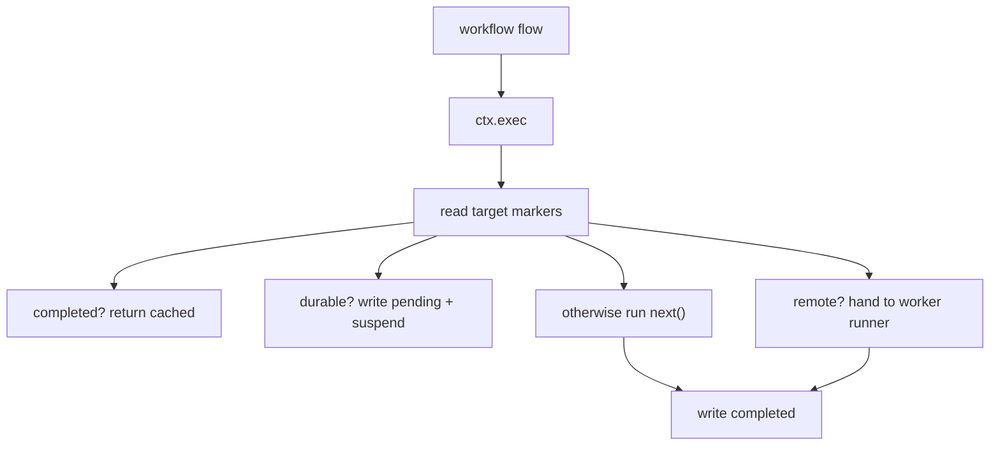

# @pumped-fn/agent-sdk

Agent workflow substrate helpers for `@pumped-fn/lite`.

This package does not add an agent runtime. It gives names and conventions to the primitives lite already has:

| Lite primitive | Agent SDK use |
|---|---|
| `flow()` | Workflow, worker, durable step, CLI-backed LLM call |
| state/service | Provider, config, registry, model client, material state |
| typed marker | Routing metadata and ambient run data |
| `ctx.exec()` | Step boundary for replay, remote routing, timeout, and suspend |
| Extension `wrapExec` | Suspense/replay router around one executable step |

The core idea: author orchestration as normal TypeScript `flow()` code. Put every side effect behind `ctx.exec()`. Then an extension can replay, memoize, route, or suspend those steps without changing workflow code.



## What Is In This Package

- Agent markers: `workflow`, `remote`, `durable`, `workerKind`, `timeout`.
- `createAgentExtension()` for agent policy: replay, suspend, timeout, and remote dispatch.
- `agentRun()` for run-scoped `scope.createContext()` options.
- `WorkerRegistry` and `delegate()` for named worker calls.
- `material()`, `patchMaterial()`, and `derivedMaterial()` for small task-scoped JSON materials.
- `cliWorker()`, `claudeCliWorker()`, and `codexCliWorker()` for real CLI-backed work.

`workflow` and `durable` are agent-facing aliases over `@pumped-fn/lite-extension-suspense` markers.

Transport is outside this core package. Tests use `@pumped-fn/agent-sdk-test` with an in-memory event log. A NATS package can implement the same `AgentEventLog` and `AgentRemoteRunner` contracts.

## Standalone Suspense

Suspense is the reusable substrate under the agent extension. It only knows about `(taskId, runId, step)`, an event log, and `ctx.exec()`. Mark replayable steps with `suspense(true)` and externally resolved steps with `suspend(true)`.

```ts
import { createScope, flow } from "@pumped-fn/lite"
import {
  createSuspenseExtension,
  suspend,
  suspenseRun,
} from "@pumped-fn/lite-extension-suspense"

const externalSync = flow({
  name: "external-sync",
  tags: [suspend(true)],
  factory: () => "unreachable until resolved",
})

const log = makeEventLog()
const scope = createScope({
  extensions: [createSuspenseExtension({ log })],
})

const ctx = scope.createContext(suspenseRun({ taskId: "doc-1", runId: "sync-1" }))

await ctx.exec({ flow: externalSync })
```

First run writes a pending entry and throws `SuspendSignal`. A resolver writes the value into the log, then replay returns the resolved value and continues. Sync can use the same shape for "wait until remote commit arrives", "wait until peer state catches up", or "resume after external acknowledgement".

## Minimal Workflow

```ts
import { createScope, flow, typed } from "@pumped-fn/lite"
import {
  agentRun,
  createAgentExtension,
  delegate,
  remote,
  workflow,
  workerKind,
  workerRegistry,
} from "@pumped-fn/agent-sdk"

const summarize = flow({
  name: "summarize",
  parse: typed<{ text: string }>(),
  tags: [remote(true), workerKind("llm")],
  factory: async (ctx) => `summary: ${ctx.input.text}`,
})

const processIssue = flow({
  name: "process_issue",
  parse: typed<{ body: string }>(),
  tags: [workflow(true)],
  factory: async (ctx) => {
    const summary = await delegate<string, { text: string }>(ctx, "summarize", {
      text: ctx.input.body,
    })
    return { summary }
  },
})

const eventLog = makeEventLog()
const scope = createScope({
  extensions: [createAgentExtension({ log: eventLog })],
})

const ctx = scope.createContext(agentRun({
  taskId: "issue-123",
  runId: "run-1",
  registry: workerRegistry([summarize]),
}))

const result = await ctx.exec({ flow: processIssue, input: { body: "..." } })
```

`delegate()` is just `ctx.exec({ flow, input })` plus a registry lookup. Nothing special happens in the worker itself.

## AI Is Just A Provider

Claude, Codex, Anthropic SDK, OpenAI SDK, local model, and test fake should all fit behind the same shape: a flow calls an injected provider or a CLI helper.

```ts
import { createScope, flow, preset, service, typed, type Lite } from "@pumped-fn/lite"
import { workerKind } from "@pumped-fn/agent-sdk"

interface Model {
  complete(ctx: Lite.ExecutionContext, prompt: string): Promise<string>
}

const model = service<Model>({
  factory: () => ({
    complete: async (_ctx, prompt) => runRealModel(prompt),
  }),
})

export const classify = flow({
  name: "classify",
  parse: typed<{ text: string }>(),
  deps: { model },
  tags: [workerKind("llm")],
  factory: async (ctx, { model }) => {
    const answer = await model.complete(ctx, `Classify:\n${ctx.input.text}`)
    return JSON.parse(answer) as { label: string }
  },
})

const fakeModel: Model = {
  complete: async () => JSON.stringify({ label: "test" }),
}

const testScope = createScope({
  presets: [preset(model, fakeModel)],
})
```

The CLI helpers are convenience adapters:

```ts
import { claudeCliWorker, codexCliWorker } from "@pumped-fn/agent-sdk"

const codex = codexCliWorker({ name: "codex-review", sandbox: "workspace-write" })
const claude = claudeCliWorker({ name: "claude-plan" })
```

Use them when the backend should invoke the real CLI. For stable tests, prefer provider state plus presets.

## Replay Contract

`ctx.exec()` is the durable step boundary. On first execution, the agent extension assigns `(taskId, runId, step)` and writes the result. On replay, the same code runs from the top, but completed steps return cached values before dependencies or factory code run.

That means workflow bodies must be deterministic between `ctx.exec()` calls:

- Use `ctx.exec({ flow })` for side effects.
- Use provider state/services for swappable integrations.
- Do not read time, random, network, filesystem, or process state directly in workflow orchestration code.
- Keep dependency factories pure enough that replay skipping them is valid.

## Materials

Materials are state-backed task data with a patch-oriented API.

```ts
const status = material("pr-status", {
  kind: "json",
  initialState: { prs: {} as Record<string, unknown> },
})

await patchMaterial(ctx, status, [
  { op: "add", path: "/prs/12", value: { state: "ok" } },
])
```

Derived materials are plain derived state that recomputes from source material state.

```ts
const html = derivedMaterial("status-html", status, renderStatus, { kind: "text" })
```

## Testing

Use `@pumped-fn/agent-sdk-test` for in-memory replay and fake remote routing:

```ts
import { createAgentTestExtension } from "@pumped-fn/agent-sdk-test"

const { extension, log } = createAgentTestExtension({
  remoteRunner: {
    run: async (event) => ({ routed: event.targetName }),
  },
})
```

This keeps tests fast and proves the same extension contract a NATS-backed runtime will use.
