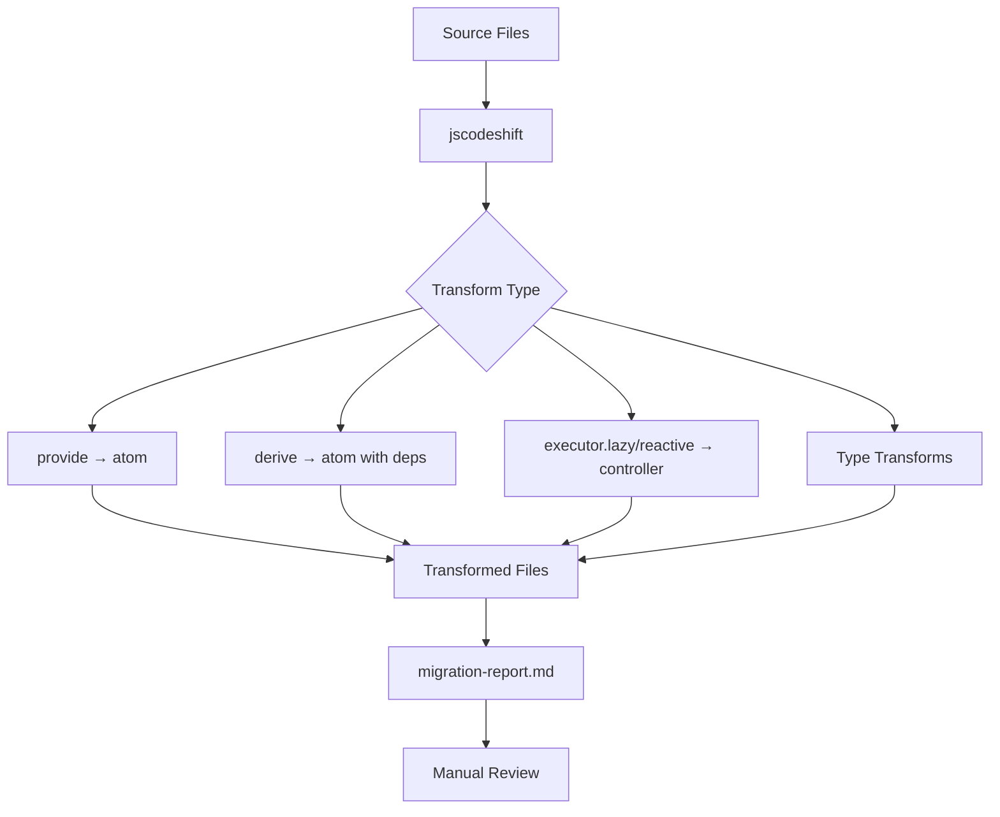

# @pumped-fn/codemod

One-time migration tool from `@pumped-fn/core-next` to `@pumped-fn/lite`.

## Transform Flow



## Usage

```bash
# Run on current directory
npx @pumped-fn/codemod

# Run on specific path
npx @pumped-fn/codemod ./src

# Dry run (preview changes)
npx @pumped-fn/codemod --dry

# Verbose output
npx @pumped-fn/codemod --verbose
```

## What Gets Transformed

| Before | After |
|--------|-------|
| `provide((ctl) => value)` | `atom({ factory: (ctx) => value })` |
| `derive([a, b], fn)` | `atom({ deps: { a, b }, factory: fn })` |
| `executor.lazy` | `controller(executor)` |
| `executor.reactive` | `controller(executor)` |
| `Core.Executor<T>` | `Lite.Atom<T>` |
| `ctl.release()` | `ctx.invalidate()` |
| `import { ... } from '@pumped-fn/core-next'` | `import { ... } from '@pumped-fn/lite'` |

## Migration Report

After running, check `migration-report.md` for:
- Summary statistics (files processed, transforms applied)
- Edge cases requiring manual review
- AI-friendly JSON for assisted migration
- Detailed breakdown of each transform type

## After Running

```bash
# Review changes
git diff

# Update dependencies
npm uninstall @pumped-fn/core-next
npm install @pumped-fn/lite

# Fix remaining TypeScript errors
npm run typecheck
```

## Edge Cases

Some patterns cannot be auto-transformed:

- `Core.Static<T>` - no equivalent in lite
- `resolves([...])` - use `Promise.all` with `scope.resolve()`
- Dynamic accessor references - requires manual refactoring
- Spread in dependencies - convert to explicit object keys
- Complex executor patterns - may need manual review

These cases are flagged in `migration-report.md` with file locations for manual review.

## CLI Options

```
Options:
  --dry          Preview changes without writing files
  --verbose      Show detailed transform information
  --help         Show help message
```

## Examples

### Basic Migration

```bash
# Before
import { provide, derive } from '@pumped-fn/core-next';

const userAtom = provide((ctl) => ({ name: 'Alice' }));
const nameAtom = derive([userAtom], (user) => user.name);

// After
import { atom } from '@pumped-fn/lite';

const userAtom = atom({ factory: (ctx) => ({ name: 'Alice' }) });
const nameAtom = atom({ deps: { userAtom }, factory: ({ userAtom }) => userAtom.name });
```

### Controller Migration

```bash
# Before
import { executor } from '@pumped-fn/core-next';

const fetchUser = executor.lazy(async (ctl, id: string) => {
  const response = await fetch(`/api/users/${id}`);
  return response.json();
});

// After
import { controller } from '@pumped-fn/lite';

const fetchUser = controller(async (ctx, id: string) => {
  const response = await fetch(`/api/users/${id}`);
  return response.json();
});
```

## Troubleshooting

**TypeScript errors after migration:**
- Check `migration-report.md` for edge cases
- Review type transforms for `Core.Executor` → `Lite.Atom`
- Ensure `@pumped-fn/lite` is installed

**Transforms not applied:**
- Verify file patterns match (`.ts`, `.tsx` files)
- Check for syntax errors in source files
- Use `--verbose` to see transform details

**Need to revert:**
```bash
git checkout .
```
