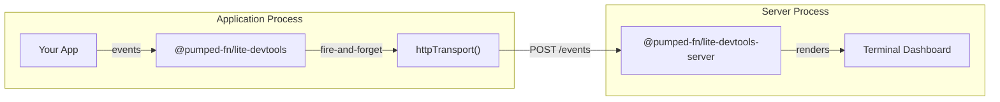

# @pumped-fn/lite-devtools-server

Standalone TUI server for receiving devtools events from `@pumped-fn/lite-devtools` via HTTP.

**CLI tool** · **Terminal dashboard** · **HTTP receiver**

## Architecture



## Usage

### Start the server

```bash
npx @pumped-fn/lite-devtools-server
# Or with custom port
PORT=4000 npx @pumped-fn/lite-devtools-server
```

### Configure your app

```typescript
import { createScope } from '@pumped-fn/lite'
import { createDevtools, httpTransport } from '@pumped-fn/lite-devtools'

const scope = createScope({
  extensions: [
    createDevtools({
      transports: [httpTransport({ url: 'http://localhost:3001/events' })]
    })
  ]
})
```

## API

### HTTP Endpoints

| Endpoint | Method | Description |
|----------|--------|-------------|
| `/events` | POST | Receive events from httpTransport |
| `/events` | GET | Retrieve buffered events (last 100) |
| `/health` | GET | Health check |

## How It Works

1. Server starts Hono HTTP server on specified port (default: 3001)
2. Events POSTed to `/events` are buffered (max 100 events)
3. TUI dashboard displays last 20 events in real-time
4. Uses `@pumped-fn/lite` atoms for reactive state management

## Full API

See [`dist/index.d.mts`](./dist/index.d.mts) for complete type definitions.

## License

MIT
