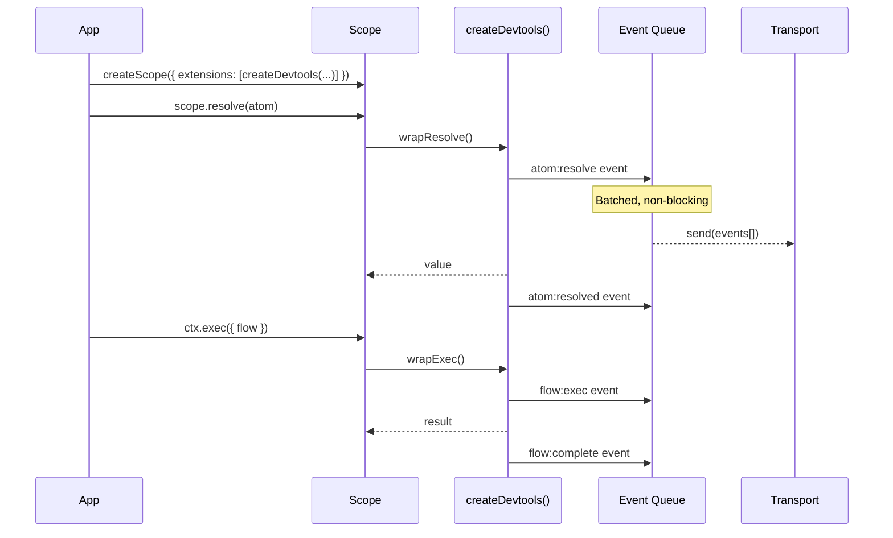
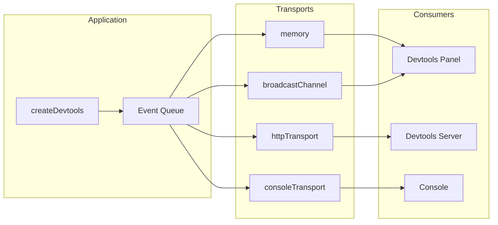

# @pumped-fn/lite-devtools

Observability extension for `@pumped-fn/lite` with fire-and-forget transport-based event streaming.

**Zero dependencies** · **Fire-and-forget** · **Multiple transports**

## How It Works



## Transport Architecture



## Transports

| Transport | Use Case | Target |
|-----------|----------|--------|
| `memory()` | Same-process consumers (panels, testing) | In-memory subscribers |
| `broadcastChannel(name?)` | Cross-tab communication | Browser tabs |
| `consoleTransport()` | Debug logging | Console output |
| `httpTransport({ url })` | Cross-process streaming | HTTP endpoint |

## Event Types

| Event | Trigger |
|-------|---------|
| `atom:resolve` | Before atom factory runs |
| `atom:resolved` | After atom factory completes |
| `flow:exec` | Before flow factory runs |
| `flow:complete` | After flow factory completes |
| `error` | On factory error |

## Full API

See [`dist/index.d.mts`](./dist/index.d.mts) for complete type definitions.

All types available under the `Devtools` namespace:

```typescript
import type { Devtools } from '@pumped-fn/lite-devtools'
```

## License

MIT
