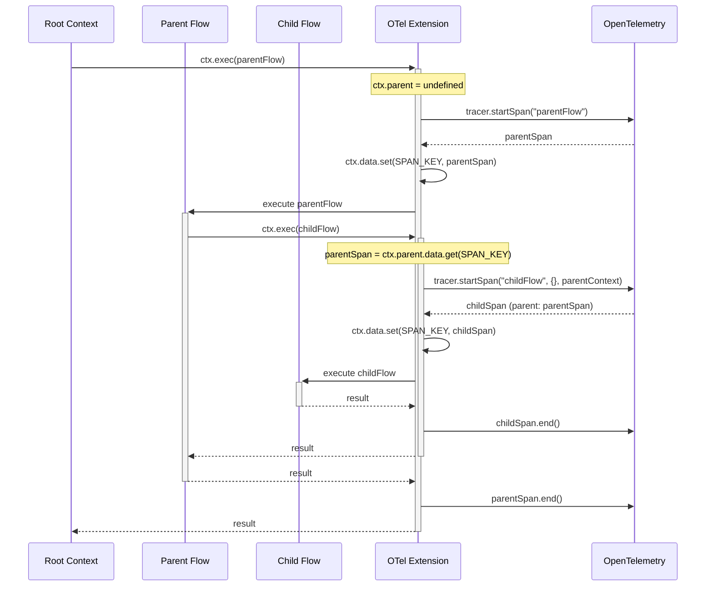
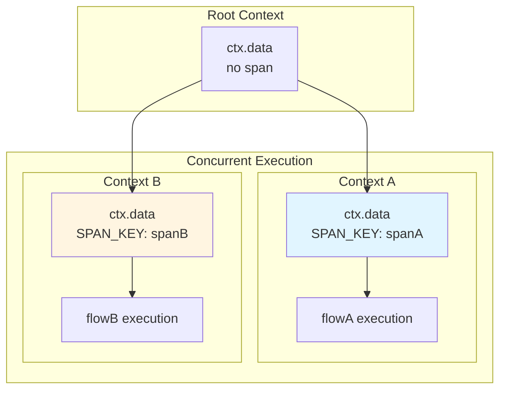
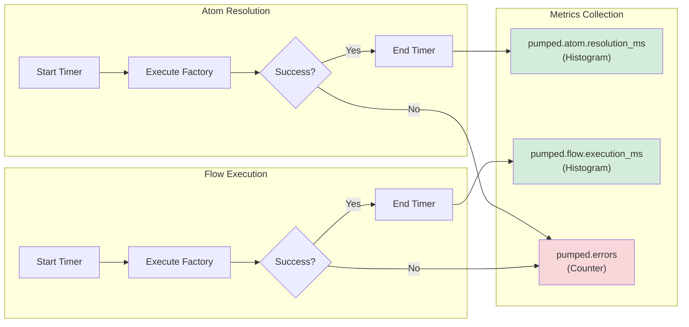
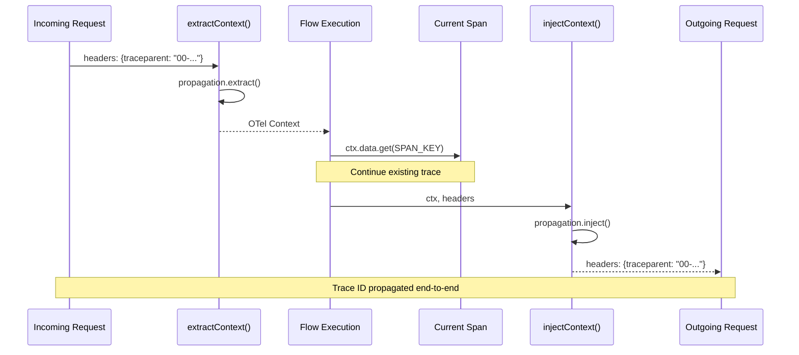
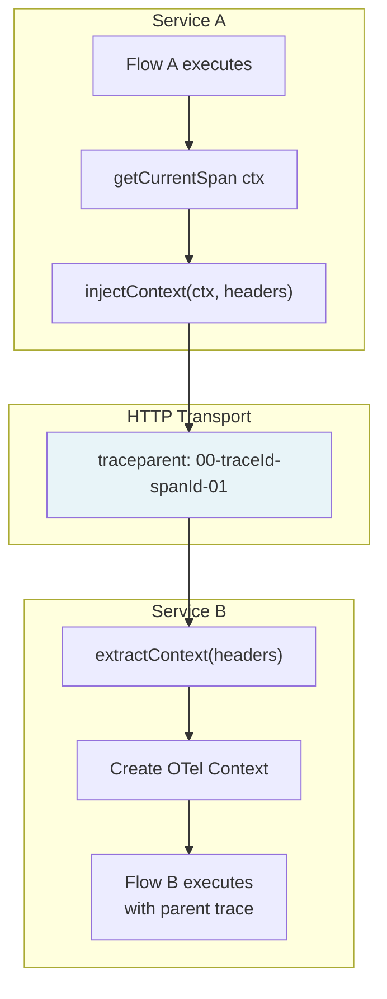
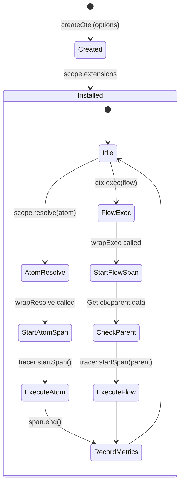

# @pumped-fn/lite-extension-otel

OpenTelemetry extension for @pumped-fn/lite with automatic tracing, metrics, and context propagation.

**Zero runtime dependencies** · **ADR-016 compliant** · **W3C Trace Context**

## Architecture Overview

```mermaid
graph TB
    subgraph "Extension Hooks"
        wrapResolve[wrapResolve<br/>Atom Resolution]
        wrapExec[wrapExec<br/>Flow Execution]
    end

    subgraph "OpenTelemetry API"
        Tracer[Tracer<br/>Span Creation]
        Meter[Meter<br/>Metrics Recording]
    end

    subgraph "Context Storage"
        CtxData[ExecutionContext.data<br/>SPAN_KEY Symbol]
    end

    wrapResolve --> Tracer
    wrapResolve --> Meter
    wrapExec --> Tracer
    wrapExec --> Meter

    Tracer --> CtxData
    wrapExec -.ctx.parent.data.-> CtxData
```

## Span Hierarchy

Parent-child span relationships are established automatically via ADR-016 hierarchical ExecutionContext without AsyncLocalStorage.



### Concurrent Execution Isolation



## Metrics Flow



### Recorded Metrics

| Metric Name | Type | Description | Attributes |
|-------------|------|-------------|------------|
| `pumped.atom.resolution_ms` | Histogram | Time to resolve atoms | `atom.name` |
| `pumped.flow.execution_ms` | Histogram | Time to execute flows | `flow.name` |
| `pumped.errors` | Counter | Number of errors | `atom.name` or `flow.name`, `error.type` |

## Context Propagation

W3C Trace Context propagation for distributed tracing across service boundaries.



### Propagation Flow Detail



## Features

| Feature | Description | Implementation |
|---------|-------------|----------------|
| **Automatic Tracing** | Spans created for all atoms/flows | `wrapResolve` + `wrapExec` hooks |
| **Hierarchical Spans** | Parent-child relationships via `ctx.parent.data` | No AsyncLocalStorage required (ADR-016) |
| **Metrics Collection** | Duration histograms and error counters | Optional Meter support |
| **Context Propagation** | W3C Trace Context extract/inject | `extractContext()` / `injectContext()` |
| **Filtering** | Selective tracing via `atomFilter` / `flowFilter` | Filter predicates in options |
| **Custom Naming** | Override span names | `spanName` option |
| **Error Recording** | Exception events and status codes | Automatic on catch |

## Extension Lifecycle



## Dependencies

| Package | Version | Type | Purpose |
|---------|---------|------|---------|
| `@pumped-fn/lite` | `^1.0.0` | peer | Core framework integration |
| `@opentelemetry/api` | `^1.0.0` | peer | OpenTelemetry API types and context |

## Design Principles

1. **Zero Runtime Dependencies**: Only peer dependencies for maximum flexibility
2. **ADR-016 Compliance**: Leverages hierarchical ExecutionContext for automatic parent tracking
3. **Opt-in Metrics**: Tracing always enabled, metrics only when Meter provided
4. **Type-Safe**: Full TypeScript support via generated `.d.mts` / `.d.cts` files
5. **Extension-Based**: Clean integration via `Lite.Extension` protocol

## License

MIT
