# @pumped-fn/lite-extension-otel

OpenTelemetry tracing extension for `@pumped-fn/lite` with self-contained provider management.

## Installation

```bash
pnpm add @pumped-fn/lite-extension-otel
```

## Usage

```typescript
import { createScope, flow } from "@pumped-fn/lite"
import { otel, otelConfig } from "@pumped-fn/lite-extension-otel"

const scope = createScope({
  extensions: [otel()]
})

scope.setTag(otelConfig.name, "my-app")
scope.setTag(otelConfig.url, "http://localhost:4318/v1/traces")
scope.setTag(otelConfig.type, "http")

await scope.ready

const myFlow = flow({
  name: "processOrder",
  factory: async (ctx) => {
    return { orderId: "123" }
  }
})

const ctx = scope.createContext()
await ctx.exec({ flow: myFlow })
await ctx.close()
```

## Configuration Tags

| Tag | Type | Default | Description |
|-----|------|---------|-------------|
| `otelConfig.name` | `string` | `"default-app"` | Service name for spans |
| `otelConfig.url` | `string` | `"http://localhost:4318/v1/traces"` | OTLP collector URL |
| `otelConfig.type` | `"http" \| "grpc" \| "console"` | `"console"` | Exporter type |
| `otelConfig.captureResults` | `boolean` | `true` | Capture operation results in spans |
| `otelConfig.redact` | `boolean` | `false` | Redact sensitive data (per-execution) |

## Redacting Sensitive Data

Set the redact tag on the execution context to prevent result capture:

```typescript
const ctx = scope.createContext()
ctx.data.setTag(otelConfig.redact, true)
await ctx.exec({ flow: sensitiveFlow })
```

## Architecture

```mermaid
sequenceDiagram
    participant Scope
    participant Ext as otel Extension
    participant ALS as AsyncLocalStorage
    participant Provider as TracerProvider

    Scope->>Ext: init(scope)
    Ext->>Ext: Read config from tags
    Ext->>Provider: Create provider + exporter

    Scope->>Ext: wrapExec(next, target, ctx)
    Ext->>ALS: getStore() → parent context
    Ext->>Provider: startSpan(name, parent)
    Ext->>ALS: run(newContext, next)
    ALS-->>Ext: result
    Ext->>Provider: span.end()

    Scope->>Ext: dispose()
    Ext->>Provider: shutdown()
```


