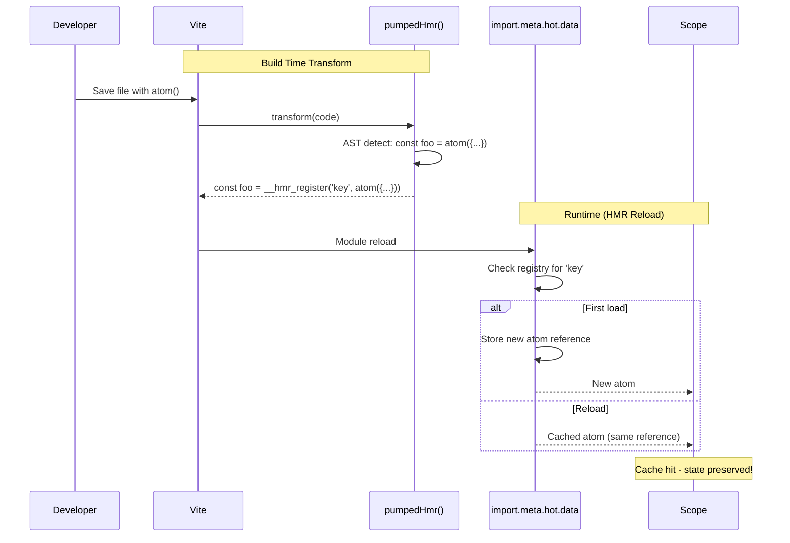

# @pumped-fn/lite-hmr

Vite HMR plugin for `@pumped-fn/lite` that preserves atom state across hot module reloads.

**Dev only** · **Zero overhead in production** · **Vite plugin**

## How It Works



## Usage

```typescript
// vite.config.ts
import { defineConfig } from 'vite'
import react from '@vitejs/plugin-react'
import { pumpedHmr } from '@pumped-fn/lite-hmr'

export default defineConfig({
  plugins: [
    pumpedHmr(),  // Add before other plugins
    react()
  ]
})
```

## Transform Example

The plugin transforms named atom declarations at build time:

```typescript
// Your code
const configAtom = atom({ factory: () => loadConfig() })

// Transformed (dev only)
const configAtom = __hmr_register('src/atoms.ts:1:18', atom({ factory: () => loadConfig() }))
```

The `__hmr_register` helper stores atom references in `import.meta.hot.data`. On HMR reload, it returns the cached reference, preserving Scope cache hits.

## What Gets Transformed

| Pattern | Transformed |
|---------|-------------|
| `const foo = atom({...})` | Yes |
| `let foo = atom({...})` | Yes |
| `export const foo = atom({...})` | Yes |
| `atoms.push(atom({...}))` | No (dynamic) |
| `createAtom(() => atom({...}))` | No (nested) |

## Options

```typescript
pumpedHmr({
  include: /\.[jt]sx?$/,  // Files to transform (default)
  exclude: /node_modules/ // Files to skip (default)
})
```

## Production

The plugin is automatically disabled in production builds (`NODE_ENV=production`).

## License

MIT
