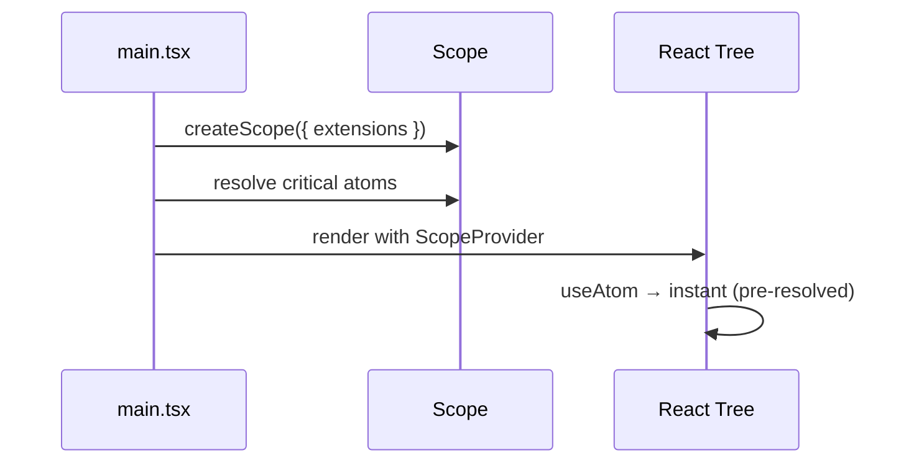
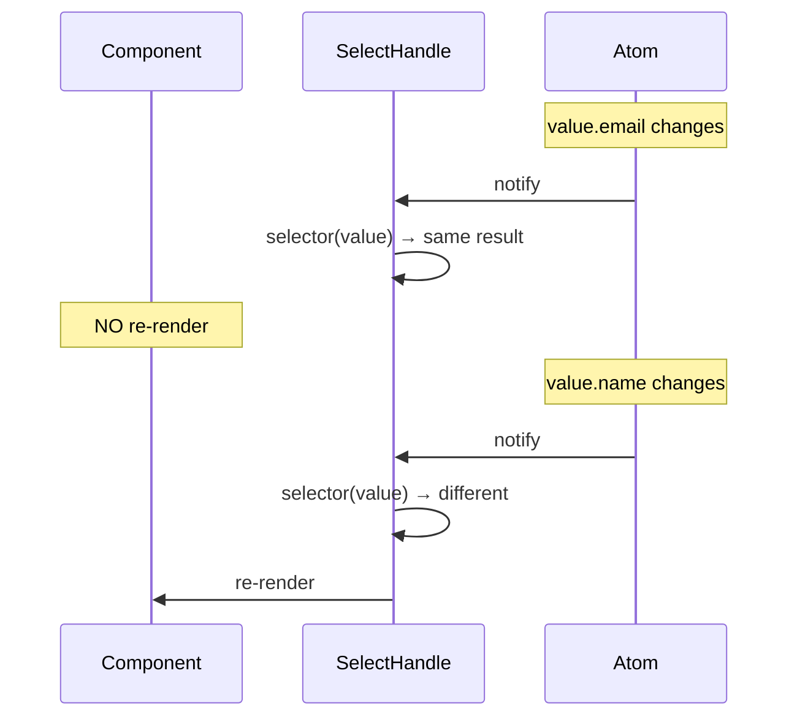

# React Patterns

Architectural patterns for `@pumped-fn/lite-react`. For API reference, see [README.md](./README.md).

---

## App Bootstrap

Pre-resolve critical atoms before rendering to avoid loading flash:

---

## Fine-Grained Reactivity

`useSelect` filters re-renders by selector output:

- Default equality: `===` (reference)
- Custom equality for complex comparisons

---

## Anti-Patterns

| Anti-Pattern | Problem | Solution |
|--------------|---------|----------|
| Resolve in useEffect | Race conditions, no Suspense | Use `useAtom` (auto-resolves) |
| Create Scope in component | New scope every render | Create once outside component |
| Complex selector returning objects | Always re-renders (new reference) | Return primitives or custom equality |
| Fat atoms with mixed concerns | Can't preset granularly | One concern per atom |
