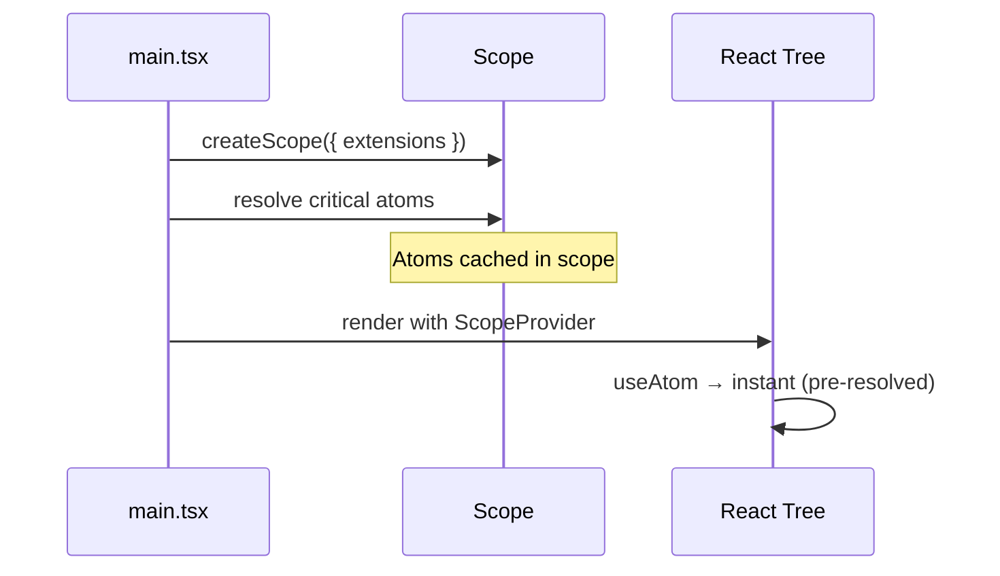
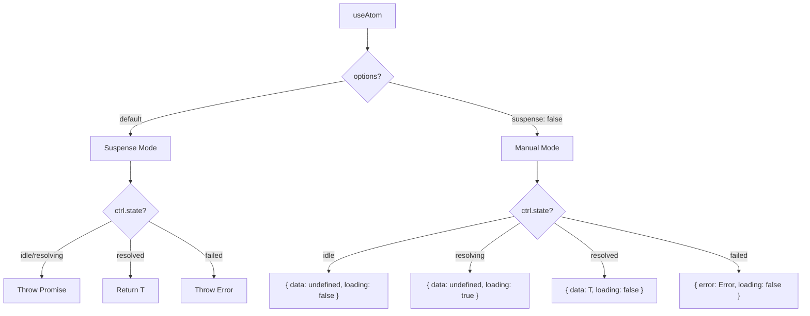
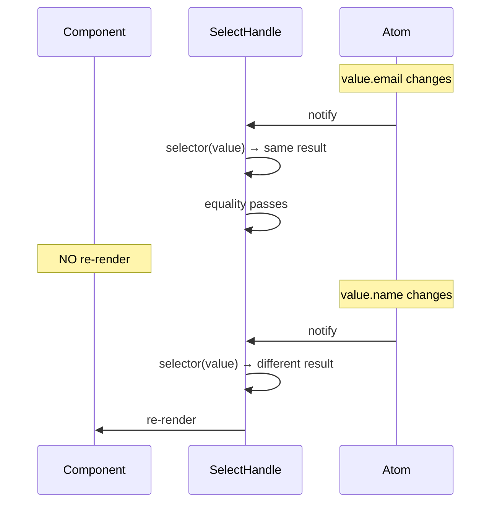
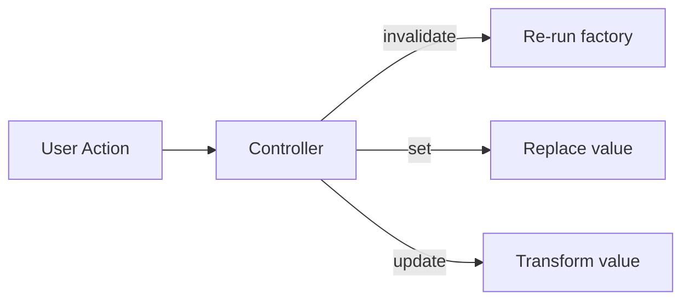
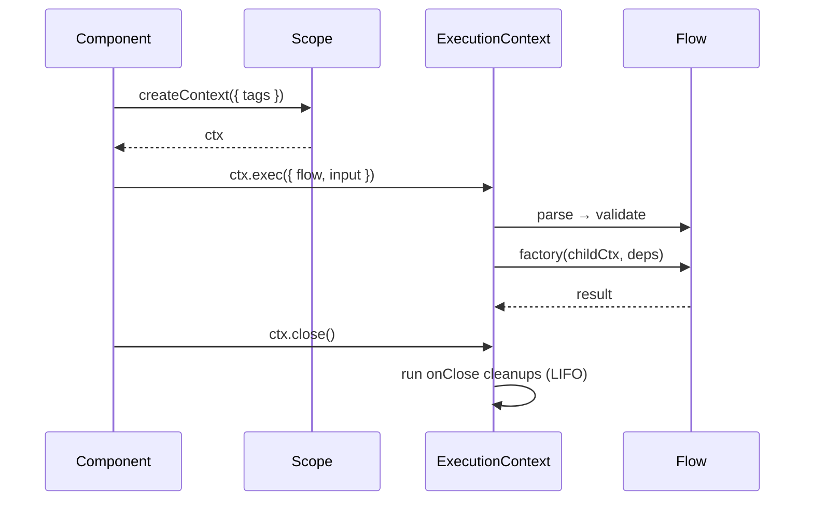
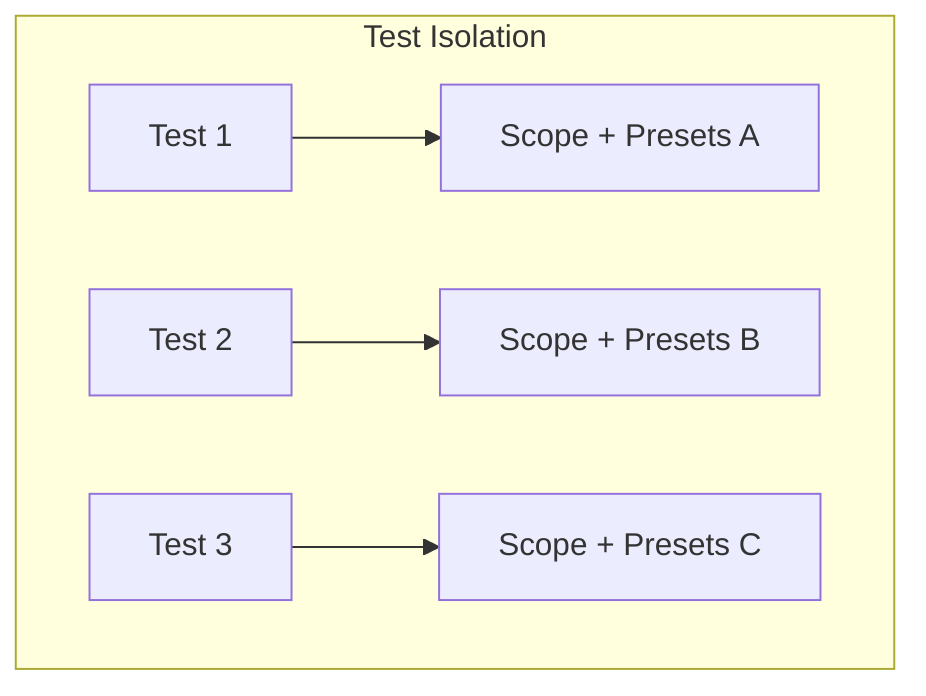
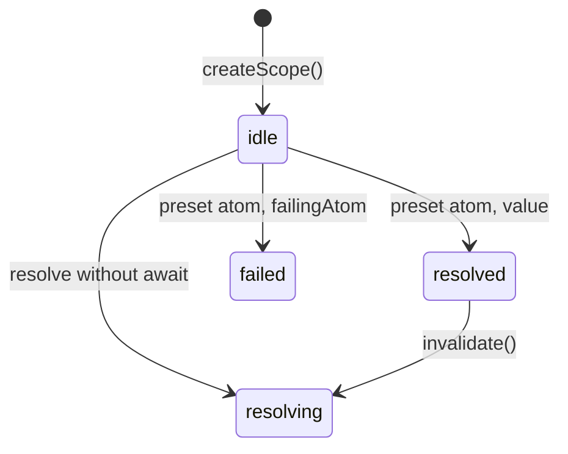
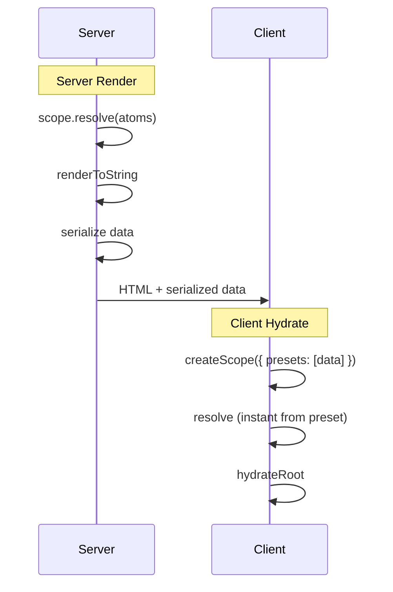
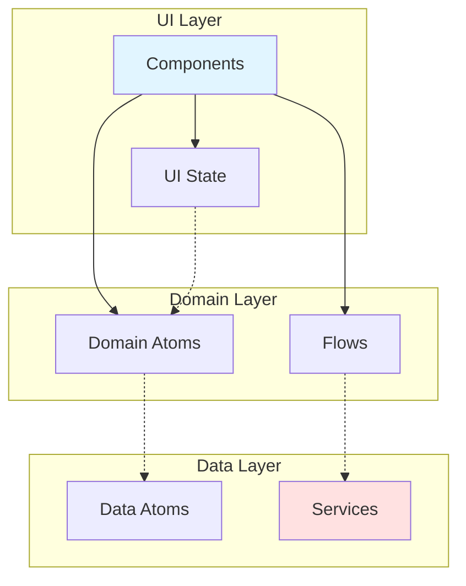

# React Patterns

Architectural patterns for `@pumped-fn/lite-react` — when and how to compose lite primitives in React applications.

## Pattern Overview

| Pattern | Lite Primitives | React Integration | Use Case |
|---------|-----------------|-------------------|----------|
| [App Bootstrap](#app-bootstrap) | `Scope`, `atom` | `ScopeProvider` | Application initialization |
| [Data Subscription](#data-subscription) | `Controller` | `useAtom`, `Suspense` | Reactive data display |
| [Fine-Grained Reactivity](#fine-grained-reactivity) | `SelectHandle` | `useSelect` | Render optimization |
| [Imperative Actions](#imperative-actions) | `Controller` | `useController` | Mutations, refresh |
| [Request Lifecycle](#request-lifecycle) | `Flow`, `ExecutionContext` | `useScope` | Form submission, API calls |
| [Isolated Testing](#isolated-testing) | `Scope`, `preset` | `ScopeProvider` | Component test isolation |
| [SSR Hydration](#ssr-hydration) | `Scope`, `preset` | `ScopeProvider` | Server rendering |
| [Testable Architecture](#testable-architecture) | `atom`, `preset` | Layer separation | Design for testability |

---

## App Bootstrap

**Combines:** IoC Container + Provider Pattern



**Characteristics:**
- Scope created once at app entry
- Critical atoms pre-resolved before render
- Extensions initialize at scope creation
- No loading flash for pre-resolved atoms

---

## Data Subscription

**Combines:** Observer + Suspense Integration



### Suspense Mode (Default)

| Atom State | React Behavior |
|------------|----------------|
| `idle` | Auto-resolve, throw Promise |
| `resolving` | Throw Promise (Suspense catches) |
| `resolved` | Return value, subscribe to changes |
| `failed` | Throw stored error (ErrorBoundary catches) |

**Characteristics:**
- Declarative loading via Suspense
- Declarative errors via ErrorBoundary
- Auto-resolution for lazy atoms
- Re-renders on value change or invalidation

### Manual Mode (Non-Suspense)

```tsx
const { data, loading, error, controller } = useAtom(atom, { suspense: false })
```

| Option | Behavior |
|--------|----------|
| `{ suspense: false }` | Returns state object, no auto-resolve |
| `{ suspense: false, resolve: true }` | Returns state object, auto-resolves on mount |

**Characteristics:**
- Imperative loading/error handling
- No Suspense boundary required
- Similar to TanStack Query pattern
- Controller exposed for mutations

---

## Fine-Grained Reactivity

**Combines:** Selector Pattern + Equality Filtering



**Characteristics:**
- Selector extracts derived value
- Component re-renders only when selected value changes
- Default equality: `===` (reference)
- Custom equality for complex comparisons

---

## Imperative Actions

**Combines:** Command Pattern + Controller



| Method | Behavior | Triggers Suspense |
|--------|----------|-------------------|
| `invalidate()` | Re-runs factory | Yes |
| `set(value)` | Replaces value directly | No |
| `update(fn)` | Transforms current value | No |

**Characteristics:**
- Controller memoized per atom
- `invalidate` → factory re-execution with Suspense
- `set`/`update` → immediate value change without factory

---

## Request Lifecycle

**Combines:** Command + Context Object + Cleanup



**Characteristics:**
- ExecutionContext bounds request lifecycle
- Flow encapsulates validation + execution
- `rawInput` delegates validation to flow's `parse`
- Tags propagate through nested `exec()` calls
- `ctx.close()` runs cleanups in LIFO order

---

## Isolated Testing

**Combines:** IoC Container + Strategy (Preset)



### State Control



| Target State | Setup |
|--------------|-------|
| `idle` | Create scope, don't resolve |
| `resolving` | Trigger resolve, don't await |
| `resolved` | Preset value or await resolve |
| `failed` | Preset failing atom |

### Preset Strategies

| Strategy | Use Case |
|----------|----------|
| Static value | Unit tests with fixed data |
| Atom redirect | Mock services, error simulation |
| No preset | Integration tests |

### Unit vs Integration

| Test Type | Preset Strategy |
|-----------|----------------|
| Unit | Preset all deps |
| Integration | Preset external only (API, DB) |

**Characteristics:**
- Fresh scope per test
- No global state pollution
- Safe for parallel execution

---

## SSR Hydration

**Combines:** IoC Container + Preset Injection



**Characteristics:**
- No hydration mismatch (same data)
- Presets bypass async factory
- `useSyncExternalStore` provides server snapshot
- No flash of loading state

---

## Testable Architecture

**Principle:** Dependencies flow downward — preset lower layers, test upper layers.



### Atom Granularity

| Atom Type | Dependencies | Test Strategy |
|-----------|--------------|---------------|
| Service | None | Always preset |
| Data | Services only | Preset or real |
| Domain | Data atoms | Usually real |
| UI State | Domain/Data | Preset to target state |

**Anti-Pattern:** Fat atoms mixing concerns — impossible to preset granularly.

### Test Boundaries

| Test Type | Preset | Real |
|-----------|--------|------|
| Component | All atoms | None |
| Domain | Data atoms | Domain logic |
| Flow | Services | Validation + factory |
| Integration | External only | Everything else |

---

## Anti-Patterns

| Anti-Pattern | Problem | Solution |
|--------------|---------|----------|
| Resolve in useEffect | Race conditions, no Suspense | Use `useAtom` (auto-resolves) |
| Create Scope in component | New scope every render | Create once outside component |
| Complex selector returning objects | Always re-renders (new reference) | Return primitives or custom equality |
| Missing ctx.close() | Cleanups never run | Always close in finally block |
| Fat atoms with mixed concerns | Can't preset granularly | One concern per atom |
