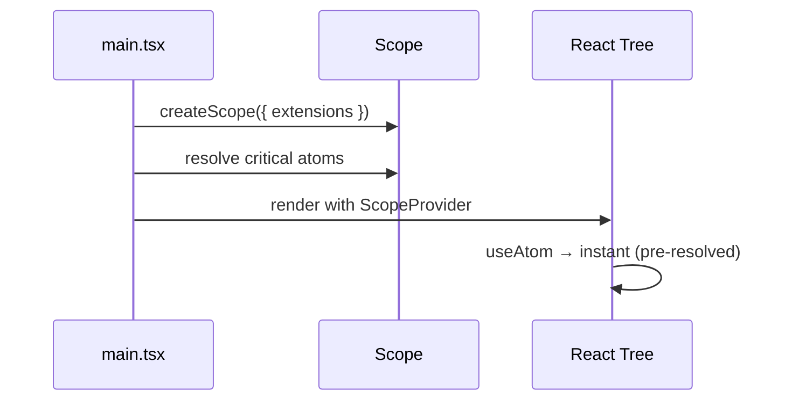
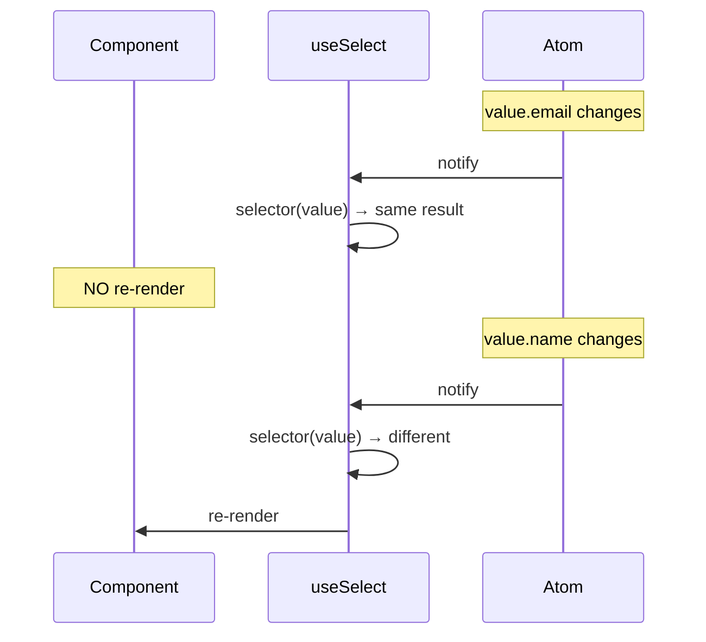
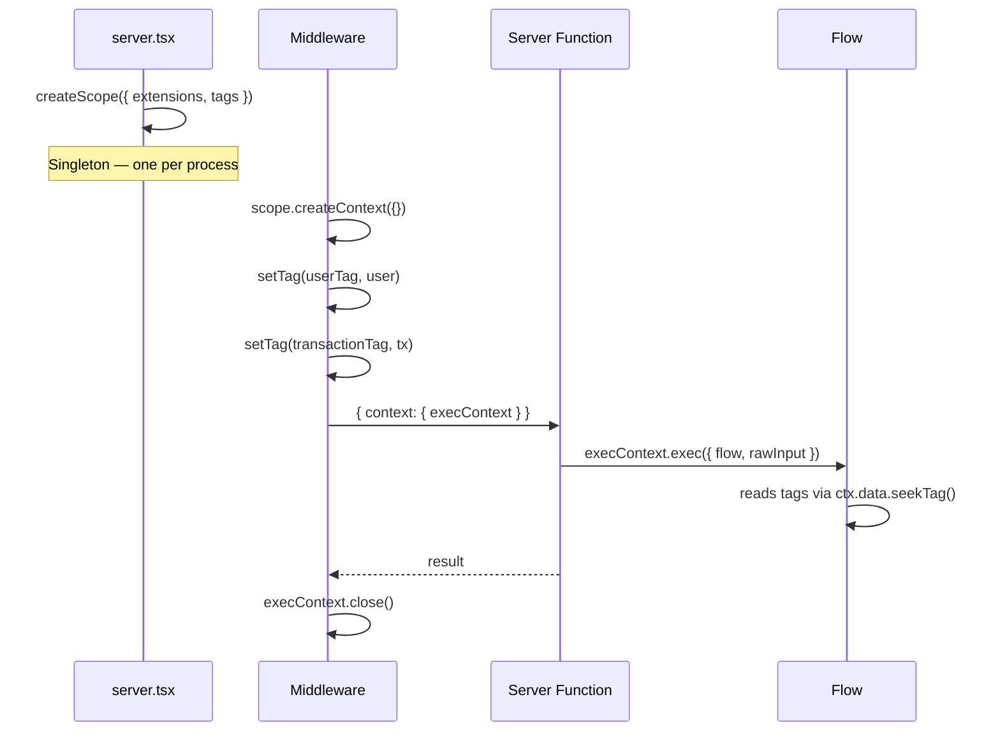

# React Patterns

Architectural patterns for `@pumped-fn/lite-react`. For API reference, see [README.md](./README.md).

---

## App Bootstrap

Pre-resolve critical atoms before rendering to avoid loading flash:


```mermaid
sequenceDiagram
    participant Main as main.tsx
    participant Scope
    participant React as React Tree

    Main->>Scope: createScope({ extensions })
    Main->>Scope: resolve critical atoms
    Main->>React: render with ScopeProvider
    React->>React: useAtom → instant (pre-resolved)
```

---

## Fine-Grained Reactivity

`useSelect` filters re-renders by selector output:


```mermaid
sequenceDiagram
    participant Component
    participant useSelect
    participant Atom

    Note over Atom: value.email changes
    Atom->>useSelect: notify
    useSelect->>useSelect: selector(value) → same result
    Note over Component: NO re-render

    Note over Atom: value.name changes
    Atom->>useSelect: notify
    useSelect->>useSelect: selector(value) → different
    useSelect->>Component: re-render
```

- Default equality: `Object.is`
- Custom equality for complex comparisons
- Selector logic is reevaluated when the store changes or you pass a new selector function, so prop-driven selectors stay in sync without waiting for another atom update

---

## TanStack Start Backend Integration

Singleton scope at server entry, per-request execution context via middleware chain.


```mermaid
sequenceDiagram
    participant Entry as server.tsx
    participant MW as Middleware
    participant Fn as Server Function
    participant Flow as Flow

    Entry->>Entry: createScope({ extensions, tags })
    Note over Entry: Singleton — one per process

    MW->>MW: scope.createContext({})
    MW->>MW: setTag(userTag, user)
    MW->>MW: setTag(transactionTag, tx)
    MW->>Fn: { context: { execContext } }
    Fn->>Flow: execContext.exec({ flow, rawInput })
    Flow->>Flow: reads tags via ctx.data.seekTag()
    Fn-->>MW: result
    MW->>MW: execContext.close()
```

### 1. Server entry — singleton scope

```typescript
const scope = createScope({
  extensions: [otel()],
  tags: [envTag(process.env.NODE_ENV)],
})

export default createServerEntry({
  async fetch(request) {
    return handler.fetch(request, { context: { scope } })
  },
})
```

### 2. Execution context middleware — per-request lifecycle

```typescript
export const executionContextMiddleware = createMiddleware()
  .server(async ({ next, context: { scope } }) => {
    const execContext = scope.createContext({})
    try {
      return await next({ context: { execContext } })
    } finally {
      await execContext.close()
    }
  })
```

### 3. Tag-seeding middleware — ambient data

```typescript
export const authMiddleware = createMiddleware()
  .middleware([executionContextMiddleware])
  .server(async ({ next, context: { execContext } }) => {
    const user = await resolveCurrentUser()
    execContext.data.setTag(currentUserTag, user)
    return next({ context: { user } })
  })
```

### 4. Server functions — execute flows

```typescript
export const listInvoices = createServerFn({ method: 'POST' })
  .middleware([transactionMiddleware])
  .handler(async ({ data, context: { execContext } }) => {
    return execContext.exec({ flow: invoiceFlows.list, rawInput: data })
  })
```

### 5. Client hydration — preset loader data

```typescript
const loaderData = Route.useLoaderData()
const scope = createScope({
  presets: [
    preset(invoicesAtom, loaderData.invoices),
    preset(userAtom, loaderData.user),
  ],
})

return (
  <ScopeProvider scope={scope}>
    <Outlet />
  </ScopeProvider>
)
```

| Rule | Rationale |
|------|-----------|
| One scope per server process | Atoms cache singletons (connections, services) |
| One execution context per request | Tag isolation (user, tx, tracing) |
| Middleware creates and closes context | Guarantees cleanup even on error |
| Tags over function params | Flows read ambient tags — no signature coupling |
| `execContext.exec({ flow })` for request work | Flows get lifecycle, tracing, cleanup |
| Preset server data on client scope | No re-fetch; atoms hydrate from loader |

---

## Anti-Patterns

| Anti-Pattern | Problem | Solution |
|--------------|---------|----------|
| Resolve in useEffect | Race conditions, no Suspense | Use `useAtom` (auto-resolves) |
| Create Scope in component | New scope every render | Create once outside component |
| Complex selector returning objects | Always re-renders (new reference) | Return primitives or custom equality |
| Fat atoms with mixed concerns | Can't preset granularly | One concern per atom |
| `createScope()` inside server function | New scope per request, atoms re-resolve | Singleton scope at server entry |
| `flow.factory(ctx, deps)` in handler | Bypasses lifecycle, tags, extensions | `execContext.exec({ flow })` |
| User/tx as flow input instead of tags | Couples flow signatures to transport | Tags are ambient via `setTag` |
| `ScopeProvider` without presets from loader | Client re-fetches everything | Preset loader data into client scope |
