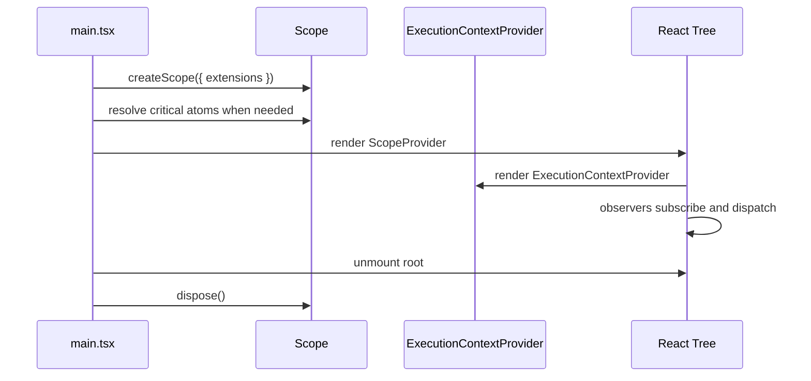
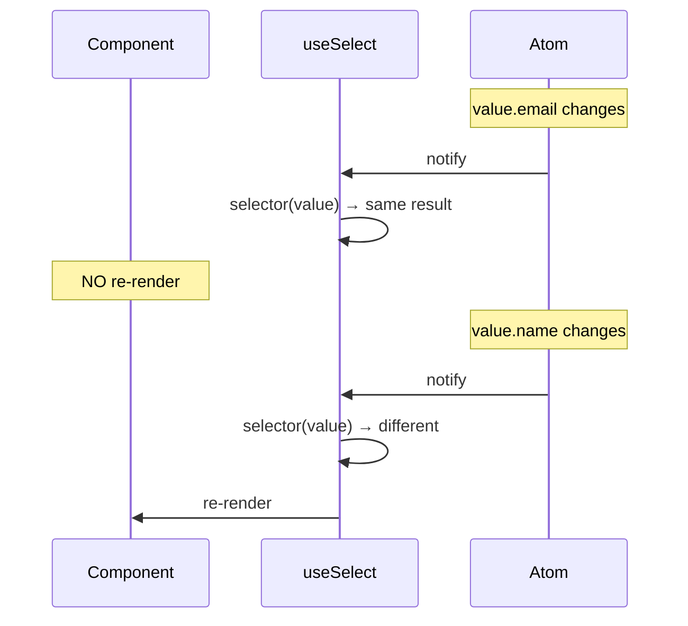

# React Patterns

Architectural patterns for `@pumped-fn/lite-react`. For API reference, see [README.md](./README.md).

---

## Observer Components

React components are observers of the Lite graph. The graph owns logic, mutable state, validation, async work, and dependency declarations; components render snapshots and dispatch graph actions.

Use `useAtom`, `useSelect`, `useResource`, and `useScopedValue` for observation. Use `useFlow` for UI-triggered flows. Treat `useExecutionContext` and `useScope` as infrastructure escape hatches for provider/bootstrap helpers, not the normal feature-component path.

---

## Provider-Owned UI Execution

`ScopeProvider` supplies the composition boundary, and `ExecutionContextProvider` supplies the UI execution boundary. Feature components should not create contexts, close contexts, or pass `scope` into product helpers.

```tsx
<ScopeProvider scope={scope}>
  <ExecutionContextProvider>
    <App />
  </ExecutionContextProvider>
</ScopeProvider>
```

---

## Testing Split

Keep graph logic in node. Logic tests should exercise atoms, flows, resources, and scoped values through `createScope({ presets, tags, extensions })` and public APIs, without DOM, browser globals, module mocks, or product-only test branches.

Use browser observer tests for rendered components, provider wiring, and bootstrap adapters. Browser observer tests should prove that components observe graph state and dispatch graph actions, not that business logic only works when React or a browser is present.

Browser mode does not replace node logic tests. CI also runs a Lightpanda smoke against a Vite-served `useFlow` page. Guard ambient browser APIs so raw IO stays in transport atoms or composition-root adapters.

Public examples that claim architectural quality should keep those claims derived or explicitly scoped: inventories come from files, implemented slices name backlog, and strong boundary rules get structural guards.

`@pumped-fn/lite-lint` codifies the React-facing guardrails in a lint-like scanner: feature components
should not call `useScope` or `useExecutionContext`, mirror graph state with `useState`, create or close execution contexts
manually, or rely on JSDOM instead of Vitest Browser Mode observer tests.

---

## App Bootstrap

Bootstrap is a composition-root adapter. It creates the scope once, wires providers, mounts React, and owns disposal. Pre-resolve critical atoms before rendering when you want to avoid loading flash, but keep business logic in graph nodes instead of the bootstrap function.


```mermaid
sequenceDiagram
    participant Main as main.tsx
    participant Scope
    participant Ctx as ExecutionContextProvider
    participant React as React Tree

    Main->>Scope: createScope({ extensions })
    Main->>Scope: resolve critical atoms when needed
    Main->>React: render ScopeProvider
    React->>Ctx: render ExecutionContextProvider
    React->>React: observers subscribe and dispatch
    Main->>React: unmount root
    Main->>Scope: dispose()
```

Tests can mount the same bootstrap adapter and assert through the returned scope or public graph APIs. Feature components stay under `ExecutionContextProvider`; they dispatch with `useFlow` and do not create or close contexts themselves.

---

## Fine-Grained Reactivity

`useSelect` filters re-renders by selector output:


```mermaid
sequenceDiagram
    participant Component
    participant useSelect
    participant Atom

    Note over Atom: value.email changes
    Atom->>useSelect: notify
    useSelect->>useSelect: selector(value) → same result
    Note over Component: NO re-render

    Note over Atom: value.name changes
    Atom->>useSelect: notify
    useSelect->>useSelect: selector(value) → different
    useSelect->>Component: re-render
```

- Default equality: `Object.is`
- Custom equality for complex comparisons
- Selector logic is reevaluated when the store changes or you pass a new selector function, so prop-driven selectors stay in sync without waiting for another atom update

---

## Execution-Scoped Resources

`ExecutionContextProvider` supplies the context used by `useResource` and `useScopedValue`.

```tsx
<ScopeProvider scope={scope}>
  <ExecutionContextProvider ctx={ctx}>
    <CurrentUser />
  </ExecutionContextProvider>
</ScopeProvider>
```

Use explicit `ctx` for tests and request boundaries. Omit `ctx` only when you want managed mode from the surrounding `ScopeProvider`; managed mode creates the execution context for the provider, inherits the nearest execution context in the same scope, and closes it on unmount.

Managed mode reuses the context when the parent and tag records compare the same. Object-valued boundary tags should define `eq` only when equal values are fully substitutable, because reuse keeps the existing execution context and its current-owned resources. This is a React boundary optimization, not tag lookup, dedupe, cache, or resource-sharing semantics.

`useResource(resource, { suspense: false })` returns a load union, not an atom-style controller state:

```tsx
function CurrentUser() {
  const user = useResource(currentUserResource, { suspense: false })

  if (user.status === 'loading') return <p>Loading...</p>
  if (user.status === 'error') return <p role="alert">{user.error.message}</p>
  return <p>{user.data.name}</p>
}
```

Do not add `resolve: true`, read `loading`, or call `controller.invalidate()` on the return value. Resource controllers are internal observation handles here; product components should use the load union, Suspense value, or domain actions. Resource reset is owned by `ctx.release(resource)`.

---

## Scoped Form State

`scopedValue` is the form/draft primitive. It is backed by a current-owned resource, so nested provider forms reset with their owning execution context instead of leaking into the parent boundary. Define dependencies and actions with the value, then let React subscribe at the boundary.
React receives `snapshot + actions`, not a resource controller.
Complete React modules should show the provider boundary too: `ScopeProvider` owns the scope, and `ExecutionContextProvider` owns the execution context where the scoped value lives.

```tsx
const loginForm = scopedValue({
  deps: { auth: authResource },
  initial: () => ({ email: '', password: '', error: undefined as string | undefined }),
  actions: ({ get, patch }, { auth }) => ({
    setEmail(email: string) {
      patch({ email, error: undefined })
    },
    setPassword(password: string) {
      patch({ password, error: undefined })
    },
    submit() {
      const snapshot = get()
      return auth.login(snapshot.email, snapshot.password).catch((error: Error) => {
        patch({ error: error.message })
        return undefined
      })
    },
  }),
})

const scope = createScope()

function LoginScreen() {
  return (
    <ScopeProvider scope={scope}>
      <ExecutionContextProvider>
        <LoginForm />
      </ExecutionContextProvider>
    </ScopeProvider>
  )
}

function LoginForm() {
  const form = useScopedValue(loginForm)

  return (
    <form onSubmit={(event) => { event.preventDefault(); void form.actions.submit() }}>
      <input value={form.snapshot.email} onChange={(event) => form.actions.setEmail(event.currentTarget.value)} />
      <input value={form.snapshot.password} onChange={(event) => form.actions.setPassword(event.currentTarget.value)} />
      {form.snapshot.error ? <p role="alert">{form.snapshot.error}</p> : null}
      <button>Sign in</button>
    </form>
  )
}
```

The same value is testable without React:

```ts
const ctx = scope.createContext()
const form = await loginForm.resolve(ctx)
form.actions.setEmail('a@example.com')
if (form.getSnapshot().email !== 'a@example.com') throw new Error('expected updated email')
await form.actions.submit()
await ctx.release(loginForm)
await ctx.close()
```

Outside React, resolved access uses `getSnapshot()` or `get()`; `snapshot` exists only on the value returned by `useScopedValue`.

Avoid `useState` mirrors for scoped fields. Render from `form.snapshot`; mutate through `form.actions`.

---

## Anti-Patterns

| Anti-Pattern | Problem | Solution |
|--------------|---------|----------|
| Resolve in useEffect | Race conditions, no Suspense | Use `useAtom` (auto-resolves) |
| Create Scope in component | New scope every render | Create once outside component |
| Mirror scopedValue into useState | Split source of truth | Render `form.snapshot`, mutate `form.actions` |
| Use `context=` prop | Wrong provider API | Pass `ctx={ctx}` or omit `ctx` for managed mode |
| Read `loading` from useResource | Old atom hook shape | Check `load.status` / `load.data` / `load.error` |
| Complex selector returning objects | Always re-renders (new reference) | Return primitives or custom equality |
| Fat atoms with mixed concerns | Can't preset granularly | One concern per atom |
