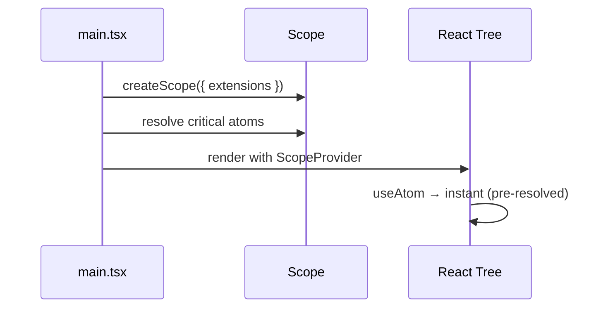
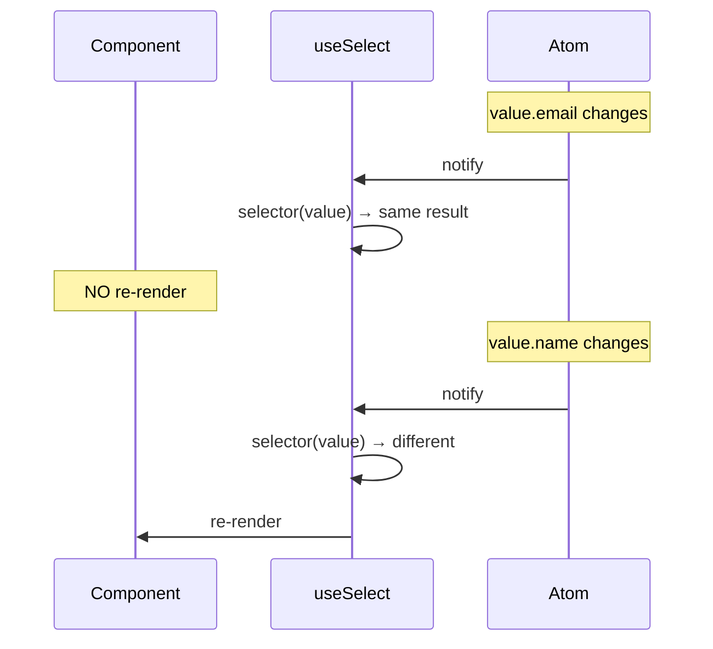

# React Patterns

Architectural patterns for `@pumped-fn/lite-react`. For API reference, see [README.md](./README.md).

---

## App Bootstrap

Pre-resolve critical atoms before rendering to avoid loading flash:


```mermaid
sequenceDiagram
    participant Main as main.tsx
    participant Scope
    participant React as React Tree

    Main->>Scope: createScope({ extensions })
    Main->>Scope: resolve critical atoms
    Main->>React: render with ScopeProvider
    React->>React: useAtom → instant (pre-resolved)
```

---

## Fine-Grained Reactivity

`useSelect` filters re-renders by selector output:


```mermaid
sequenceDiagram
    participant Component
    participant useSelect
    participant Atom

    Note over Atom: value.email changes
    Atom->>useSelect: notify
    useSelect->>useSelect: selector(value) → same result
    Note over Component: NO re-render

    Note over Atom: value.name changes
    Atom->>useSelect: notify
    useSelect->>useSelect: selector(value) → different
    useSelect->>Component: re-render
```

- Default equality: `Object.is`
- Custom equality for complex comparisons
- Selector logic is reevaluated when the store changes or you pass a new selector function, so prop-driven selectors stay in sync without waiting for another atom update

---

## Execution-Scoped Resources

`ExecutionContextProvider` supplies the context used by `useResource` and `useScopedValue`.

```tsx
<ScopeProvider scope={scope}>
  <ExecutionContextProvider ctx={ctx}>
    <CurrentUser />
  </ExecutionContextProvider>
</ScopeProvider>
```

Use explicit `ctx` for tests and request boundaries. Omit `ctx` only when you want managed mode from the surrounding `ScopeProvider`; managed mode creates the execution context after commit and closes it on unmount.

`useResource(resource, { suspense: false })` returns a load union, not an atom-style controller state:

```tsx
function CurrentUser() {
  const user = useResource(currentUserResource, { suspense: false })

  if (user.status === 'loading') return <p>Loading...</p>
  if (user.status === 'error') return <p role="alert">{user.error.message}</p>
  return <p>{user.data.name}</p>
}
```

Do not add `resolve: true`, read `loading`, or call `controller.invalidate()` on the return value. Resource reset is owned by `ctx.release(resource)`.

---

## Scoped Form State

`scopedValue` is the form/draft primitive. Define dependencies and actions with the value, then let React subscribe at the boundary.

```tsx
const loginForm = scopedValue({
  deps: { auth: authResource },
  initial: () => ({ email: '', password: '', error: undefined as string | undefined }),
  actions: ({ get, patch }, { auth }) => ({
    setEmail(email: string) {
      patch({ email, error: undefined })
    },
    setPassword(password: string) {
      patch({ password, error: undefined })
    },
    submit() {
      const snapshot = get()
      return auth.login(snapshot.email, snapshot.password).catch((error: Error) => {
        patch({ error: error.message })
        return undefined
      })
    },
  }),
})

function LoginForm() {
  const form = useScopedValue(loginForm)

  return (
    <form onSubmit={(event) => { event.preventDefault(); void form.actions.submit() }}>
      <input value={form.snapshot.email} onChange={(event) => form.actions.setEmail(event.currentTarget.value)} />
      <input value={form.snapshot.password} onChange={(event) => form.actions.setPassword(event.currentTarget.value)} />
      {form.snapshot.error ? <p role="alert">{form.snapshot.error}</p> : null}
      <button>Sign in</button>
    </form>
  )
}
```

The same value is testable without React:

```ts
const ctx = scope.createContext()
const form = await loginForm.resolve(ctx)
form.actions.setEmail('a@example.com')
await form.actions.submit()
await ctx.release(loginForm)
await ctx.close()
```

Avoid `useState` mirrors for scoped fields. Render from `form.snapshot`; mutate through `form.actions`.

---

## Anti-Patterns

| Anti-Pattern | Problem | Solution |
|--------------|---------|----------|
| Resolve in useEffect | Race conditions, no Suspense | Use `useAtom` (auto-resolves) |
| Create Scope in component | New scope every render | Create once outside component |
| Mirror scopedValue into useState | Split source of truth | Render `form.snapshot`, mutate `form.actions` |
| Use `context=` prop | Wrong provider API | Pass `ctx={ctx}` or omit `ctx` for managed mode |
| Read `loading` from useResource | Old atom hook shape | Check `load.status` / `load.data` / `load.error` |
| Complex selector returning objects | Always re-renders (new reference) | Return primitives or custom equality |
| Fat atoms with mixed concerns | Can't preset granularly | One concern per atom |
