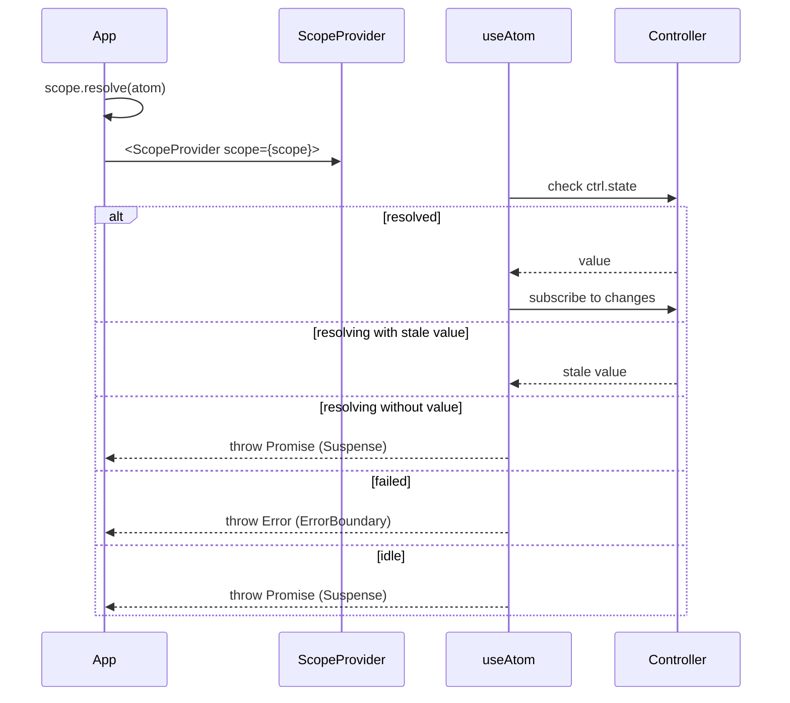
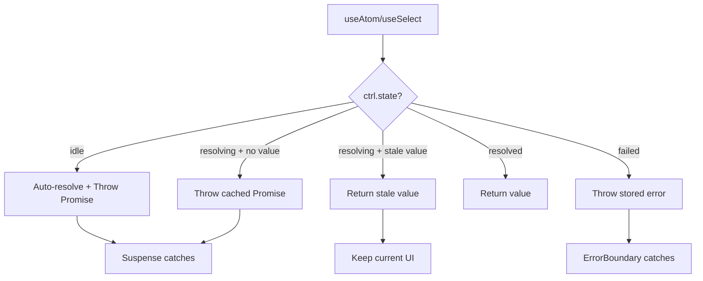
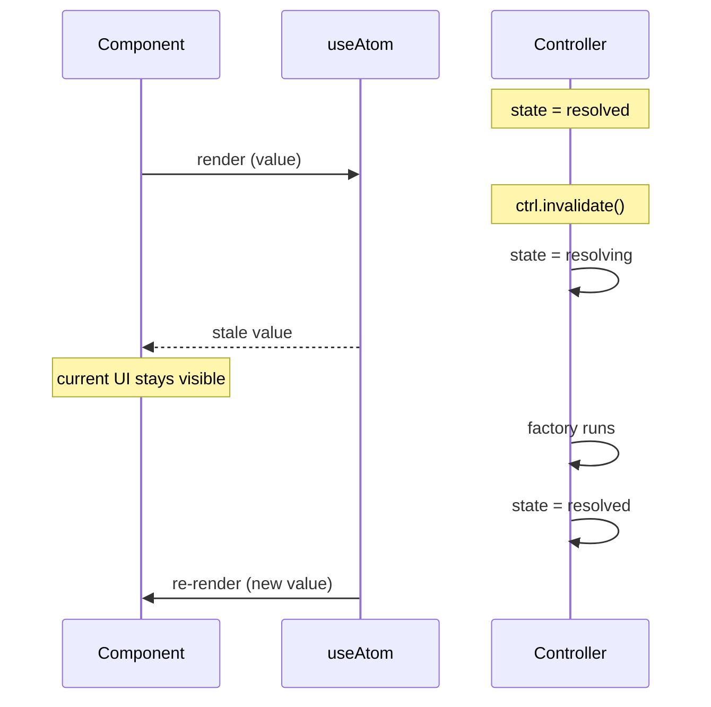

# @pumped-fn/lite-react

React bindings for `@pumped-fn/lite` with Suspense, ErrorBoundary integration, and stale-while-revalidate refreshes.

**Zero dependencies** · **<2KB bundle** · **React 18+**

## How It Works



## State Handling



| State | Hook Behavior |
|-------|---------------|
| `idle` | Auto-resolves and suspends — Suspense shows fallback |
| `resolving` | Returns stale value if available, otherwise throws cached promise |
| `resolved` | Returns value, subscribes to changes |
| `failed` | Throws stored error — ErrorBoundary catches |

## API

### ScopeProvider

Provides scope to component tree.

```tsx
import { createScope } from '@pumped-fn/lite'
import { ScopeProvider } from '@pumped-fn/lite-react'

const scope = createScope()
await scope.resolve(userAtom)

<ScopeProvider scope={scope}>
  <App />
</ScopeProvider>
```

### ExecutionContextProvider

Provides an execution context to resource and scoped-value hooks. In tests or request boundaries, pass the context explicitly with `ctx`.

```tsx
import { createScope } from '@pumped-fn/lite'
import { ExecutionContextProvider, ScopeProvider } from '@pumped-fn/lite-react'

const scope = createScope()
const ctx = scope.createContext()

<ScopeProvider scope={scope}>
  <ExecutionContextProvider ctx={ctx}>
    <App />
  </ExecutionContextProvider>
</ScopeProvider>
```

Create the scope and explicit context outside component bodies. Do not call `createScope()` or `scope.createContext()` inside a React component; that creates a new graph during render. Components should consume an existing boundary through `ExecutionContextProvider`.

Managed mode creates an execution context from the surrounding `ScopeProvider` after commit and closes it on unmount:

```tsx
<ScopeProvider scope={scope}>
  <ExecutionContextProvider>
    <App />
  </ExecutionContextProvider>
</ScopeProvider>
```

### useResource

Read execution-scoped resources at the React boundary. Suspense mode is the default:

```tsx
const user = useResource(currentUserResource)
```

Without Suspense, the hook returns a stable load union:

```tsx
function CurrentUser() {
  const user = useResource(currentUserResource, { suspense: false })

  if (user.status === 'loading') return <p>Loading...</p>
  if (user.status === 'error') return <p role="alert">{user.error.message}</p>

  return <p>{user.data.name}</p>
}
```

The non-Suspense union is:

```ts
type Load<T> =
  | { status: 'loading'; data: undefined; error: undefined }
  | { status: 'ready'; data: T; error: undefined }
  | { status: 'error'; data: undefined; error: Error }
```

Do not load resources with `useEffect`. `useResource` observes the resource controller, starts work at the right React boundary, and stays reset-aware when the owner context releases the resource.

### scopedValue

Use `scopedValue` for execution-scoped frontend state such as form drafts. The state is resource-backed, so it can be tested without React and is discarded when the execution context is released or closed.

```tsx
import { createScope, resource } from '@pumped-fn/lite'
import { ExecutionContextProvider, ScopeProvider, scopedValue, useScopedValue } from '@pumped-fn/lite-react'

const authResource = resource({
  factory: () => ({
    login: async (email: string, password: string) => ({ email }),
  }),
})

const loginForm = scopedValue({
  name: 'login-form',
  deps: { auth: authResource },
  initial: () => ({ email: '', password: '', status: 'editing' as const, error: undefined as string | undefined }),
  actions: ({ get, patch }, { auth }) => ({
    setEmail(email: string) {
      patch({ email, status: 'editing', error: undefined })
    },
    setPassword(password: string) {
      patch({ password, status: 'editing', error: undefined })
    },
    submit() {
      const snapshot = get()
      if (!snapshot.email.includes('@')) {
        patch({ status: 'editing', error: 'Enter a valid email' })
        return Promise.resolve(undefined)
      }
      patch({ status: 'submitting', error: undefined })
      return auth.login(snapshot.email, snapshot.password).then(
        (user) => {
          patch({ status: 'submitted', error: undefined })
          return user
        },
        (error: Error) => {
          patch({ status: 'editing', error: error.message })
          return undefined
        },
      )
    },
  }),
})

const scope = createScope()

export function LoginScreen() {
  return (
    <ScopeProvider scope={scope}>
      <ExecutionContextProvider>
        <LoginForm />
      </ExecutionContextProvider>
    </ScopeProvider>
  )
}

function LoginForm() {
  const form = useScopedValue(loginForm)

  return (
    <form onSubmit={(event) => { event.preventDefault(); void form.actions.submit() }}>
      <input value={form.snapshot.email} onChange={(event) => form.actions.setEmail(event.currentTarget.value)} />
      <input value={form.snapshot.password} onChange={(event) => form.actions.setPassword(event.currentTarget.value)} />
      {form.snapshot.error ? <p role="alert">{form.snapshot.error}</p> : null}
      <button disabled={form.snapshot.status === 'submitting'}>Sign in</button>
    </form>
  )
}
```

Test the same graph without React:

```ts
const scope = createScope()
const ctx = scope.createContext()
const form = await loginForm.resolve(ctx)

form.actions.setEmail('a@example.com')
if (form.getSnapshot().email !== 'a@example.com') throw new Error('expected updated email')
await form.actions.submit()

await ctx.release(loginForm)
await ctx.close()
await scope.dispose()
```

Resolved scoped-value access does not have a `snapshot` property. Outside React, read current state with `form.getSnapshot()` or `form.get()`. The `snapshot` property is only added by `useScopedValue` for React rendering.

Components should not mirror scoped-value fields into `useState`. Use `form.snapshot` for render state and `form.actions` for mutations.

### useScope

Access scope from context.

```tsx
const scope = useScope()
await scope.resolve(someAtom)
```

### useController

Get memoized controller for imperative operations.

```tsx
const ctrl = useController(counterAtom)
ctrl.set(10)
ctrl.update(n => n + 1)
ctrl.invalidate()
```

With `{ resolve: true }` option, triggers Suspense if atom not resolved:

```tsx
// Suspense ensures controller is resolved before render
const ctrl = useController(configAtom, { resolve: true })
ctrl.get() // safe - Suspense guarantees resolved state
```

While a controller is re-resolving, `{ resolve: true }` keeps suspending until the controller settles.

### useAtom

Subscribe to atom value with Suspense integration.

```tsx
function UserProfile() {
  const user = useAtom(userAtom)
  return <div>{user.name}</div>
}

// Wrap with Suspense + ErrorBoundary
<ErrorBoundary fallback={<Error />}>
  <Suspense fallback={<Loading />}>
    <UserProfile />
  </Suspense>
</ErrorBoundary>
```

#### Non-Suspense Mode

For manual loading/error state handling without Suspense:

```tsx
function UserProfile() {
  const { data, loading, error, controller } = useAtom(userAtom, { suspense: false })

  if (loading && data) return <div>Refreshing {data.name}...</div>
  if (loading) return <div>Loading...</div>
  if (error) return <div>Error: {error.message}</div>
  if (!data) return <div>Not loaded</div>

  return (
    <div>
      <h1>{data.name}</h1>
      <button onClick={() => controller.invalidate()}>Refresh</button>
    </div>
  )
}
```

With `{ resolve: true }`, auto-resolves on mount:

```tsx
// Starts resolution automatically when component mounts
const { data, loading, error } = useAtom(userAtom, { suspense: false, resolve: true })
```

| Option | Effect |
|--------|--------|
| `{ suspense: false }` | Returns state object, no auto-resolve |
| `{ suspense: false, resolve: true }` | Returns state object, auto-resolves on mount |

While `loading` is `true`, `data` may still contain the last resolved value during a refresh.

### useSelect

Fine-grained selection — only re-renders when selected value changes.

```tsx
const name = useSelect(userAtom, user => user.name)
const count = useSelect(todosAtom, todos => todos.length, (a, b) => a === b)
```

## Invalidation

When an atom is invalidated, `useAtom` and `useSelect` keep rendering the last value while re-resolving:



`useController(atom, { resolve: true })` is different: it suspends until the controller settles again.

## Testing

Use presets for test isolation:

```tsx
import { createScope, preset } from '@pumped-fn/lite'
import { ScopeProvider } from '@pumped-fn/lite-react'

const scope = createScope({
  presets: [preset(userAtom, { name: 'Test User' })]
})
await scope.resolve(userAtom)

render(
  <ScopeProvider scope={scope}>
    <UserProfile />
  </ScopeProvider>
)
```

## SSR

SSR-compatible when request-scoped atoms are resolved before rendering:

- No side effects on import
- Scope passed as prop (no global state)

```tsx
// Server
const scope = createScope()
await scope.resolve(dataAtom)
const html = renderToString(<ScopeProvider scope={scope}><App /></ScopeProvider>)

// Client
const clientScope = createScope({
  presets: [preset(dataAtom, window.__DATA__)]
})
await clientScope.resolve(dataAtom)
hydrateRoot(root, <ScopeProvider scope={clientScope}><App /></ScopeProvider>)
```

## Full API

See [`dist/index.d.mts`](./dist/index.d.mts) for complete type definitions.

## License

MIT
