# Patterns

Usage patterns as sequences. For API details, see `packages/lite/dist/index.d.mts`.

## A. Fundamental Usage

### Request Lifecycle

Model a request boundary with cleanup and shared context.

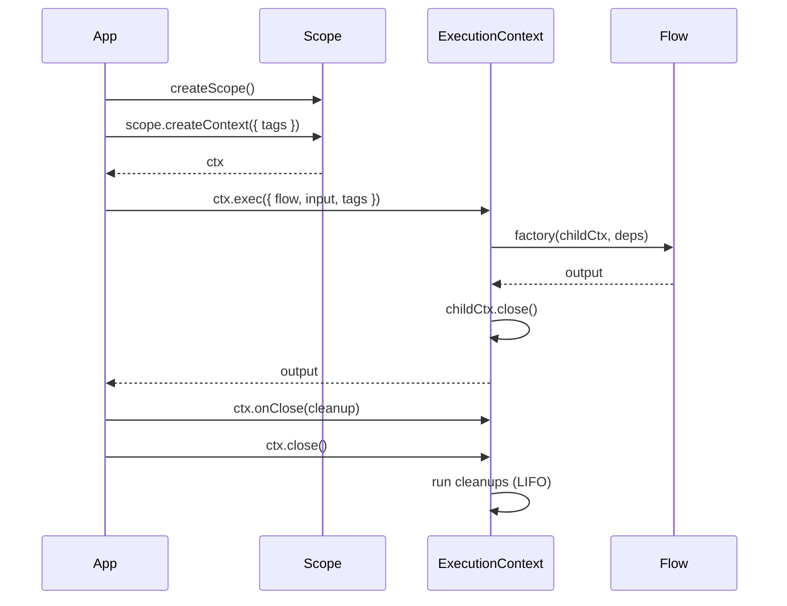

### Extensions Pipeline

Observe and wrap timing for atoms/flows (logging, auth, tracing).

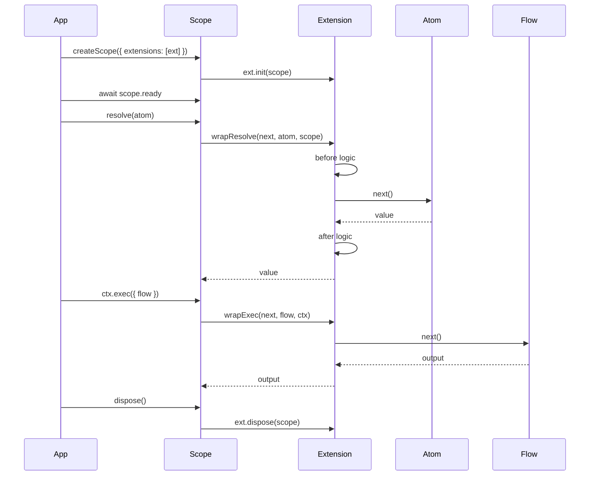

### Scoped Isolation + Testing

Swap implementations and isolate tenants/tests.

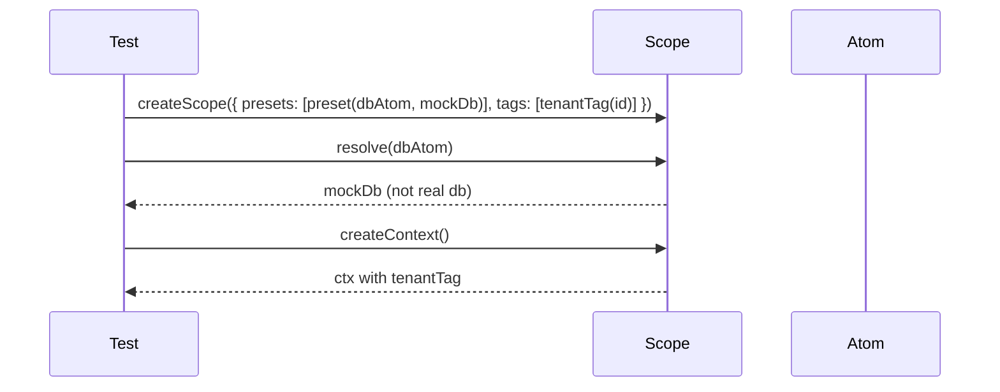

## B. Advanced Client/State Usage

### Controller Reactivity

Client-side state with lifecycle hooks and invalidation.

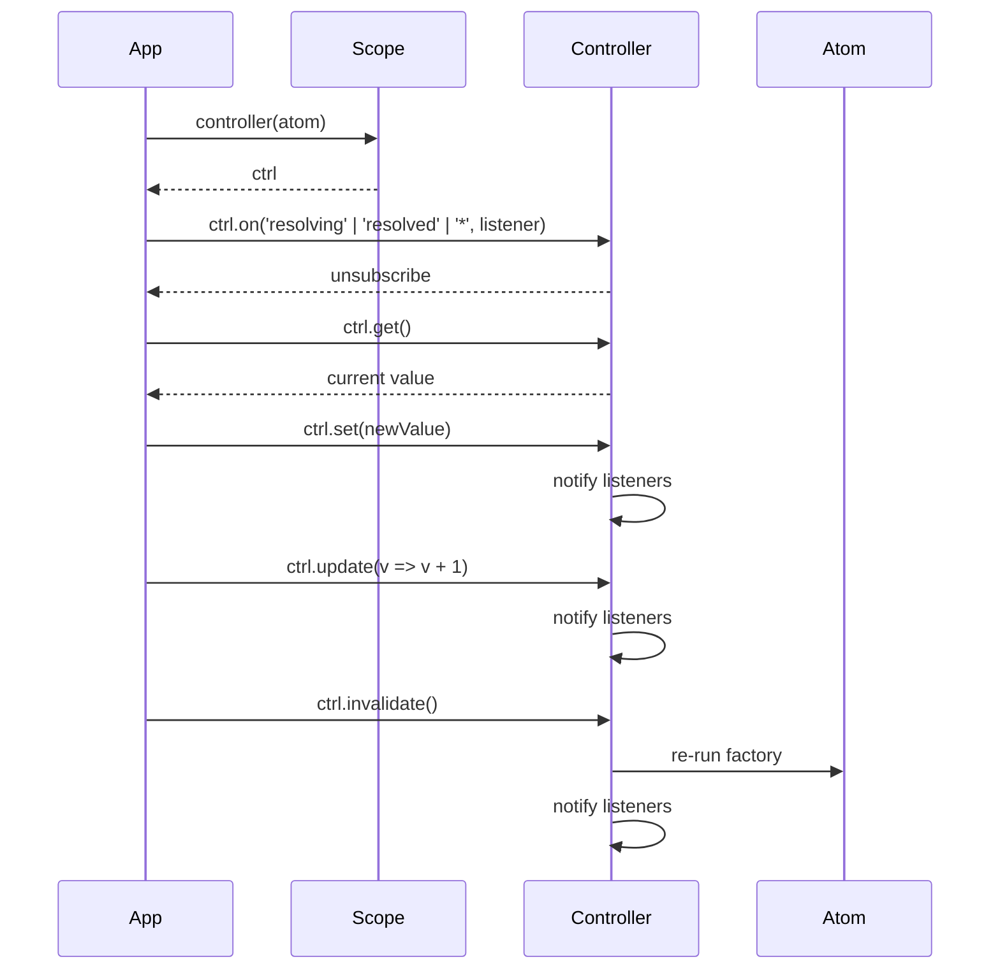

### Ambient Context (Tags)

Propagate state without wiring parameters (app shell, user, locale).

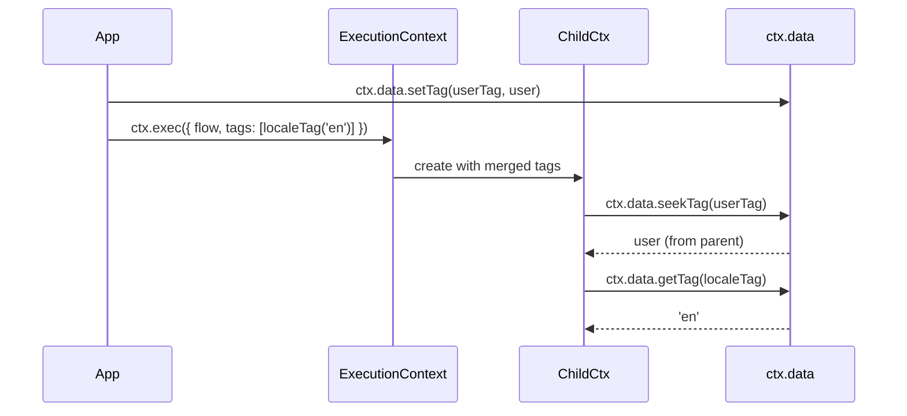

### Derived State (Select)

Subscribe to a slice of atom state with custom equality.

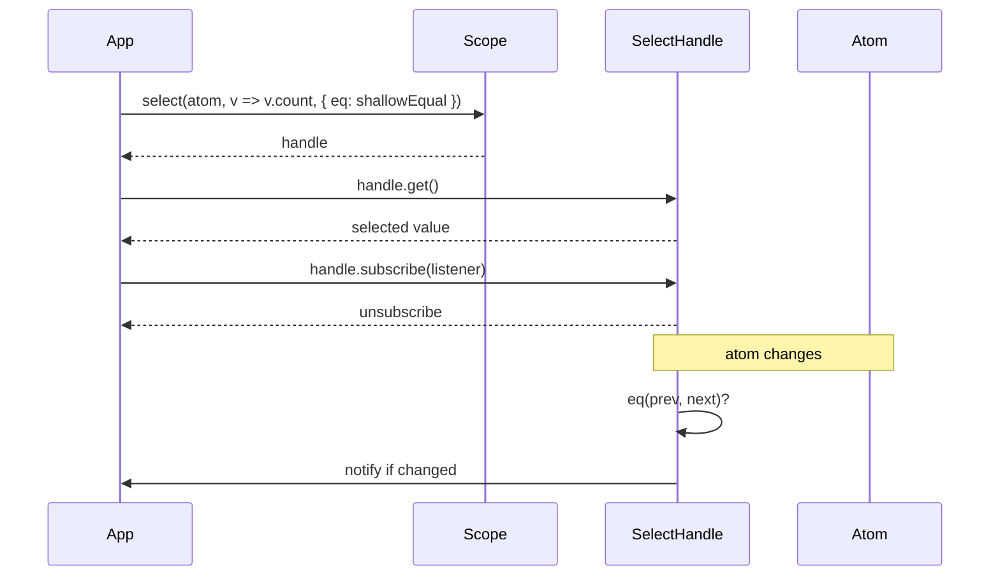

### Service Pattern

Constrain atom methods to ExecutionContext-first signature for tracing/auth.

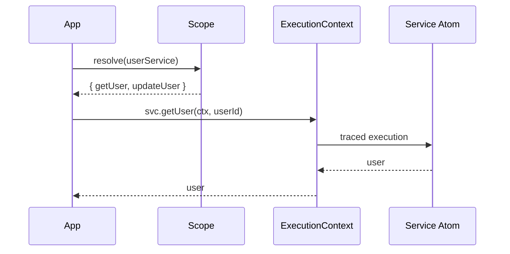

### Typed Flow Input

Type flow input without runtime parsing overhead.

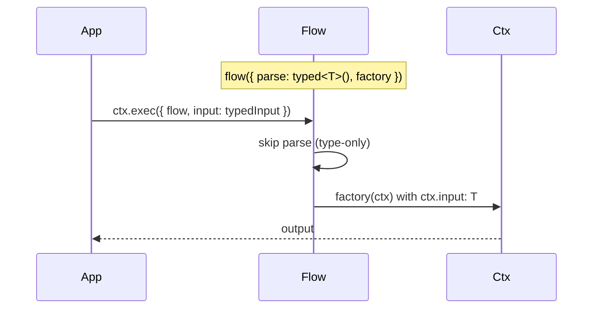

### Controller as Dependency

Receive reactive handle instead of resolved value in atom/flow deps.

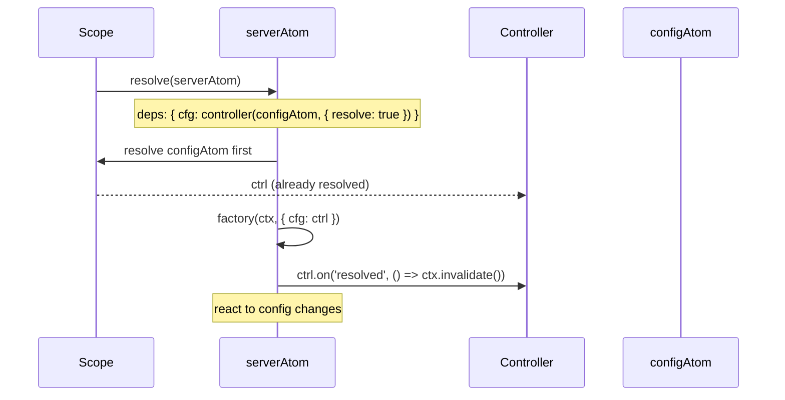

### Inline Function Execution

Execute ad-hoc logic within context without defining a flow.

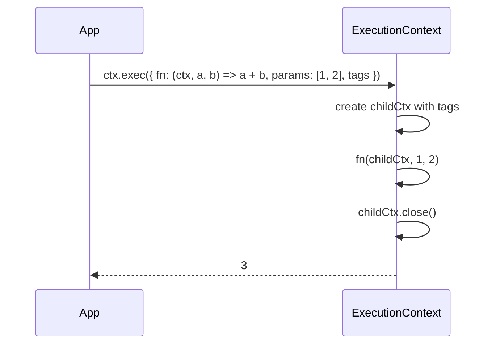

### Atom Retention (GC)

Control when atoms are garbage collected or kept alive indefinitely.

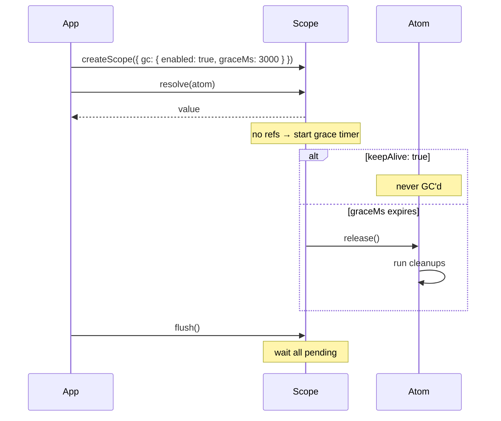
