# Patterns

Usage patterns as sequences. For API details, see `packages/lite/dist/index.d.mts`.

## Boundary Ownership Checklist

Use this checklist before adding helpers around the graph.

| Boundary | Owns | Guard |
|----------|------|-------|
| Scope seam | `createScope({ presets, tags, extensions })` at composition and test boundaries | Product helpers should not accept `scope`; graph work enters through atoms, flows, resources, tags, controllers, and `ctx.exec` |
| Test radius | inside-out tests preset a unit's direct deps; outside-in tests preset only edge adapters | No module mocks, no global stubs above raw transport wrappers, no internal reaches, no test-only product branches |
| transport atom | Raw ambient IO such as network, clock, storage, random, and process APIs | Transport-owned tests may fake the platform API below the seam |
| capability atom | Domain/application operations built on transport atom deps | Capability atoms stay ambient-free and are presettable at a wider radius |
| feature atom | User-facing state, derived data, and application decisions | Feature atoms depend on capability atom ports, not raw transports plus auth/session/token plumbing |
| composition root | Scope, root execution context, providers, route/job mounting, and disposal | Keep it thin and tested; do not hide flows behind facade objects or shared preconfigured scope factories |
| public docs | Architectural claims, inventories, run commands, and implemented slices | Strong claims need structural guards, and counts must be derived or explicitly scoped |

## A. Fundamental Usage

### Request Lifecycle

Model a request boundary with cleanup and shared context.

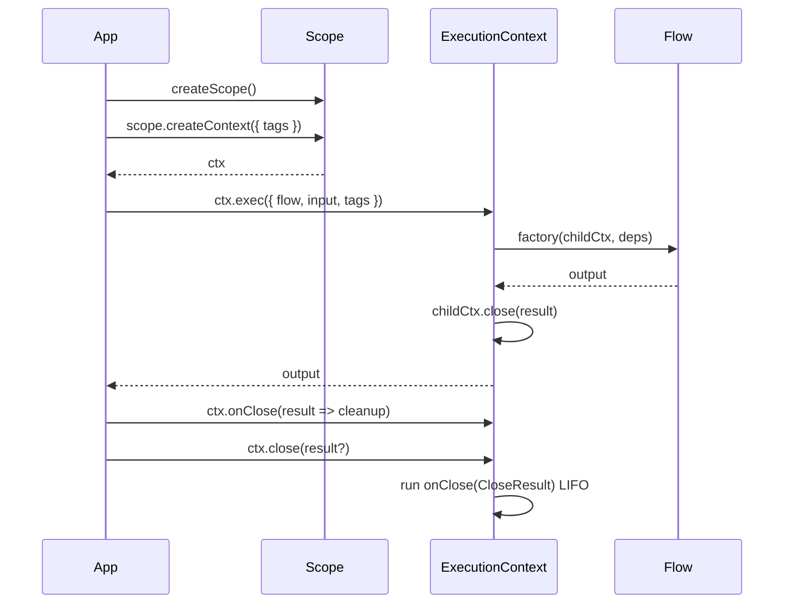
```mermaid
sequenceDiagram
    participant App
    participant Scope
    participant Ctx as ExecutionContext
    participant Flow

    App->>Scope: createScope()
    App->>Scope: scope.createContext({ tags })
    Scope-->>App: ctx

    App->>Ctx: ctx.exec({ flow, input, tags })
    Ctx->>Flow: factory(childCtx, deps)
    Flow-->>Ctx: output
    Ctx->>Ctx: childCtx.close(result)
    Ctx-->>App: output

    App->>Ctx: ctx.onClose(result => cleanup)
    App->>Ctx: ctx.close(result?)
    Ctx->>Ctx: run onClose(CloseResult) LIFO
```

### Extensions Pipeline

Observe and wrap atoms/flows — logging, auth, tracing, transaction boundaries. Extensions register `onClose(CloseResult)` to finalize based on success or failure.

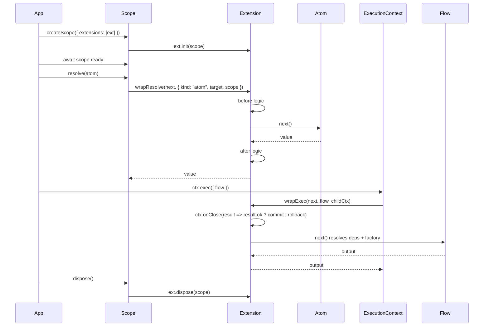
```mermaid
sequenceDiagram
    participant App
    participant Scope
    participant Ext as Extension
    participant Atom
    participant Ctx as ExecutionContext
    participant Flow

    App->>Scope: createScope({ extensions: [ext] })
    Scope->>Ext: ext.init(scope)
    App->>Scope: await scope.ready

    App->>Scope: resolve(atom)
    Scope->>Ext: wrapResolve(next, { kind: "atom", target, scope })
    Ext->>Ext: before logic
    Ext->>Atom: next()
    Atom-->>Ext: value
    Ext->>Ext: after logic
    Ext-->>Scope: value

    App->>Ctx: ctx.exec({ flow })
    Ctx->>Ext: wrapExec(next, flow, childCtx)
    Ext->>Ext: ctx.onClose(result => result.ok ? commit : rollback)
    Ext->>Flow: next() resolves deps + factory
    Flow-->>Ext: output
    Ext-->>Ctx: output

    App->>Scope: dispose()
    Scope->>Ext: ext.dispose(scope)
```

### Scoped Isolation + Testing

Swap implementations and isolate tenants/tests.

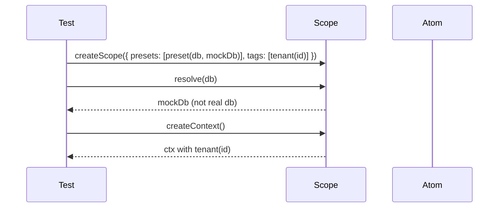
```mermaid
sequenceDiagram
    participant Test
    participant Scope
    participant Atom

    Test->>Scope: createScope({ presets: [preset(db, mockDb)], tags: [tenant(id)] })
    Test->>Scope: resolve(db)
    Scope-->>Test: mockDb (not real db)

    Test->>Scope: createContext()
    Scope-->>Test: ctx with tenant(id)
```

### Execution-Scoped Resource

Resolve resource values from an `ExecutionContext` when the value should live below the scope. Use the default `ownership: "boundary"` when a child execution should share the nearest boundary-owned value. Use `ownership: "current"` when a flow/action or explicit context boundary should own a fresh value that `ctx.exec()` children can reuse but sibling executions and nested explicit boundaries cannot.

```ts
import { createScope, resource } from "@pumped-fn/lite"

const events: string[] = []

const tx = resource({
  name: "tx",
  ownership: "current",
  factory: (ctx) => {
    const tx = {
      commit: async () => {
        events.push("commit")
      },
      rollback: async () => {
        events.push("rollback")
      },
      release: async () => {
        events.push("release")
      },
    }

    ctx.onClose((result) => result.ok ? tx.commit() : tx.rollback())
    ctx.cleanup(() => tx.release())
    return tx
  },
})

const scope = createScope()
const ctx = scope.createContext()
await ctx.resolve(tx)
await ctx.close({ ok: true })

if (events.join(",") !== "commit,release") throw new Error("expected commit then release")

events.length = 0
const failed = scope.createContext()
await failed.resolve(tx)
await failed.close({ ok: false, error: new Error("failed") })

if (events.join(",") !== "rollback,release") throw new Error("expected rollback then release")

await scope.dispose()
```

Resource state is not stored in `ctx.data`. `ctx.data` is for tags and user data. Boundary-owned resources keep the current behavior: child misses create on the surrounding execution boundary. Current-owned resources create on the current execution boundary and do not cross into a parent explicit boundary. Child executions can read ancestor-owned resources, but they do not release them.

> **`ctx.release(tx)` vs `ctx.close()`**: `ctx.release(tx)` runs only the resource's `ctx.cleanup` handlers (owner-local reset for mid-request recycle), but `onClose` handlers registered by that resource still fire when `ctx.close()` is eventually called. Do not follow `ctx.release(tx)` with `ctx.close()` if the resource registered an `onClose` side effect (e.g., commit) — the released resource will be committed again. Use `ctx.release` only when you need a fresh resource instance within the same open context and the `onClose` side effect is safe to run regardless.

### Resource Controller Dependency

Use `controller(resource)` when a resource should decide whether or when to load another resource. Use `watch: true` only in resource deps, never in atom or flow deps.

```ts
import { controller, resource } from "@pumped-fn/lite"

const config = resource({
  factory: () => ({ namespace: "app", version: 1 }),
})

const cache = resource({
  deps: {
    config: controller(config, {
      resolve: true,
      watch: true,
      eq: (a, b) => a.namespace === b.namespace && a.version === b.version,
    }),
  },
  factory: (_ctx, { config }) => {
    const cfg = config.get()
    return new Map<string, unknown>([["namespace", cfg.namespace]])
  },
})
```

## B. Advanced Client/State Usage

### Controller Reactivity

Client-side state with lifecycle hooks and invalidation.

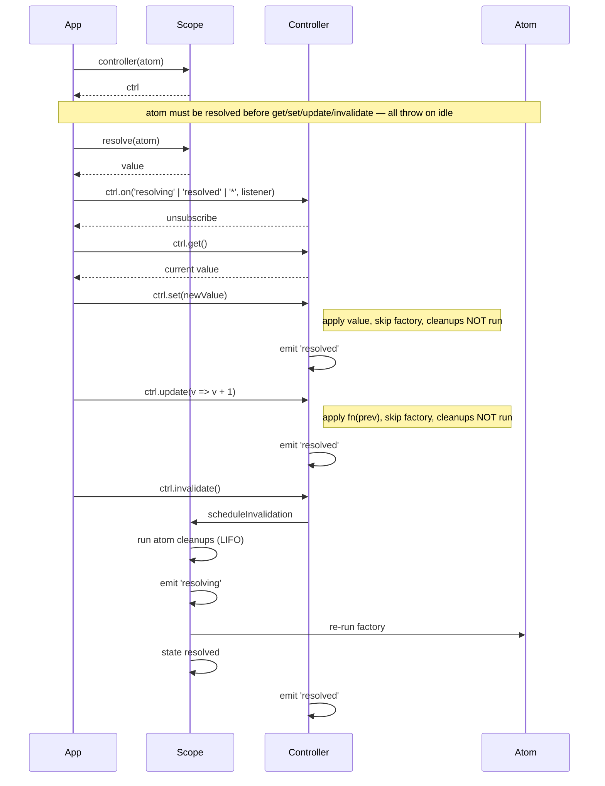
```mermaid
sequenceDiagram
    participant App
    participant Scope
    participant Ctrl as Controller
    participant Atom

    App->>Scope: controller(atom)
    Scope-->>App: ctrl

    Note over App,Atom: atom must be resolved before get/set/update/invalidate — all throw on idle
    App->>Scope: resolve(atom)
    Scope-->>App: value

    App->>Ctrl: ctrl.on('resolving' | 'resolved' | '*', listener)
    Ctrl-->>App: unsubscribe

    App->>Ctrl: ctrl.get()
    Ctrl-->>App: current value

    App->>Ctrl: ctrl.set(newValue)
    Note right of Ctrl: apply value, skip factory, cleanups NOT run
    Ctrl->>Ctrl: emit 'resolved'

    App->>Ctrl: ctrl.update(v => v + 1)
    Note right of Ctrl: apply fn(prev), skip factory, cleanups NOT run
    Ctrl->>Ctrl: emit 'resolved'

    App->>Ctrl: ctrl.invalidate()
    Ctrl->>Scope: scheduleInvalidation
    Scope->>Scope: run atom cleanups (LIFO)
    Scope->>Scope: emit 'resolving'
    Scope->>Atom: re-run factory
    Scope->>Scope: state resolved
    Ctrl->>Ctrl: emit 'resolved'
```

### Ambient Context (Tags)

Propagate values without wiring parameters. Tags serve two roles: scope-level config (consumed by atoms via `tags.required()`) and per-context ambient data (requestId, locale). Use `tags.required()` in deps to declare that an atom or flow needs an ambient value (e.g., a transacted connection) — extensions or context setup provide the value, the consumer just depends on it.

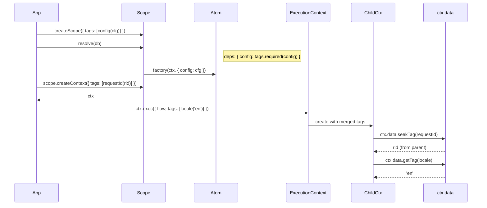
```mermaid
sequenceDiagram
    participant App
    participant Scope
    participant Atom
    participant Ctx as ExecutionContext
    participant ChildCtx
    participant Data as ctx.data

    App->>Scope: createScope({ tags: [config(cfg)] })
    App->>Scope: resolve(db)
    Note right of Atom: deps: { config: tags.required(config) }
    Scope->>Atom: factory(ctx, { config: cfg })

    App->>Scope: scope.createContext({ tags: [requestId(rid)] })
    Scope-->>App: ctx

    App->>Ctx: ctx.exec({ flow, tags: [locale('en')] })
    Ctx->>ChildCtx: create with merged tags

    ChildCtx->>Data: ctx.data.seekTag(requestId)
    Data-->>ChildCtx: rid (from parent)

    ChildCtx->>Data: ctx.data.getTag(locale)
    Data-->>ChildCtx: 'en'
```

### Derived State (Select)

Subscribe to a slice of atom state with custom equality.

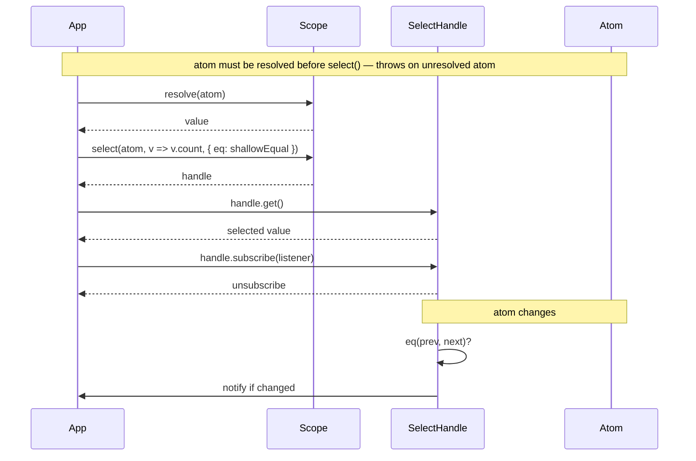
```mermaid
sequenceDiagram
    participant App
    participant Scope
    participant Handle as SelectHandle
    participant Atom

    Note over App,Atom: atom must be resolved before select() — throws on unresolved atom
    App->>Scope: resolve(atom)
    Scope-->>App: value

    App->>Scope: select(atom, v => v.count, { eq: shallowEqual })
    Scope-->>App: handle

    App->>Handle: handle.get()
    Handle-->>App: selected value

    App->>Handle: handle.subscribe(listener)
    Handle-->>App: unsubscribe

    Note over Atom,Handle: atom changes
    Handle->>Handle: eq(prev, next)?
    Handle->>App: notify if changed
```

### Service Pattern

Constrain atom methods to ExecutionContext-first signature. Always invoke via `ctx.exec` so a child context is created — extensions can observe the call, and cleanup is scoped.

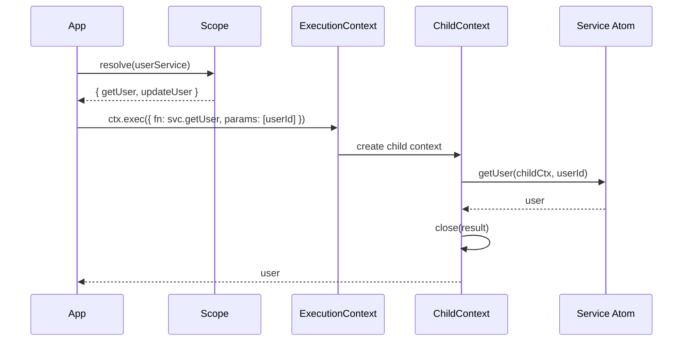
```mermaid
sequenceDiagram
    participant App
    participant Scope
    participant Ctx as ExecutionContext
    participant Child as ChildContext
    participant Svc as Service Atom

    App->>Scope: resolve(userService)
    Scope-->>App: { getUser, updateUser }

    App->>Ctx: ctx.exec({ fn: svc.getUser, params: [userId] })
    Ctx->>Child: create child context
    Child->>Svc: getUser(childCtx, userId)
    Svc-->>Child: user
    Child->>Child: close(result)
    Child-->>App: user
```

### Typed Flow Input

Type flow input without runtime parsing overhead.

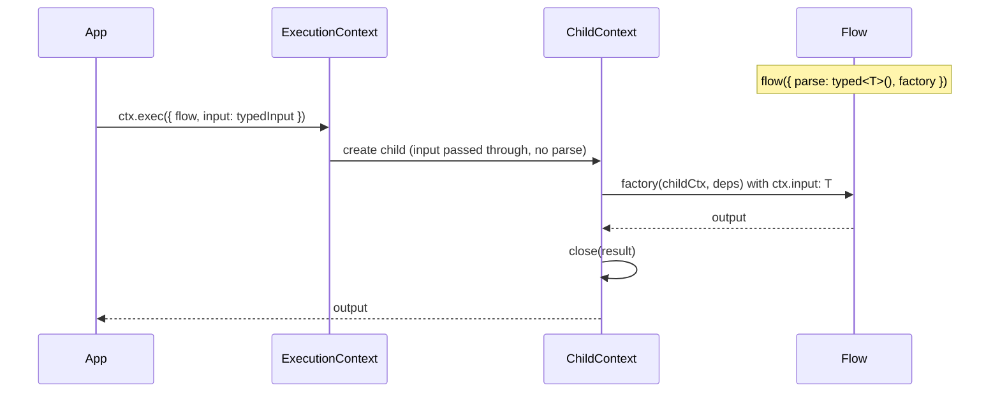
```mermaid
sequenceDiagram
    participant App
    participant Ctx as ExecutionContext
    participant Child as ChildContext
    participant Flow

    Note over Flow: flow({ parse: typed<T>(), factory })
    App->>Ctx: ctx.exec({ flow, input: typedInput })
    Ctx->>Child: create child (input passed through, no parse)
    Child->>Flow: factory(childCtx, deps) with ctx.input: T
    Flow-->>Child: output
    Child->>Child: close(result)
    Child-->>App: output
```

### Controller as Dependency

Receive a reactive handle instead of the resolved value in atom deps. Use `resolve: true` to pre-resolve before the factory runs. Add `watch: true` (atom deps only) to auto-invalidate the parent when the dep value changes — replaces manual `ctx.cleanup(ctx.scope.on('resolved', dep, () => ctx.invalidate()))`.

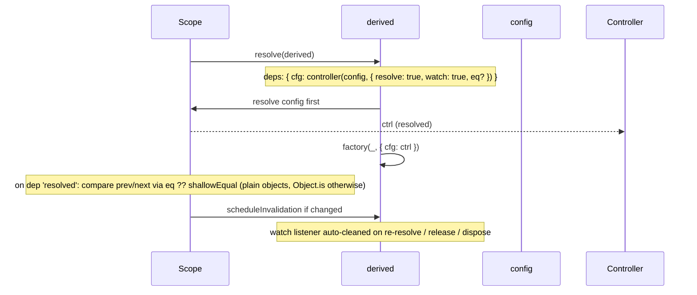
```mermaid
sequenceDiagram
    participant Scope
    participant Parent as derived
    participant Dep as config
    participant Ctrl as Controller

    Scope->>Parent: resolve(derived)
    Note over Parent: deps: { cfg: controller(config, { resolve: true, watch: true, eq? }) }
    Parent->>Scope: resolve config first
    Scope-->>Ctrl: ctrl (resolved)
    Parent->>Parent: factory(_, { cfg: ctrl })
    Note over Scope: on dep 'resolved': compare prev/next via eq ?? shallowEqual (plain objects, Object.is otherwise)
    Scope->>Parent: scheduleInvalidation if changed
    Note over Parent: watch listener auto-cleaned on re-resolve / release / dispose
```

### Inline Function Execution

Execute ad-hoc logic within context without defining a flow.

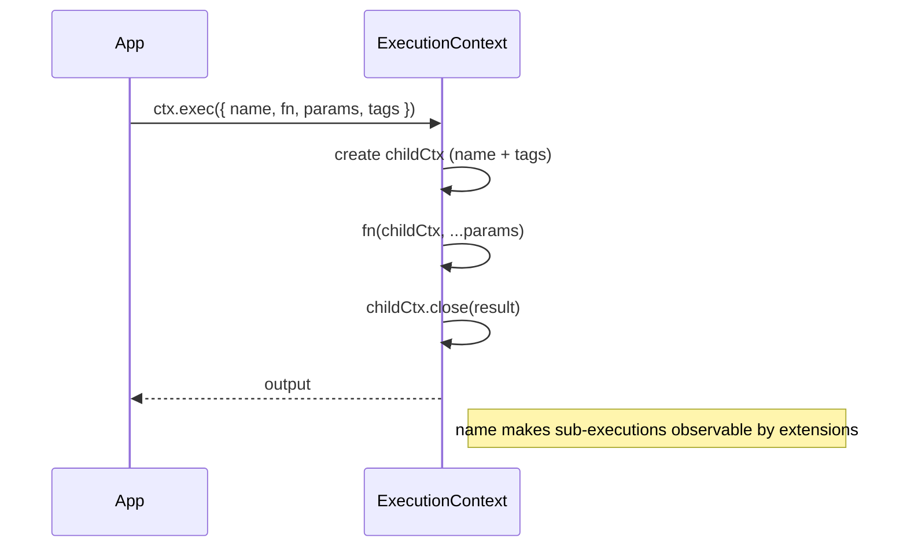
```mermaid
sequenceDiagram
    participant App
    participant Ctx as ExecutionContext

    App->>Ctx: ctx.exec({ name, fn, params, tags })
    Ctx->>Ctx: create childCtx (name + tags)
    Ctx->>Ctx: fn(childCtx, ...params)
    Ctx->>Ctx: childCtx.close(result)
    Ctx-->>App: output
    Note right of Ctx: name makes sub-executions observable by extensions
```

### Atom Retention (GC)

Control when atoms are garbage collected or kept alive indefinitely.

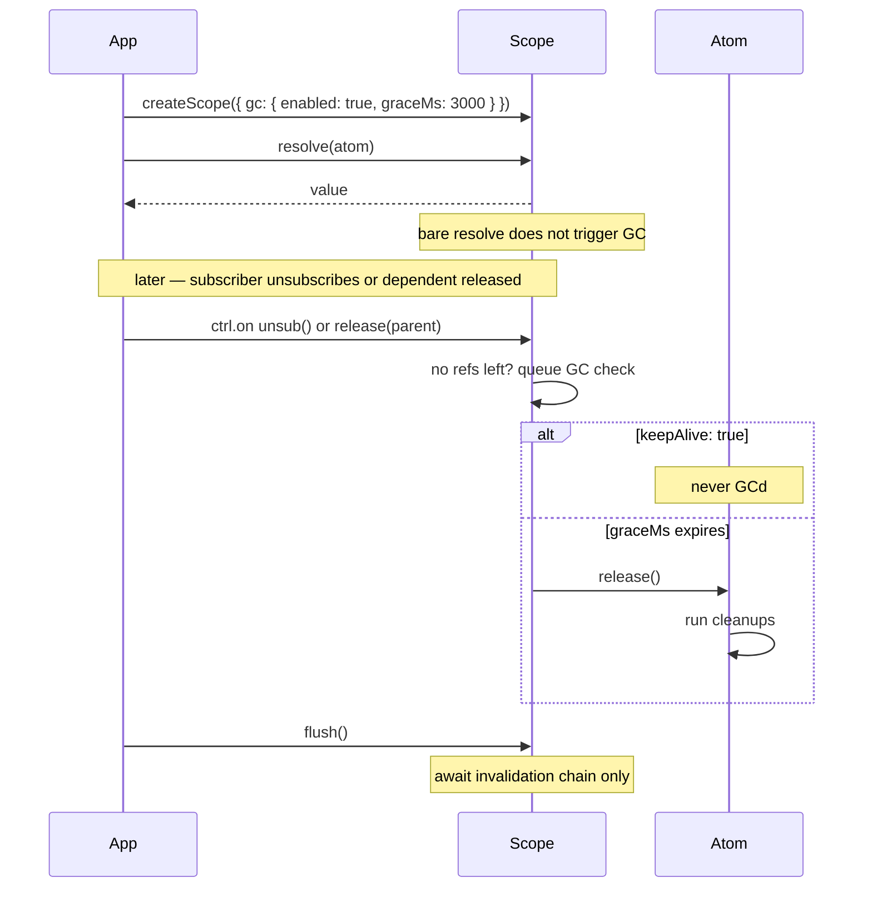
```mermaid
sequenceDiagram
    participant App
    participant Scope
    participant Atom

    App->>Scope: createScope({ gc: { enabled: true, graceMs: 3000 } })

    App->>Scope: resolve(atom)
    Scope-->>App: value
    Note over Scope: bare resolve does not trigger GC

    Note over App,Scope: later — subscriber unsubscribes or dependent released
    App->>Scope: ctrl.on unsub() or release(parent)
    Scope->>Scope: no refs left? queue GC check

    alt keepAlive: true
        Note over Atom: never GCd
    else graceMs expires
        Scope->>Atom: release()
        Atom->>Atom: run cleanups
    end

    App->>Scope: flush()
    Note over Scope: await invalidation chain only
```

## Golden Examples

Runnable examples live in `examples/lite-golden`. They cover import-time singletons, ambient request tags, preset substitution, lifecycle cleanup, transaction resources, watch-based derived state, extensions, request-scoped resources, tenant scopes, and a service health monitor capstone.

Frontend and BFF examples live in `examples/lite-golden-react` and `examples/lite-golden-bff`. The
tiered comparison in `examples/lite-golden-react/capstone` shows logic moving across backend, BFF, and
React tiers while tests keep the same scope seam. Some spectrum slices are intentionally backlog, and the
comparison docs scope implemented claims to the slices that exist.

The golden examples use the same boundary vocabulary as the package docs. React bootstrap files are
adapter/composition roots tested through real `ScopeProvider`/`ExecutionContextProvider` wiring, and
observers execute graph work through `useExecutionContext` instead of accepting `scope` or hand-rolling
`createContext`/`close` wrappers. Backend and BFF entry points keep route/job work behind flows or
`ctx.exec`, own root execution lifecycle at the composition root, and dispose scopes explicitly. Raw IO is
kept in transport atoms or composition-root adapters; capability atoms depend on transports and remain
presettable; feature atoms depend on capabilities. Public example claims are guarded by structural tests
for ambient IO, test substitution, provider wiring, route boundaries, and derived inventories.

Backend golden:

```bash
pnpm -F @pumped-fn/lite-golden test
pnpm -F @pumped-fn/lite-golden typecheck
```

React golden:

```bash
pnpm -F @pumped-fn/lite-golden-react test
pnpm -F @pumped-fn/lite-golden-react typecheck
```

BFF golden:

```bash
pnpm -F @pumped-fn/lite-golden-bff test
pnpm -F @pumped-fn/lite-golden-bff typecheck
```
