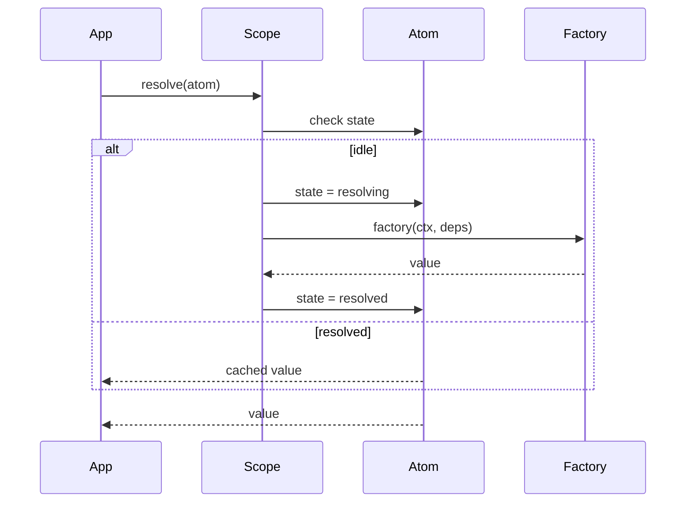
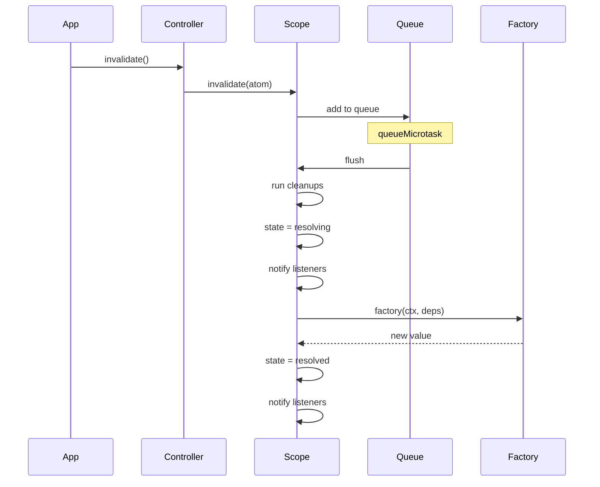

# @pumped-fn/lite

Lightweight dependency injection with minimal reactivity for TypeScript.

## Features

- **Atoms** - Long-lived dependencies with caching and cleanup
- **Flows** - Short-lived request/response execution
- **Tags** - Contextual metadata for request-scoped data
- **Controllers** - Deferred resolution with state subscriptions
- **Zero dependencies** - No external runtime dependencies

## Install

```bash
npm install @pumped-fn/lite
```

## Quick Start

```typescript
import { atom, flow, createScope, controller, tag, tags } from '@pumped-fn/lite'

// Define atoms (long-lived dependencies)
const configAtom = atom({
  factory: () => ({ apiUrl: 'https://api.example.com' })
})

const apiClientAtom = atom({
  deps: { config: configAtom },
  factory: (ctx, { config }) => {
    const client = createApiClient(config.apiUrl)
    ctx.cleanup(() => client.close())
    return client
  }
})

// Define flows (request handlers)
const getUserFlow = flow({
  deps: { api: apiClientAtom },
  factory: async (ctx, { api }) => {
    const userId = ctx.input as string
    return api.getUser(userId)
  }
})

// Create scope and use
const scope = await createScope()
const user = await scope.createContext().exec({
  flow: getUserFlow,
  input: 'user-123'
})
```

## Lifecycle



## Invalidation & Reactivity



## Controller Pattern

Use controllers for deferred resolution and reactive subscriptions:

```typescript
const expensiveAtom = atom({
  factory: async () => {
    const data = await fetchExpensiveData()
    return data
  }
})

const consumerAtom = atom({
  deps: { expensive: controller(expensiveAtom) },
  factory: async (ctx, { expensive }) => {
    // Subscribe to changes
    expensive.on(() => {
      console.log('expensive atom changed, new state:', expensive.state)
    })

    // Resolve when needed
    const data = await expensive.resolve()
    return process(data)
  }
})
```

## Self-Invalidation

Atoms can schedule their own re-resolution:

```typescript
const pollingAtom = atom({
  factory: async (ctx) => {
    const data = await fetchData()

    // Re-fetch every 60 seconds
    const timer = setTimeout(() => ctx.invalidate(), 60000)
    ctx.cleanup(() => clearTimeout(timer))

    return data
  }
})
```

## Tags (Request-Scoped Data)

```typescript
const requestIdTag = tag<string>({ label: 'requestId' })
const userIdTag = tag<string>({ label: 'userId' })

const auditFlow = flow({
  deps: {
    requestId: tags.required(requestIdTag),
    userId: tags.optional(userIdTag)
  },
  factory: (ctx, { requestId, userId }) => {
    return { requestId, userId: userId ?? 'anonymous' }
  }
})

// Execute with tags
const ctx = scope.createContext()
await ctx.exec({
  flow: auditFlow,
  input: null,
  tags: [requestIdTag('req-123'), userIdTag('user-456')]
})
```

## Extensions

Add cross-cutting concerns:

```typescript
const loggingExtension: Lite.Extension = {
  name: 'logging',
  wrapResolve: async (next, atom) => {
    console.log('resolving...')
    const result = await next()
    console.log('resolved')
    return result
  }
}

const scope = await createScope({
  extensions: [loggingExtension]
})
```

## API

| Function | Description |
|----------|-------------|
| `createScope(options?)` | Create DI container |
| `atom(config)` | Define long-lived dependency |
| `flow(config)` | Define request handler |
| `tag(config)` | Define metadata tag |
| `controller(atom)` | Create controller dependency |
| `preset(atom, value)` | Override atom value |

## License

MIT
