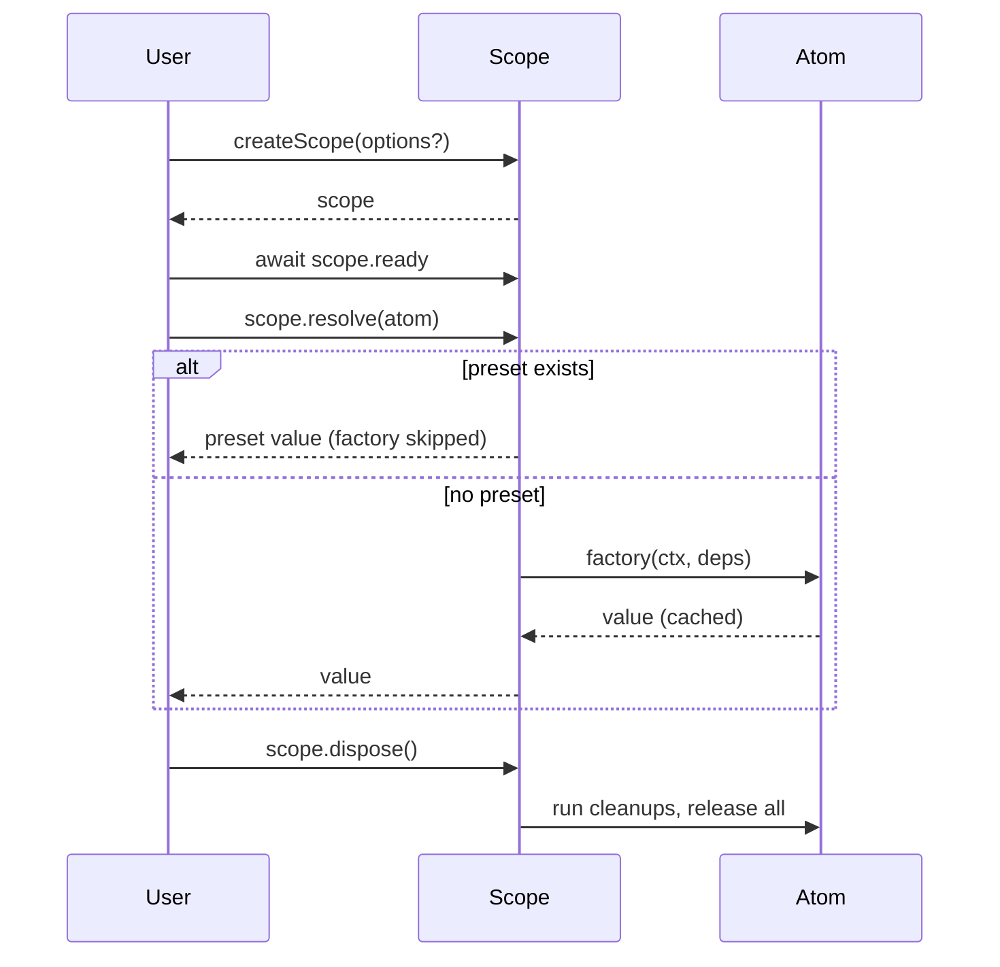
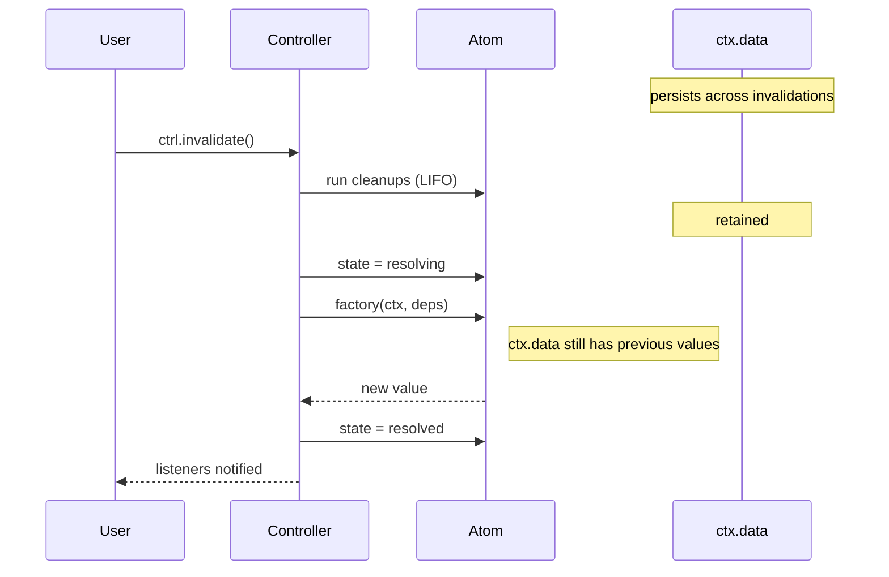
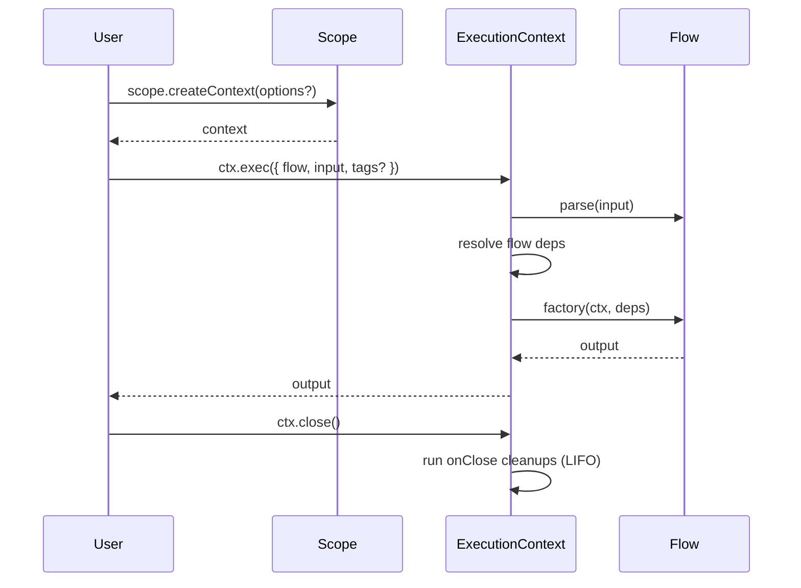
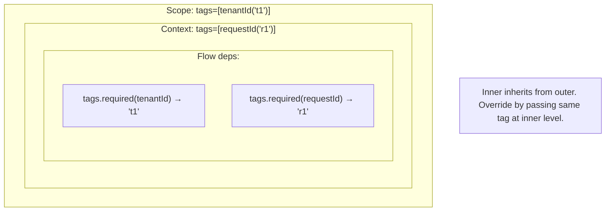
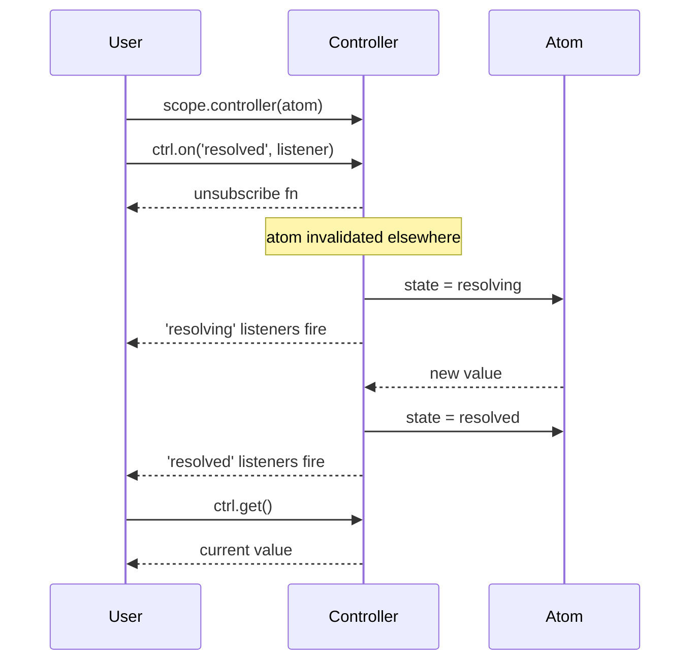

# @pumped-fn/lite

A lightweight effect system for TypeScript with managed lifecycles and minimal reactivity.

**Zero dependencies** · **<17KB bundle** · **Full TypeScript support**

## How It Works



## Invalidation & Data Retention



## Flow Execution



## Tag Inheritance



## Controller Reactivity



## Primitives

### Scope

Entry point. Manages atom lifecycles, caching, and cleanup orchestration.

- `createScope(options?)` — create with optional extensions, presets, tags
- `scope.ready` — wait for extension initialization
- `scope.resolve(atom)` — resolve and cache
- `scope.controller(atom)` — get reactive handle
- `scope.release(atom)` — run cleanups, remove from cache
- `scope.dispose()` — release all, cleanup extensions
- `scope.createContext(options?)` — create execution context for flows
- `scope.select(atom, selector)` — fine-grained reactivity
- `scope.flush()` — wait for pending invalidations

### Atom

Long-lived cached dependency with lifecycle.

- Dependencies on other atoms via `deps`
- `ctx.cleanup(fn)` — runs on invalidate and release (LIFO order)
- `ctx.invalidate()` — schedule re-resolution
- `ctx.data` — storage that survives invalidation (cleared on release)
- `ctx.data.getOrSetTag(tag, defaultValue)` — initialize and retrieve in one call

### Flow

Short-lived operation with input/output.

- `parse` — validate/transform input before factory (throws `ParseError` on failure)
- `typed<T>()` — type marker without runtime parsing
- Dependencies on atoms via `deps`
- `ctx.input` — typed input access
- `ctx.onClose(fn)` — cleanup when context closes
- `ctx.exec({ flow, rawInput })` — pass unknown input when flow has `parse`

### Tag

Contextual value passed through execution without explicit wiring.

- `tag({ label, default?, parse? })` — define with optional default and validation
- `tags.required(tag)` — dependency that throws if missing
- `tags.optional(tag)` — dependency that returns undefined if missing
- `tags.all(tag)` — collects all values from inheritance chain
- Tags inherit: Scope → Context → exec call

### Controller

Reactive handle for observing and controlling atom state.

- `ctrl.state` — sync access: `'idle' | 'resolving' | 'resolved' | 'failed'`
- `ctrl.get()` — sync value access (throws if not resolved, returns stale during resolving)
- `ctrl.resolve()` — async resolution
- `ctrl.invalidate()` — trigger re-resolution (runs factory)
- `ctrl.set(value)` — replace value directly (skips factory)
- `ctrl.update(fn)` — transform value: `fn(currentValue) → newValue` (skips factory)
- `ctrl.on(event, listener)` — subscribe to `'resolved' | 'resolving' | '*'`
- Use `controller(atom)` in deps for reactive dependency (unresolved, you control timing)
- Use `controller(atom, { resolve: true })` to auto-resolve before passing to factory
- Use `scope.controller(atom, { resolve: true })` for same behavior outside deps

### Preset

Value injection for testing. Bypasses factory entirely.

- `preset(atom, value)` — inject direct value
- `preset(atom, otherAtom)` — redirect to another atom's factory
- Pass via `createScope({ presets: [...] })`

### Extension

AOP-style middleware for cross-cutting concerns.

- `init(scope)` — setup when scope created
- `wrapResolve(next, atom, scope)` — intercept atom resolution
- `wrapExec(next, target, ctx)` — intercept flow execution
- `dispose(scope)` — cleanup when scope disposed
- Pass via `createScope({ extensions: [...] })`

## Full API

See [`dist/index.d.mts`](./dist/index.d.mts) for complete type definitions.

All types available under the `Lite` namespace:

```typescript
import type { Lite } from '@pumped-fn/lite'
```

## Edge Cases

### Controller.set() / update()

| State | Behavior |
|-------|----------|
| `idle` | Throws "Atom not resolved" |
| `resolving` | Queues, applies after resolution completes |
| `resolved` | Queues normally |
| `failed` | Throws the stored error |

Both run cleanups before applying the new value.

### ContextData.getTag()

`ctx.data.getTag(tag)` always returns `T | undefined` (Map-like semantics). Use `getOrSetTag(tag)` when you need the tag's default value.

```typescript
const countTag = tag<number>({ label: 'count', default: 0 })

ctx.data.getTag(countTag)       // undefined (not stored)
ctx.data.getOrSetTag(countTag)  // 0 (uses default, now stored)
ctx.data.getTag(countTag)       // 0 (now stored)
```

### Hierarchical Data Lookup with seek()

Each execution context has isolated data, but `seekTag()` traverses the parent chain:

```typescript
const requestIdTag = tag<string>({ label: 'requestId' })

const middleware = flow({
  factory: async (ctx) => {
    ctx.data.setTag(requestIdTag, 'req-123')
    return ctx.exec({ flow: handler })
  }
})

const handler = flow({
  factory: (ctx) => {
    // seekTag() finds value from parent context
    const reqId = ctx.data.seekTag(requestIdTag)  // 'req-123'
  }
})
```

| Method | Scope | Use Case |
|--------|-------|----------|
| `getTag(tag)` | Local only | Per-exec isolated data |
| `seekTag(tag)` | Local → parent → root | Cross-cutting concerns |
| `setTag(tag, v)` | Local only | Always writes to current context |

## License

MIT
