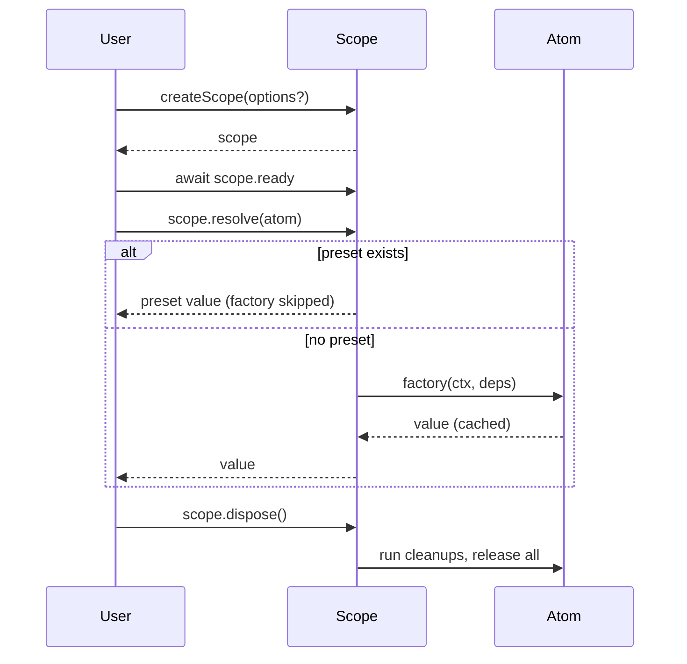
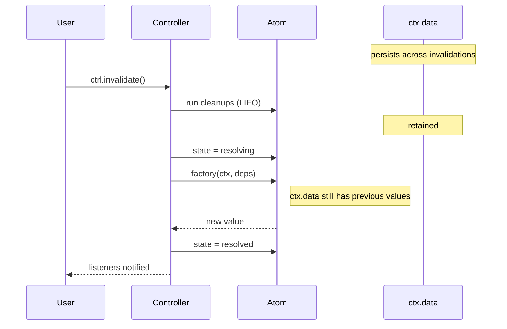
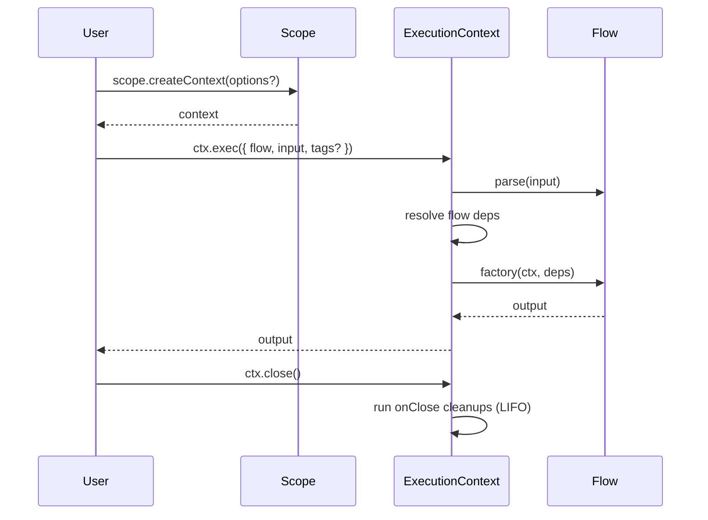
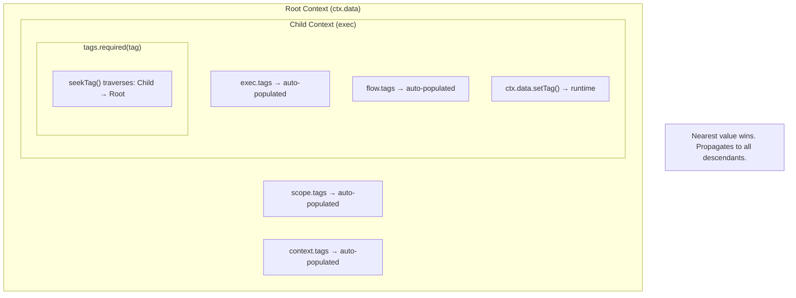
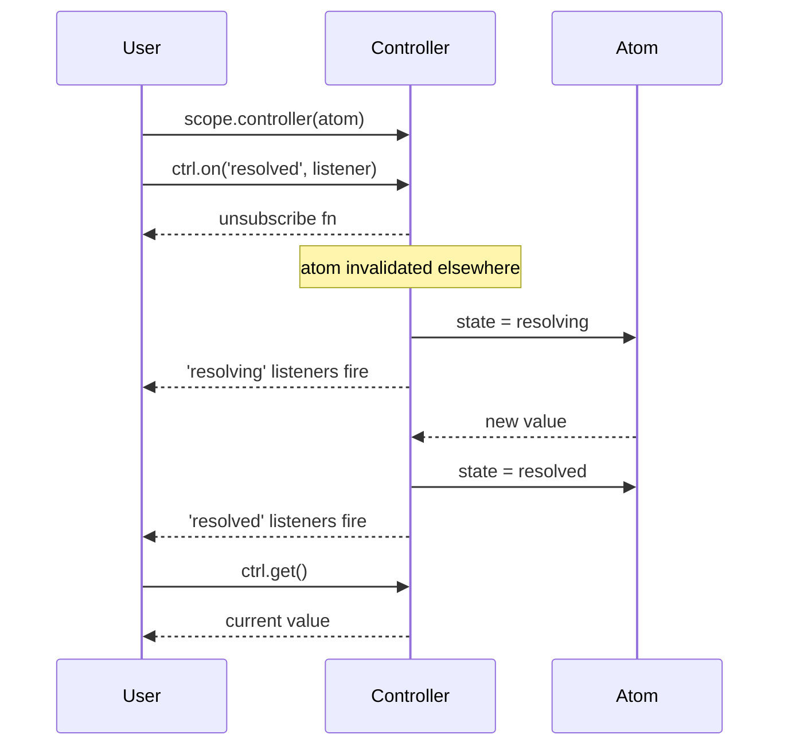
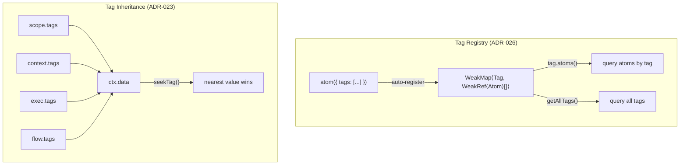
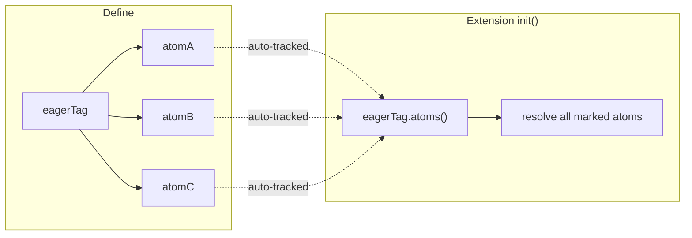
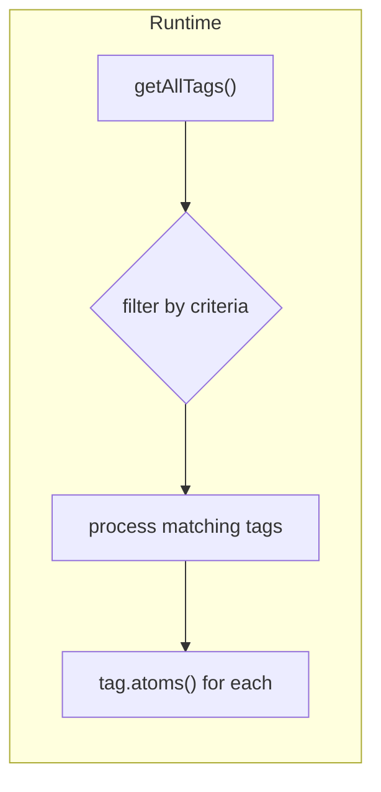
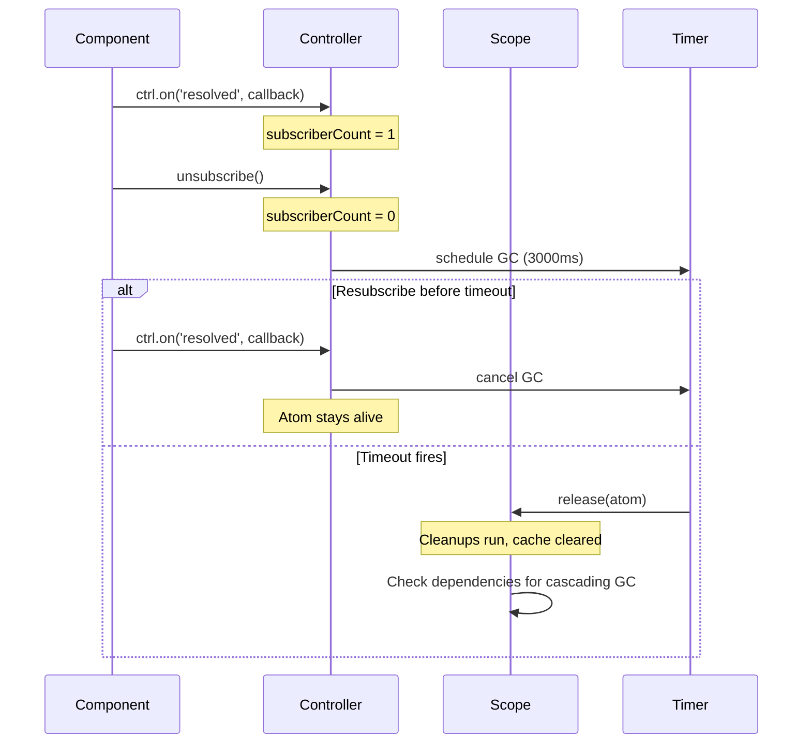

# @pumped-fn/lite

A lightweight effect system for TypeScript with managed lifecycles and minimal reactivity.

**Zero dependencies** · **<17KB bundle** · **Full TypeScript support**

## Documentation

| Resource | Purpose |
|----------|---------|
| [PATTERNS.md](./PATTERNS.md) | Architecture patterns, flow design, deps resolution, cleanup strategies |
| [dist/index.d.mts](./dist/index.d.mts) | API reference with TSDoc |

## How It Works



## Invalidation & Data Retention



## Flow Execution



## Tag Inheritance (ADR-023)

Tags are auto-populated into `ctx.data` and resolved via `seekTag()`:



## Controller Reactivity



## Primitives

### Scope

Entry point. Manages atom lifecycles, caching, and cleanup orchestration.

- `createScope(options?)` — create with optional extensions, presets, tags
- `scope.ready` — wait for extension initialization
- `scope.resolve(atom)` — resolve and cache
- `scope.controller(atom)` — get reactive handle
- `scope.release(atom)` — run cleanups, remove from cache
- `scope.dispose()` — release all, cleanup extensions
- `scope.createContext(options?)` — create execution context for flows
- `scope.select(atom, selector)` — fine-grained reactivity
- `scope.flush()` — wait for pending invalidations

### Atom

Long-lived cached dependency with lifecycle.

- Dependencies on other atoms via `deps`
- `ctx.cleanup(fn)` — runs on invalidate and release (LIFO order)
- `ctx.invalidate()` — schedule re-resolution
- `ctx.data` — storage that survives invalidation (cleared on release)
- `ctx.data.getOrSetTag(tag, defaultValue)` — initialize and retrieve in one call

### Flow

Short-lived operation with input/output.

- `parse` — validate/transform input before factory (throws `ParseError` on failure)
- `typed<T>()` — type marker without runtime parsing
- Dependencies on atoms via `deps`
- `ctx.input` — typed input access
- `ctx.onClose(fn)` — cleanup when context closes
- `ctx.exec({ flow, rawInput })` — pass unknown input when flow has `parse`

### Tag

Contextual value passed through execution without explicit wiring.

- Hierarchical lookup via `seekTag()` (ADR-023)
- Auto-populates into `ctx.data`: scope → context → exec → flow
- Registry tracks atom↔tag relationships (ADR-026)



Memory: `WeakRef` allows GC of unused atoms/tags. Cleanup on query.

### Controller

Reactive handle for observing and controlling atom state.

- `ctrl.state` — sync access: `'idle' | 'resolving' | 'resolved' | 'failed'`
- `ctrl.get()` — sync value access (throws if not resolved, returns stale during resolving)
- `ctrl.resolve()` — async resolution
- `ctrl.invalidate()` — trigger re-resolution (runs factory)
- `ctrl.set(value)` — replace value directly (skips factory)
- `ctrl.update(fn)` — transform value: `fn(currentValue) → newValue` (skips factory)
- `ctrl.on(event, listener)` — subscribe to `'resolved' | 'resolving' | '*'`
- Use `controller(atom)` in deps for reactive dependency (unresolved, you control timing)
- Use `controller(atom, { resolve: true })` to auto-resolve before passing to factory
- Use `scope.controller(atom, { resolve: true })` for same behavior outside deps

### Preset

Value injection for testing. Bypasses factory entirely.

- `preset(atom, value)` — inject direct value
- `preset(atom, otherAtom)` — redirect to another atom's factory
- Pass via `createScope({ presets: [...] })`

### Extension

AOP-style middleware for cross-cutting concerns.

- `init(scope)` — setup when scope created
- `wrapResolve(next, atom, scope)` — intercept atom resolution
- `wrapExec(next, target, ctx)` — intercept flow execution
- `dispose(scope)` — cleanup when scope disposed
- Pass via `createScope({ extensions: [...] })`

## Patterns

### Eager Resolution via Tag Registry

Use tags to mark atoms for eager resolution without hardcoding atom references:



### Extension Discovery via getAllTags()

Extensions can discover and process all tags at runtime:



Use cases: metrics collection, debugging, documentation generation.

## Types

All types available under the `Lite` namespace:

```typescript
import type { Lite } from '@pumped-fn/lite'
```

## Edge Cases

### Controller.set() / update()

| State | Behavior |
|-------|----------|
| `idle` | Throws "Atom not resolved" |
| `resolving` | Queues, applies after resolution completes |
| `resolved` | Queues normally |
| `failed` | Throws the stored error |

Both run cleanups before applying the new value.

### ContextData.getTag()

`ctx.data.getTag(tag)` always returns `T | undefined` (Map-like semantics). Use `getOrSetTag(tag)` when you need the tag's default value.

```typescript
const countTag = tag<number>({ label: 'count', default: 0 })

ctx.data.getTag(countTag)       // undefined (not stored)
ctx.data.getOrSetTag(countTag)  // 0 (uses default, now stored)
ctx.data.getTag(countTag)       // 0 (now stored)
```

### Hierarchical Data Lookup with seekTag() (ADR-023)

Tag dependencies (`tags.required()`, `tags.optional()`, `tags.all()`) use `seekTag()` internally to traverse the ExecutionContext parent chain. Tags from all sources are auto-populated into `ctx.data`:

```typescript
const requestIdTag = tag<string>({ label: 'requestId' })

const middleware = flow({
  factory: async (ctx) => {
    ctx.data.setTag(requestIdTag, 'req-123')
    return ctx.exec({ flow: handler })
  }
})

const handler = flow({
  deps: { reqId: tags.required(requestIdTag) },
  factory: (ctx, { reqId }) => {
    // reqId === 'req-123' (found via seekTag from parent)
  }
})
```

| Method | Scope | Use Case |
|--------|-------|----------|
| `getTag(tag)` | Local only | Per-exec isolated data |
| `seekTag(tag)` | Local → parent → root | Cross-cutting concerns |
| `setTag(tag, v)` | Local only | Always writes to current context |
| `tags.required(tag)` | Uses `seekTag()` | Dependency injection |

### Resolution Timing

Tag dependencies resolve **once** at factory start. Direct `seekTag()` calls reflect runtime changes:

```typescript
const handler = flow({
  deps: { userId: tags.required(userIdTag) },
  factory: (ctx, { userId }) => {
    ctx.data.setTag(userIdTag, 'changed')

    console.log(userId)                      // Original (stable)
    console.log(ctx.data.seekTag(userIdTag)) // 'changed' (dynamic)
  }
})
```

| Access | Resolution | Runtime Changes |
|--------|------------|-----------------|
| `deps: { x: tags.required(tag) }` | Once at start | Stable snapshot |
| `ctx.data.seekTag(tag)` | Each call | Sees changes |

## Automatic Garbage Collection

Atoms are automatically released when they have no subscribers, preventing memory leaks in long-running applications.

### How It Works



### Configuration

```typescript
// Default: GC enabled with 3000ms grace period
const scope = createScope()

// Custom grace period (useful for tests)
const scope = createScope({
  gc: { graceMs: 100 }
})

// Disable GC entirely (preserves pre-1.11 behavior)
const scope = createScope({
  gc: { enabled: false }
})
```

### Opt-Out with keepAlive

Mark atoms that should never be automatically released:

```typescript
const configAtom = atom({
  factory: () => loadConfig(),
  keepAlive: true  // Never auto-released
})
```

### Cascading Dependency Protection

Dependencies are protected while dependents are mounted:

```
configAtom (keepAlive: true)
    ↑
dbAtom ←── userServiceAtom ←── [Component subscribes]
```

- `dbAtom` won't be GC'd while `userServiceAtom` is mounted
- When component unmounts, `userServiceAtom` is GC'd after grace period
- Then `dbAtom` becomes eligible for GC (no dependents)
- `configAtom` stays alive due to `keepAlive: true`

### React Strict Mode Compatibility

The 3000ms default grace period handles React's double-mount behavior:

```
Mount (render 1):     subscribe    → count=1
Unmount (cleanup 1):  unsubscribe  → count=0 → schedule GC
Mount (render 2):     subscribe    → count=1 → CANCEL GC
```

The second mount always happens before the GC timer fires.

### API Summary

| Option | Default | Description |
|--------|---------|-------------|
| `gc.enabled` | `true` | Enable/disable automatic GC |
| `gc.graceMs` | `3000` | Delay before releasing (ms) |
| `atom.keepAlive` | `false` | Prevent auto-release for specific atoms |

## License

MIT
