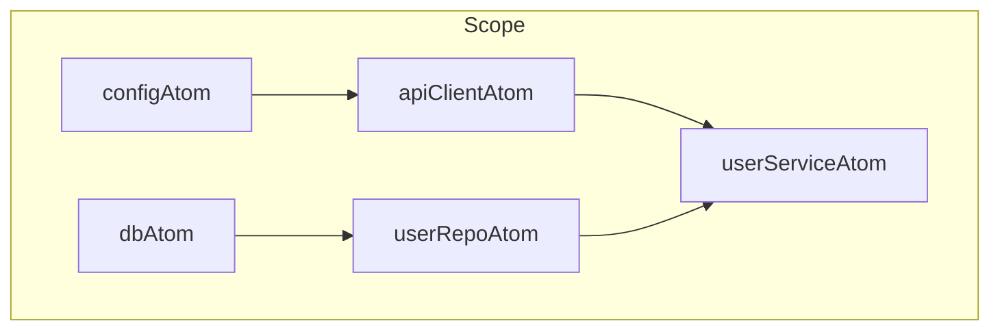
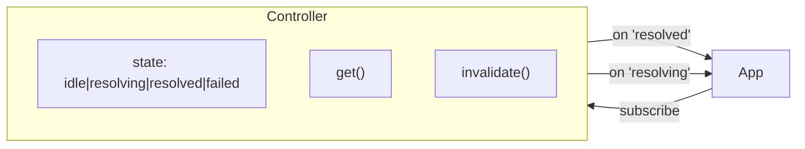
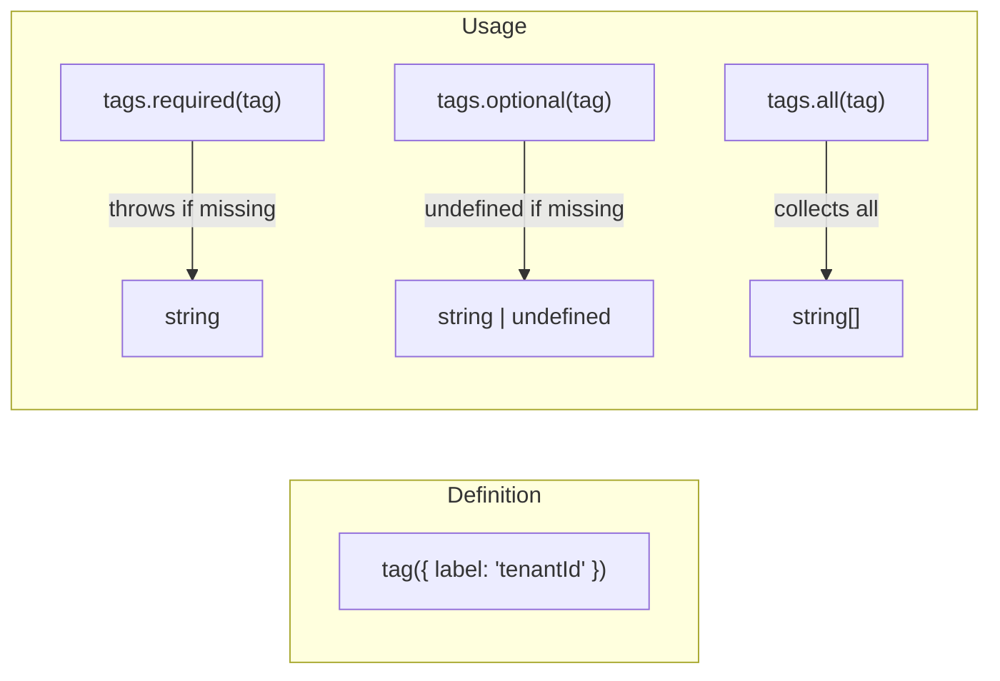
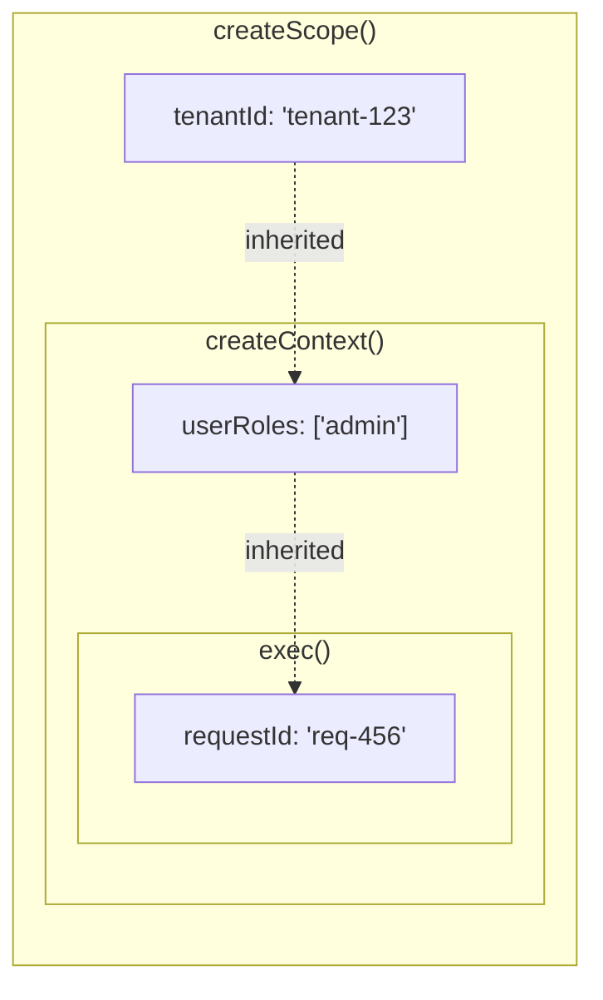
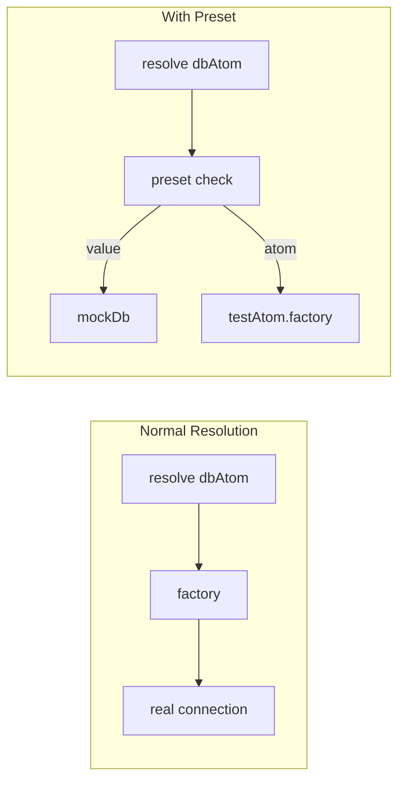
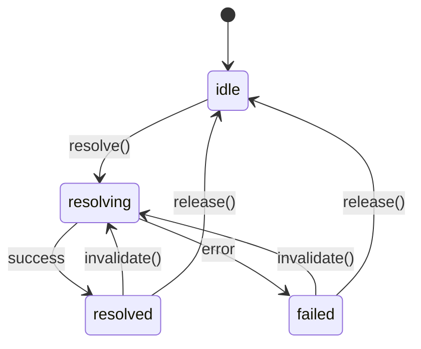

# @pumped-fn/lite

A lightweight effect system for TypeScript with managed lifecycles and minimal reactivity.

**Zero dependencies** · **<17KB bundle** · **Full TypeScript support**

## What is an Effect System?

An effect system manages **how** and **when** computations run, handling:
- **Resource lifecycle** - acquire, use, release
- **Computation ordering** - what depends on what
- **Side effect isolation** - controlled execution boundaries
- **State transitions** - idle → resolving → resolved → failed

## Installation

```bash
npm install @pumped-fn/lite
# or
pnpm add @pumped-fn/lite
# or
yarn add @pumped-fn/lite
```

## Quick Start

```typescript
import { atom, flow, createScope, tag, tags, controller } from '@pumped-fn/lite'

// 1. Define atoms (long-lived, cached dependencies)
const configAtom = atom({
  factory: () => ({ apiUrl: 'https://api.example.com', timeout: 5000 })
})

const apiClientAtom = atom({
  deps: { config: configAtom },
  factory: (ctx, { config }) => {
    const client = new ApiClient(config.apiUrl, config.timeout)
    ctx.cleanup(() => client.disconnect())
    return client
  }
})

// 2. Define flows (short-lived request handlers)
const fetchUserFlow = flow({
  deps: { api: apiClientAtom },
  factory: async (ctx, { api }) => {
    const userId = ctx.input as string
    return api.getUser(userId)
  }
})

// 3. Create scope and execute
const scope = createScope()
await scope.ready

const context = scope.createContext()
const user = await context.exec({ flow: fetchUserFlow, input: 'user-123' })
await context.close()

// 4. Cleanup when done
await scope.dispose()
```

## Core Concepts

| Concept | Purpose |
|---------|---------|
| **Scope** | Long-lived boundary that manages atom lifecycles |
| **Atom** | A managed effect with lifecycle (create, cache, cleanup, recreate) |
| **Flow** | Template for short-lived operations with input/output |
| **ExecutionContext** | Short-lived context for running flows with input and tags |
| **Controller** | Handle for observing and controlling an atom's state |
| **Tag** | Contextual value passed through execution |

## Atoms

Atoms are long-lived dependencies that are cached within a scope.



### Basic Atom

```typescript
const dbAtom = atom({
  factory: async (ctx) => {
    const connection = await createConnection()
    ctx.cleanup(() => connection.close())
    return connection
  }
})
```

**`ctx.cleanup()` lifecycle:** Runs on every `invalidate()` (before re-resolution) and on `release()`. Cleanups execute in LIFO order. For resources that should survive invalidation, use `ctx.data` instead.

### Atom with Dependencies

```typescript
const userRepoAtom = atom({
  deps: { db: dbAtom },
  factory: (ctx, { db }) => new UserRepository(db)
})
```

### Self-Invalidating Atom

```typescript
const configAtom = atom({
  factory: async (ctx) => {
    const config = await fetchConfig()

    // Re-fetch every 60 seconds
    const interval = setInterval(() => ctx.invalidate(), 60_000)
    ctx.cleanup(() => clearInterval(interval))

    return config
  }
})
```

**`ctx.invalidate()` behavior:** Schedules re-resolution after the current factory completes — does not interrupt execution. Use `scope.flush()` in tests to wait for pending invalidations.

### Per-Atom Private Storage

Use `ctx.data` to store data that survives invalidation:

```typescript
const prevDataTag = tag<Data>({ label: 'prevData' })

const pollingAtom = atom({
  factory: async (ctx) => {
    const prev = ctx.data.get(prevDataTag)  // Data | undefined
    const current = await fetchData()

    if (prev && hasChanged(prev, current)) {
      notifyChanges(prev, current)
    }

    ctx.data.set(prevDataTag, current)
    setTimeout(() => ctx.invalidate(), 5000)
    return current
  }
})
```

With default values:

```typescript
const countTag = tag<number>({ label: 'count', default: 0 })

const counterAtom = atom({
  factory: (ctx) => {
    const count = ctx.data.get(countTag)  // number (guaranteed!)
    ctx.data.set(countTag, count + 1)
    return count
  }
})
```

Use `getOrSet()` to initialize and retrieve in one call:

```typescript
const cacheTag = tag<Map<string, Result>>({ label: 'cache' })

const cachedAtom = atom({
  factory: (ctx) => {
    const cache = ctx.data.getOrSet(cacheTag, new Map())
    return fetchWithCache(cache)
  }
})
```

**`ctx.data` lifecycle:**
- **Persists** across `invalidate()` cycles
- **Cleared** on `release()` or `scope.dispose()`
- Each atom has independent storage (same tag, different atoms = separate data)

## Flows

Flows are templates for short-lived operations with input validation.

```typescript
const createUserFlow = flow({
  name: 'createUser',
  parse: (raw) => {
    const obj = raw as Record<string, unknown>
    if (typeof obj.name !== 'string') throw new Error('name required')
    return { name: obj.name }
  },
  deps: { repo: userRepoAtom },
  factory: async (ctx, { repo }) => {
    return repo.create(ctx.input)  // ctx.input typed from parse
  }
})

// Execute
const context = scope.createContext()
const user = await context.exec({
  flow: createUserFlow,
  input: { name: 'Alice' }
})
await context.close()
```

Parse runs before factory. On failure, throws `ParseError`.

## Controllers

Controllers provide reactive access to atom state.



### Basic Usage

```typescript
const ctrl = scope.controller(configAtom)

ctrl.state              // 'idle' | 'resolving' | 'resolved' | 'failed'
ctrl.get()              // value (throws if not resolved)
await ctrl.resolve()    // resolve and wait
ctrl.invalidate()       // trigger re-resolution
```

**Stale reads:** During `'resolving'` state, `ctrl.get()` returns the previous value. This enables optimistic UI patterns.

### Subscribing to Changes

```typescript
ctrl.on('resolved', () => console.log('Updated:', ctrl.get()))
ctrl.on('resolving', () => console.log('Refreshing...'))
ctrl.on('*', () => console.log('State:', ctrl.state))
```

### Controller as Dependency

Use `controller()` when you need reactive access to an atom's state, not just its value.

**Key difference:**
- Regular dep `{ x: atom }` — auto-resolved, you receive the value
- Controller dep `{ x: controller(atom) }` — **unresolved**, you receive a reactive handle

```typescript
const appAtom = atom({
  deps: { config: controller(configAtom) },
  factory: async (ctx, { config }) => {
    await config.resolve()  // Must resolve manually

    // Subscribe to upstream changes
    const unsub = config.on('resolved', () => ctx.invalidate())
    ctx.cleanup(unsub)

    return new App(config.get())
  }
})
```

**When to use:** React to upstream invalidations, conditional/lazy resolution, access atom state.

### Fine-Grained Reactivity

Use `select()` to subscribe only when a derived value changes:

```typescript
const portSelect = scope.select(configAtom, (c) => c.port)
portSelect.subscribe(() => console.log('Port changed:', portSelect.get()))
```

## Tags

Tags pass contextual values through execution without explicit wiring.



### Creating Tags

```typescript
const tenantIdTag = tag<string>({ label: 'tenantId' })
const userRolesTag = tag<string[]>({ label: 'userRoles', default: [] })

// With parse validation
const userId = tag({
  label: 'userId',
  parse: (raw) => {
    if (typeof raw !== 'string') throw new Error('Must be string')
    return raw
  }
})

userId('abc-123')  // OK
userId(123)        // Throws ParseError
```

### Using Tags as Dependencies

```typescript
// Required - throws if not found
const tenantAtom = atom({
  deps: { tenantId: tags.required(tenantIdTag) },
  factory: (ctx, { tenantId }) => loadTenantData(tenantId)
})

// Optional - undefined if not found
const optionalAtom = atom({
  deps: { tenantId: tags.optional(tenantIdTag) },
  factory: (ctx, { tenantId }) => {
    if (tenantId) {
      return loadTenantData(tenantId)
    }
    return loadDefaultData()
  }
})

// Collect all - returns array of all matching tags
const multiAtom = atom({
  deps: { roles: tags.all(userRolesTag) },
  factory: (ctx, { roles }) => roles.flat()  // string[][]
})
```

### Passing Tags

Tags can be passed at different levels, with inner levels inheriting from outer:



All three tag levels are available during flow execution.

## Presets

Presets inject or redirect atom values, useful for testing.



**Value injection** bypasses the factory entirely:
```typescript
const scope = createScope({
  presets: [preset(dbAtom, mockDb)]
})
```

**Atom redirection** uses another atom's factory:
```typescript
const scope = createScope({
  presets: [preset(configAtom, testConfigAtom)]
})
```

## Extensions

Extensions wrap atom resolution and flow execution (AOP-style middleware).

```typescript
const timingExtension: Lite.Extension = {
  name: 'timing',
  wrapResolve: async (next, atom, scope) => {
    const start = performance.now()
    const result = await next()
    console.log(`Resolved in ${performance.now() - start}ms`)
    return result
  }
}

const scope = createScope({ extensions: [timingExtension] })
```

Interface: `{ name, init?, wrapResolve?, wrapExec?, dispose? }`

## Lifecycle



**Invalidation sequence:**
1. `invalidate()` → queued (microtask batched)
2. Cleanups run (LIFO)
3. State = resolving → factory()
4. State = resolved → listeners notified

## API Reference

### Factory Functions

| Function | Description |
|----------|-------------|
| `createScope(options?)` | Create DI container (returns Scope with `ready` promise) |
| `atom(config)` | Define long-lived cached dependency |
| `flow(config)` | Define short-lived operation template (optional `name`, `parse`) |
| `tag(config)` | Define contextual value (optional `parse` for validation) |
| `controller(atom)` | Create controller dependency helper |
| `preset(atom, value)` | Create value injection preset |

### Scope Methods

| Method | Description |
|--------|-------------|
| `scope.ready` | Promise that resolves when extensions are initialized |
| `scope.resolve(atom)` | Resolve atom and return cached value |
| `scope.controller(atom)` | Get Controller for atom |
| `scope.select(atom, selector, options?)` | Create fine-grained subscription |
| `scope.release(atom)` | Release atom (run cleanups, remove from cache) |
| `scope.dispose()` | Dispose scope (release all atoms, cleanup extensions) |
| `scope.createContext(options?)` | Create ExecutionContext for flows |
| `scope.on(event, atom, listener)` | Subscribe to atom state changes |
| `scope.flush()` | Wait for pending invalidation queue to process |

### Controller Methods

| Method | Description |
|--------|-------------|
| `ctrl.state` | Current state: `'idle'` \| `'resolving'` \| `'resolved'` \| `'failed'` |
| `ctrl.get()` | Get resolved value (throws if not resolved) |
| `ctrl.resolve()` | Resolve and return value |
| `ctrl.release()` | Release atom |
| `ctrl.invalidate()` | Trigger re-resolution |
| `ctrl.on(event, listener)` | Subscribe: `'resolved'` \| `'resolving'` \| `'*'` |

### ExecutionContext Methods

| Method | Description |
|--------|-------------|
| `ctx.input` | Current execution input |
| `ctx.scope` | Parent scope |
| `ctx.exec(options)` | Execute flow or function |
| `ctx.onClose(fn)` | Register cleanup for context close |
| `ctx.close()` | Close context and run cleanups |

### ResolveContext Methods

| Method | Description |
|--------|-------------|
| `ctx.cleanup(fn)` | Register cleanup for atom invalidation/release |
| `ctx.invalidate()` | Schedule self-invalidation |
| `ctx.scope` | Parent scope |
| `ctx.data` | Per-atom DataStore (survives invalidation) |

### Type Guards

| Function | Description |
|----------|-------------|
| `isAtom(value)` | Check if value is Atom |
| `isFlow(value)` | Check if value is Flow |
| `isTag(value)` | Check if value is Tag |
| `isTagged(value)` | Check if value is Tagged |
| `isPreset(value)` | Check if value is Preset |
| `isControllerDep(value)` | Check if value is ControllerDep |

### Types

All types are available under the `Lite` namespace:

```typescript
import type { Lite } from '@pumped-fn/lite'

const myAtom: Lite.Atom<Config> = atom({ factory: () => loadConfig() })
const myController: Lite.Controller<Config> = scope.controller(myAtom)
const myTag: Lite.Tag<string> = tag({ label: 'myTag' })
```

## Design Principles

1. **Minimal API** - Every export is expensive to learn
2. **Zero dependencies** - No runtime dependencies
3. **Explicit lifecycle** - No magic, clear state transitions
4. **Composable** - Effects compose through deps
5. **Type-safe** - Full TypeScript inference

## License

MIT
