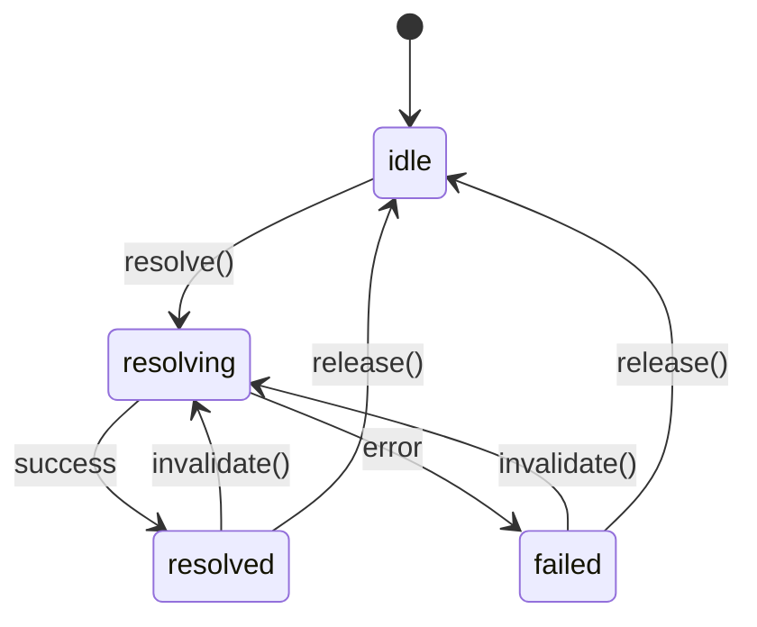
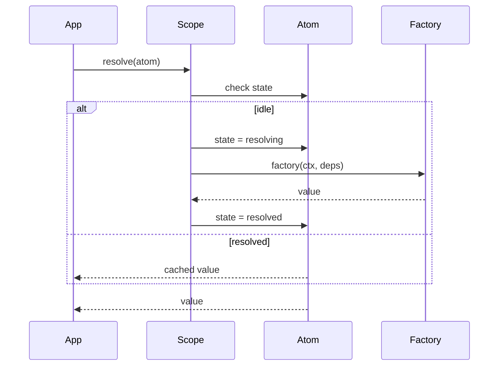

# @pumped-fn/lite

A lightweight effect system for TypeScript with managed lifecycles and minimal reactivity.

**Zero dependencies** · **<17KB bundle** · **Full TypeScript support**

## What is an Effect System?

An effect system manages **how** and **when** computations run, handling:
- **Resource lifecycle** - acquire, use, release
- **Computation ordering** - what depends on what
- **Side effect isolation** - controlled execution boundaries
- **State transitions** - idle → resolving → resolved → failed

## Installation

```bash
npm install @pumped-fn/lite
# or
pnpm add @pumped-fn/lite
# or
yarn add @pumped-fn/lite
```

## Quick Start

```typescript
import { atom, flow, createScope, tag, tags, controller } from '@pumped-fn/lite'

// 1. Define atoms (long-lived, cached dependencies)
const configAtom = atom({
  factory: () => ({ apiUrl: 'https://api.example.com', timeout: 5000 })
})

const apiClientAtom = atom({
  deps: { config: configAtom },
  factory: (ctx, { config }) => {
    const client = new ApiClient(config.apiUrl, config.timeout)
    ctx.cleanup(() => client.disconnect())
    return client
  }
})

// 2. Define flows (short-lived request handlers)
const fetchUserFlow = flow({
  deps: { api: apiClientAtom },
  factory: async (ctx, { api }) => {
    const userId = ctx.input as string
    return api.getUser(userId)
  }
})

// 3. Create scope and execute
const scope = createScope()
await scope.ready

const context = scope.createContext()
const user = await context.exec({ flow: fetchUserFlow, input: 'user-123' })
await context.close()

// 4. Cleanup when done
await scope.dispose()
```

## Core Concepts

```
┌─────────────────────────────────────────────────────────────┐
│                         Scope                               │
│  (long-lived execution boundary)                            │
│                                                             │
│   ┌─────────┐      ┌─────────┐      ┌─────────┐            │
│   │  Atom   │ ──── │  Atom   │ ──── │  Atom   │            │
│   │ (effect)│      │ (effect)│      │ (effect)│            │
│   └─────────┘      └─────────┘      └─────────┘            │
│        │                                  │                 │
│        └──────────────┬───────────────────┘                 │
│                       ▼                                     │
│   ┌─────────────────────────────────────────────────────┐   │
│   │              ExecutionContext                       │   │
│   │  (short-lived operation with input, tags, cleanup)  │   │
│   └─────────────────────────────────────────────────────┘   │
└─────────────────────────────────────────────────────────────┘
```

| Concept | Purpose |
|---------|---------|
| **Scope** | Long-lived boundary that manages atom lifecycles |
| **Atom** | A managed effect with lifecycle (create, cache, cleanup, recreate) |
| **Flow** | Template for short-lived operations with input/output |
| **ExecutionContext** | Short-lived context for running flows with input and tags |
| **Controller** | Handle for observing and controlling an atom's state |
| **Tag** | Contextual value passed through execution |

## Atoms

Atoms are long-lived dependencies that are cached within a scope.

### Basic Atom

```typescript
const dbAtom = atom({
  factory: async (ctx) => {
    const connection = await createConnection()
    ctx.cleanup(() => connection.close())
    return connection
  }
})
```

### Atom with Dependencies

```typescript
const userRepoAtom = atom({
  deps: { db: dbAtom },
  factory: (ctx, { db }) => new UserRepository(db)
})
```

### Self-Invalidating Atom

```typescript
const configAtom = atom({
  factory: async (ctx) => {
    const config = await fetchConfig()

    // Re-fetch every 60 seconds
    const interval = setInterval(() => ctx.invalidate(), 60_000)
    ctx.cleanup(() => clearInterval(interval))

    return config
  }
})
```

### Per-Atom Private Storage

Use `ctx.data` to store data that survives invalidation:

```typescript
const prevDataTag = tag<Data>({ label: 'prevData' })

const pollingAtom = atom({
  factory: async (ctx) => {
    const prev = ctx.data.get(prevDataTag)  // Data | undefined
    const current = await fetchData()

    if (prev && hasChanged(prev, current)) {
      notifyChanges(prev, current)
    }

    ctx.data.set(prevDataTag, current)
    setTimeout(() => ctx.invalidate(), 5000)
    return current
  }
})
```

With default values:

```typescript
const countTag = tag<number>({ label: 'count', default: 0 })

const counterAtom = atom({
  factory: (ctx) => {
    const count = ctx.data.get(countTag)  // number (guaranteed!)
    ctx.data.set(countTag, count + 1)
    return count
  }
})
```

## Flows

Flows are templates for short-lived operations.

### Basic Flow

```typescript
const createUserFlow = flow({
  deps: { repo: userRepoAtom },
  factory: async (ctx, { repo }) => {
    const input = ctx.input as CreateUserInput
    return repo.create(input)
  }
})
```

### Executing Flows

```typescript
const scope = createScope()
await scope.ready

const context = scope.createContext()

// Execute with input
const user = await context.exec({
  flow: createUserFlow,
  input: { name: 'Alice', email: 'alice@example.com' }
})

// Always close the context when done
await context.close()
```

### Flow with Tags

```typescript
const requestIdTag = tag<string>({ label: 'requestId' })

const loggingFlow = flow({
  deps: { requestId: tags.required(requestIdTag) },
  factory: (ctx, { requestId }) => {
    console.log(`[${requestId}] Processing request`)
    return processRequest(ctx.input)
  }
})

// Pass tags at execution time
const context = scope.createContext()
await context.exec({
  flow: loggingFlow,
  input: data,
  tags: [requestIdTag('req-abc-123')]
})
```

## Controllers

Controllers provide reactive access to atom state.

### Basic Usage

```typescript
const ctrl = scope.controller(configAtom)

// Access state
console.log(ctrl.state)  // 'idle' | 'resolving' | 'resolved' | 'failed'

// Get resolved value (throws if not resolved)
const config = ctrl.get()

// Resolve and wait
const config = await ctrl.resolve()

// Manual invalidation
ctrl.invalidate()
```

### Subscribing to Changes

```typescript
// Subscribe to specific events
ctrl.on('resolved', () => {
  console.log('Config updated:', ctrl.get())
})

ctrl.on('resolving', () => {
  console.log('Config is refreshing...')
})

// Subscribe to all state changes
ctrl.on('*', () => {
  console.log('State changed:', ctrl.state)
})
```

### Controller as Dependency

Use `controller()` to get a Controller instead of the resolved value:

```typescript
const appAtom = atom({
  deps: { config: controller(configAtom) },
  factory: (ctx, { config }) => {
    // Subscribe to config changes
    config.on('resolved', () => {
      console.log('Config updated, reinitializing...')
      ctx.invalidate()
    })

    return new App(config.get())
  }
})
```

### Fine-Grained Reactivity with select()

```typescript
const portSelect = scope.select(
  configAtom,
  (config) => config.port,
  { eq: (a, b) => a === b }  // Optional custom equality
)

portSelect.subscribe(() => {
  console.log('Port changed:', portSelect.get())
})
```

## Tags

Tags pass contextual values through execution without explicit wiring.

### Creating Tags

```typescript
const tenantIdTag = tag<string>({ label: 'tenantId' })
const userRolesTag = tag<string[]>({ label: 'userRoles', default: [] })
```

### Using Tags as Dependencies

```typescript
// Required - throws if not found
const tenantAtom = atom({
  deps: { tenantId: tags.required(tenantIdTag) },
  factory: (ctx, { tenantId }) => loadTenantData(tenantId)
})

// Optional - undefined if not found
const optionalAtom = atom({
  deps: { tenantId: tags.optional(tenantIdTag) },
  factory: (ctx, { tenantId }) => {
    if (tenantId) {
      return loadTenantData(tenantId)
    }
    return loadDefaultData()
  }
})

// Collect all - returns array of all matching tags
const multiAtom = atom({
  deps: { roles: tags.all(userRolesTag) },
  factory: (ctx, { roles }) => roles.flat()  // string[][]
})
```

### Passing Tags

```typescript
// At scope creation
const scope = createScope({
  tags: [tenantIdTag('tenant-123')]
})

// At context creation
const context = scope.createContext({
  tags: [userRolesTag(['admin', 'user'])]
})

// At execution time
await context.exec({
  flow: myFlow,
  input: data,
  tags: [requestIdTag('req-456')]
})
```

### Direct Tag Methods

```typescript
const tags = [tenantIdTag('tenant-123'), userRolesTag(['admin'])]

// Get (throws if not found for tags without default)
const tenantId = tenantIdTag.get(tags)

// Find (returns undefined if not found)
const roles = userRolesTag.find(tags)

// Collect all matching values
const allRoles = userRolesTag.collect(tags)
```

## Presets

Presets inject or redirect atom values, useful for testing.

### Value Injection

```typescript
const mockDb = { query: jest.fn() }

const scope = createScope({
  presets: [preset(dbAtom, mockDb)]
})

// resolves to mockDb without calling factory
const db = await scope.resolve(dbAtom)
```

### Atom Redirection

```typescript
const testConfigAtom = atom({
  factory: () => ({ apiUrl: 'http://localhost:3000' })
})

const scope = createScope({
  presets: [preset(configAtom, testConfigAtom)]
})

// resolves testConfigAtom instead of configAtom
const config = await scope.resolve(configAtom)
```

## Extensions

Extensions provide cross-cutting behavior via AOP-style hooks.

### Extension Interface

```typescript
interface Extension {
  readonly name: string
  init?(scope: Scope): MaybePromise<void>
  wrapResolve?<T>(next: () => Promise<T>, atom: Atom<T>, scope: Scope): Promise<T>
  wrapExec?<T>(next: () => Promise<T>, target: Flow | Function, ctx: ExecutionContext): Promise<T>
  dispose?(scope: Scope): MaybePromise<void>
}
```

### Example: Logging Extension

```typescript
const loggingExtension: Lite.Extension = {
  name: 'logging',

  init: (scope) => {
    console.log('Scope initialized')
  },

  wrapResolve: async (next, atom, scope) => {
    const start = performance.now()
    console.log('Resolving atom...')

    try {
      const result = await next()
      console.log(`Resolved in ${performance.now() - start}ms`)
      return result
    } catch (error) {
      console.error('Resolution failed:', error)
      throw error
    }
  },

  wrapExec: async (next, target, ctx) => {
    console.log('Executing:', 'flow' in target ? 'flow' : 'function')
    return next()
  },

  dispose: (scope) => {
    console.log('Scope disposed')
  }
}

const scope = createScope({ extensions: [loggingExtension] })
```

### Example: Metrics Extension

```typescript
const metricsExtension: Lite.Extension = {
  name: 'metrics',

  wrapResolve: async (next, atom, scope) => {
    const start = performance.now()
    try {
      const result = await next()
      metrics.recordResolution(atom, performance.now() - start, 'success')
      return result
    } catch (error) {
      metrics.recordResolution(atom, performance.now() - start, 'error')
      throw error
    }
  },

  wrapExec: async (next, target, ctx) => {
    const start = performance.now()
    try {
      const result = await next()
      metrics.recordExecution(target, performance.now() - start, 'success')
      return result
    } catch (error) {
      metrics.recordExecution(target, performance.now() - start, 'error')
      throw error
    }
  }
}
```

## Lifecycle

### Effect Lifecycle



### Resolution Flow



### Invalidation Flow


## API Reference

### Factory Functions

| Function | Description |
|----------|-------------|
| `createScope(options?)` | Create DI container (returns Scope with `ready` promise) |
| `atom(config)` | Define long-lived cached dependency |
| `flow(config)` | Define short-lived operation template |
| `tag(config)` | Define contextual value |
| `controller(atom)` | Create controller dependency helper |
| `preset(atom, value)` | Create value injection preset |

### Scope Methods

| Method | Description |
|--------|-------------|
| `scope.ready` | Promise that resolves when extensions are initialized |
| `scope.resolve(atom)` | Resolve atom and return cached value |
| `scope.controller(atom)` | Get Controller for atom |
| `scope.select(atom, selector, options?)` | Create fine-grained subscription |
| `scope.release(atom)` | Release atom (run cleanups, remove from cache) |
| `scope.dispose()` | Dispose scope (release all atoms, cleanup extensions) |
| `scope.createContext(options?)` | Create ExecutionContext for flows |
| `scope.on(event, atom, listener)` | Subscribe to atom state changes |

### Controller Methods

| Method | Description |
|--------|-------------|
| `ctrl.state` | Current state: `'idle'` \| `'resolving'` \| `'resolved'` \| `'failed'` |
| `ctrl.get()` | Get resolved value (throws if not resolved) |
| `ctrl.resolve()` | Resolve and return value |
| `ctrl.release()` | Release atom |
| `ctrl.invalidate()` | Trigger re-resolution |
| `ctrl.on(event, listener)` | Subscribe: `'resolved'` \| `'resolving'` \| `'*'` |

### ExecutionContext Methods

| Method | Description |
|--------|-------------|
| `ctx.input` | Current execution input |
| `ctx.scope` | Parent scope |
| `ctx.exec(options)` | Execute flow or function |
| `ctx.onClose(fn)` | Register cleanup for context close |
| `ctx.close()` | Close context and run cleanups |

### ResolveContext Methods

| Method | Description |
|--------|-------------|
| `ctx.cleanup(fn)` | Register cleanup for atom invalidation/release |
| `ctx.invalidate()` | Schedule self-invalidation |
| `ctx.scope` | Parent scope |
| `ctx.data` | Per-atom DataStore (survives invalidation) |

### Type Guards

| Function | Description |
|----------|-------------|
| `isAtom(value)` | Check if value is Atom |
| `isFlow(value)` | Check if value is Flow |
| `isTag(value)` | Check if value is Tag |
| `isTagged(value)` | Check if value is Tagged |
| `isPreset(value)` | Check if value is Preset |
| `isControllerDep(value)` | Check if value is ControllerDep |

### Types

All types are available under the `Lite` namespace:

```typescript
import type { Lite } from '@pumped-fn/lite'

const myAtom: Lite.Atom<Config> = atom({ factory: () => loadConfig() })
const myController: Lite.Controller<Config> = scope.controller(myAtom)
const myTag: Lite.Tag<string> = tag({ label: 'myTag' })
```

## Comparison with @pumped-fn/core-next

| Feature | @pumped-fn/lite | @pumped-fn/core-next |
|---------|-----------------|----------------------|
| Atoms/Executors | `atom()` | `provide()`, `derive()` |
| Flows | `flow()` | `flow()` |
| Tags | `tag()`, `tags.*` | `tag()`, `tags.*` |
| Extensions | Simple 4-hook interface | Full lifecycle hooks |
| Schema validation | No | StandardSchema |
| Journaling | No | Yes |
| Multi-executor pools | No | `multi()` |
| Enhanced Promise | No | `Promised` class |
| Error classes | Simple Error | Rich hierarchy |
| Controller reactivity | ✅ Built-in | No |
| Self-invalidation | ✅ Built-in | No |
| Fine-grained select() | ✅ Built-in | No |
| Bundle size | <17KB | ~75KB |

**Choose `@pumped-fn/lite` when:**
- Bundle size matters
- You need built-in reactivity (Controller pattern)
- You want a minimal API surface
- Schema validation can be done manually

**Choose `@pumped-fn/core-next` when:**
- You need StandardSchema validation
- You need multi-executor pools
- You need journaling/debugging features
- You need rich error context

## Design Principles

1. **Minimal API** - Every export is expensive to learn
2. **Zero dependencies** - No runtime dependencies
3. **Explicit lifecycle** - No magic, clear state transitions
4. **Composable** - Effects compose through deps
5. **Type-safe** - Full TypeScript inference

## License

MIT
