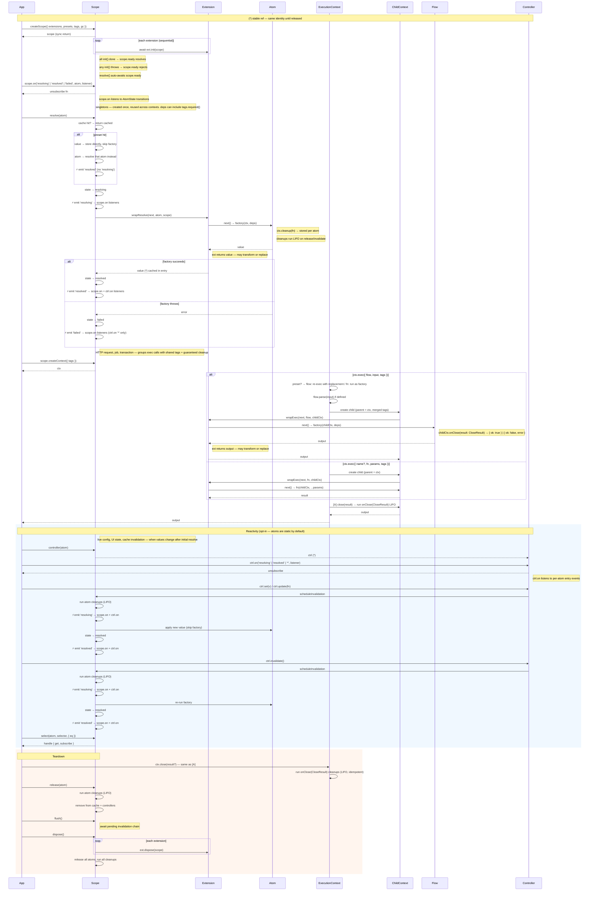

# @pumped-fn/lite

**Scoped Ambient State** for TypeScript — a scope-local atom graph with explicit dependencies and opt-in reactivity.

State lives in the scope, not in the component tree. Handlers and components observe — they don't own or construct dependencies. The same graph works across React, server handlers, background jobs, and tests.

**Frontend** — atoms form a reactive dependency graph (`homeData <- auth`). UI subscribes via controllers; auth changes cascade to dependents automatically. Components are projections of state, not owners.

**Backend** — atoms are infrastructure singletons (db pool, cache). Runtime config enters the scope as tags; atoms consume it via `tags.required()`. Contexts bound per request carry tags (tenantId, traceId) without parameter drilling. Extensions wrap every resolve/exec for logging, tracing, auth. Cleanup is guaranteed.

**Both** — presets swap any atom/flow for testing or multi-tenant isolation. Tags carry runtime config; presets replace implementations. No mocks, no test-only code paths.

```
npx @pumped-fn/lite              # CLI reference
npx @pumped-fn/lite primitives   # API
npx @pumped-fn/lite diagrams     # mermaid source
```

## How It Works



API reference: `dist/index.d.mts` | Patterns: `PATTERNS.md` | CLI: `npx @pumped-fn/lite`

## License

MIT
