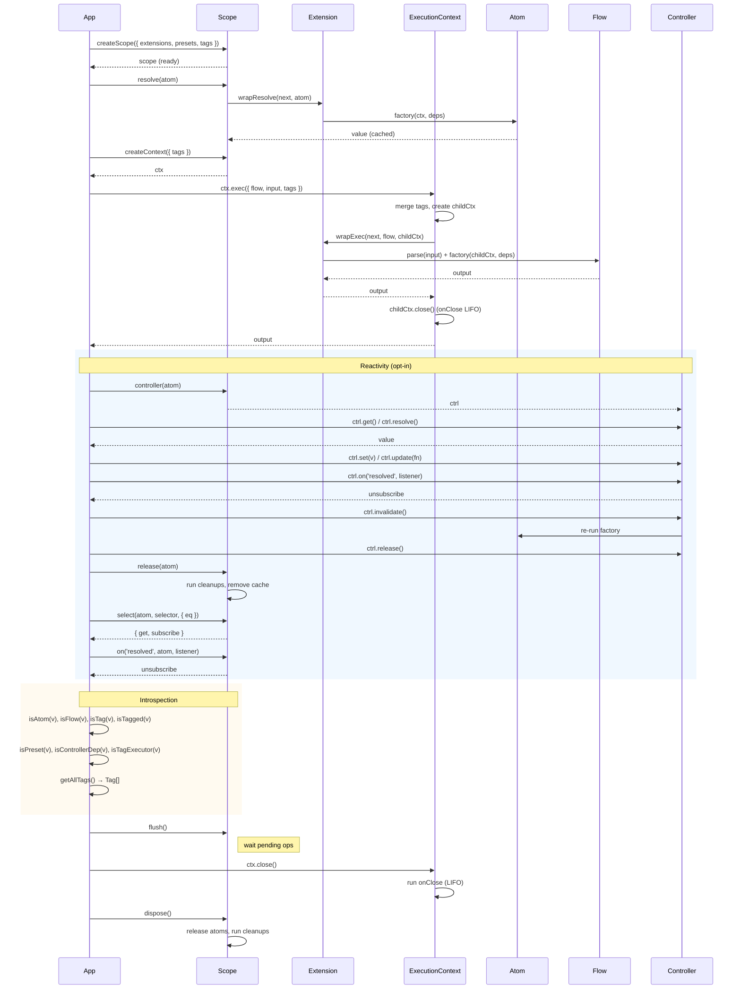
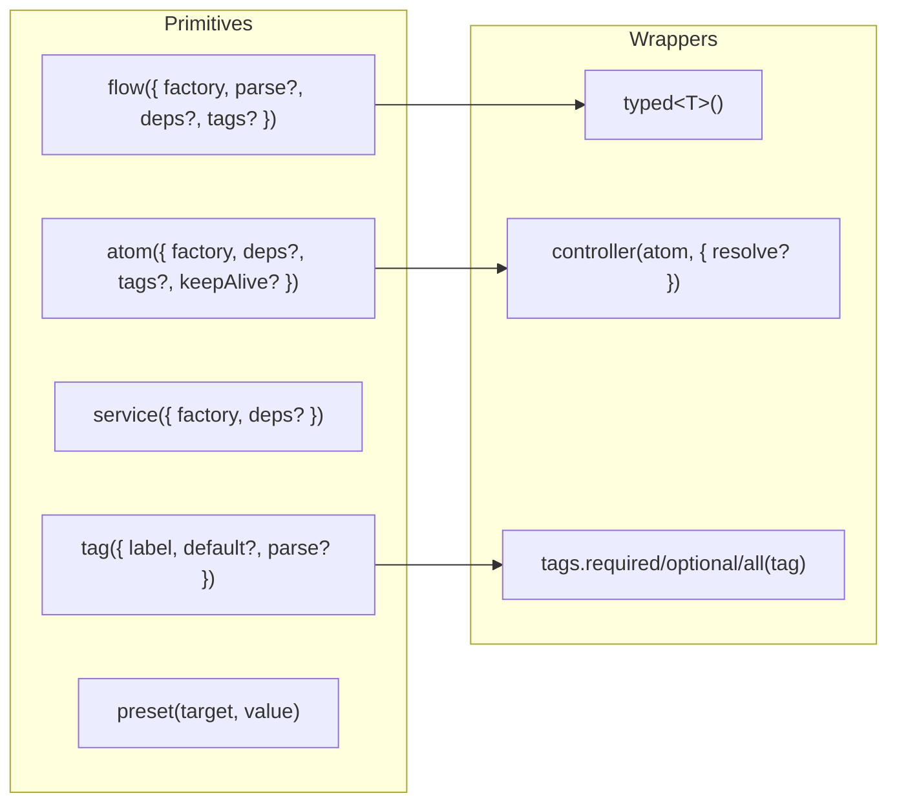
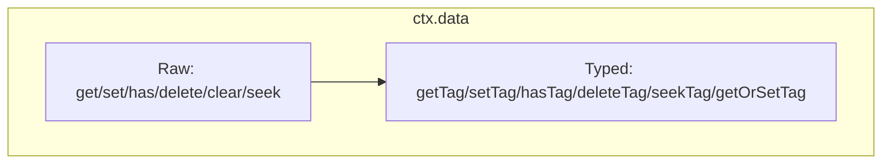
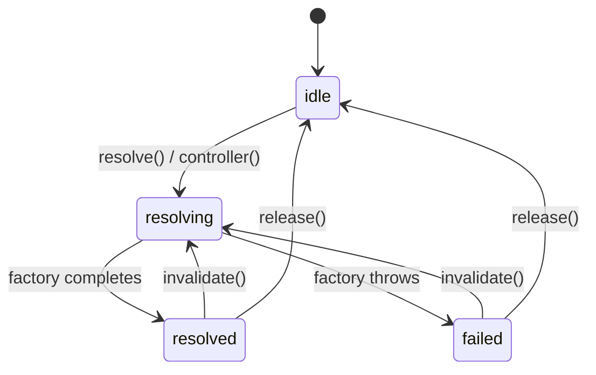
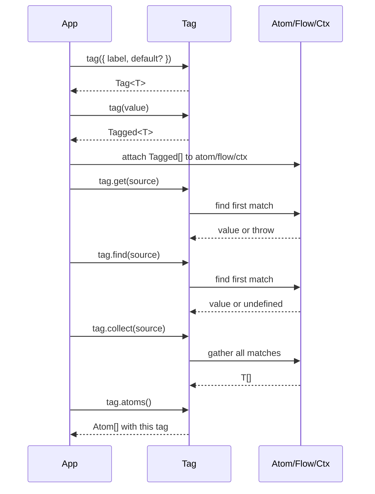
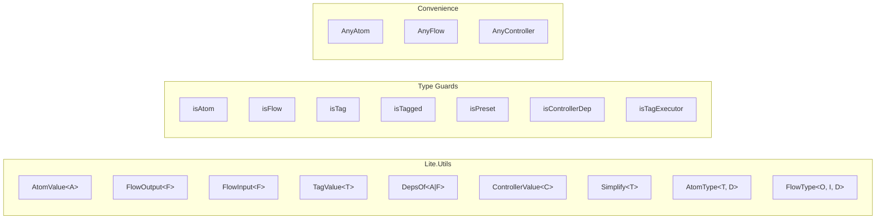
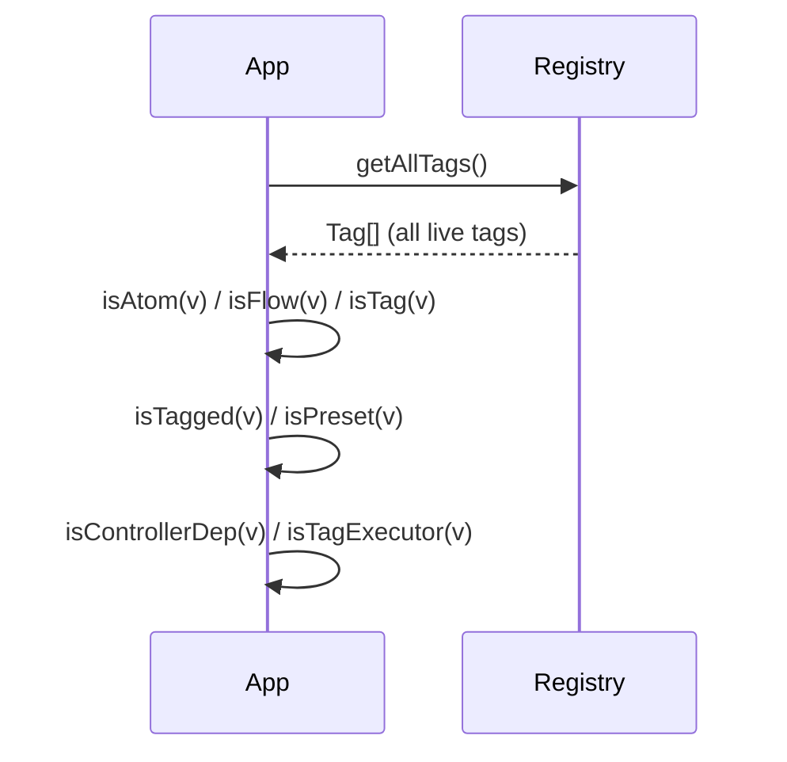
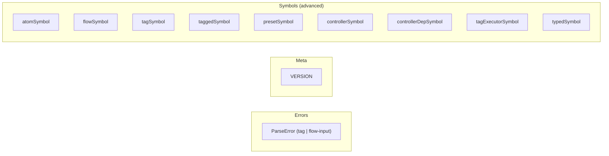

# @pumped-fn/lite

Lightweight effect system for TypeScript: scoped lifecycles, tagged context, and opt‑in reactivity.

Docs: `packages/lite/PATTERNS.md` for usage patterns, `packages/lite/dist/index.d.mts` for API details.

## How It Works

## Composition

## Context Data

## Atom Lifecycle (AtomState)

## Tag Resolution

## Type Utilities

## Introspection

## Additional Exports

API reference: `packages/lite/dist/index.d.mts`.

## License

MIT
