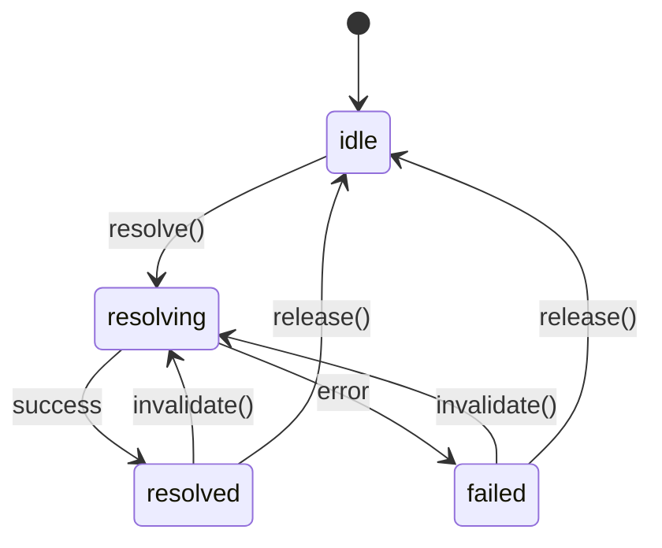
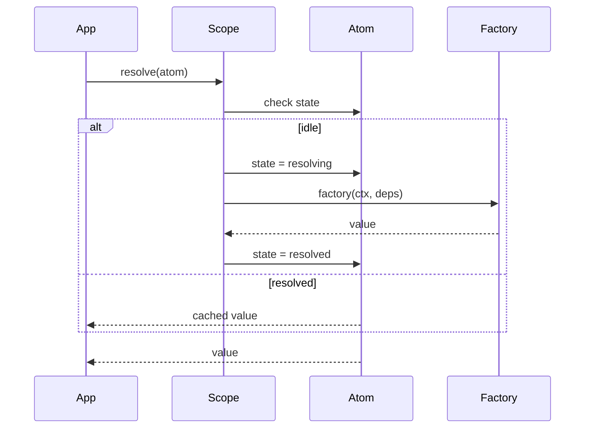
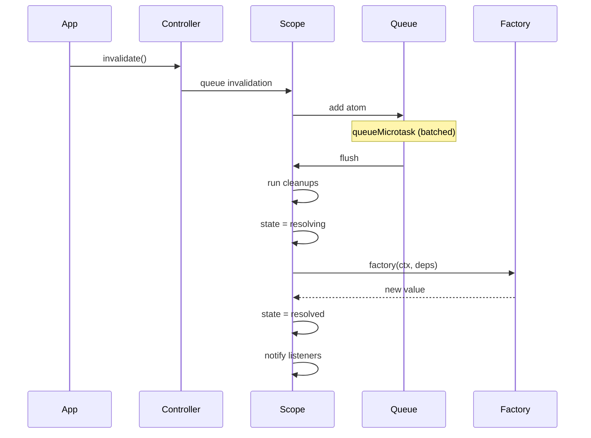

# @pumped-fn/lite

A lightweight effect system for TypeScript with managed lifecycles and minimal reactivity.

## What is an Effect System?

An effect system manages **how** and **when** computations run, handling:
- **Resource lifecycle** - acquire, use, release
- **Computation ordering** - what depends on what
- **Side effect isolation** - controlled execution boundaries
- **State transitions** - idle → resolving → resolved → failed

## Core Concepts

```
┌─────────────────────────────────────────────────────────────┐
│                         Scope                               │
│  (long-lived execution boundary)                            │
│                                                             │
│   ┌─────────┐      ┌─────────┐      ┌─────────┐            │
│   │  Atom   │ ──── │  Atom   │ ──── │  Atom   │            │
│   │ (effect)│      │ (effect)│      │ (effect)│            │
│   └─────────┘      └─────────┘      └─────────┘            │
│        │                                  │                 │
│        └──────────────┬───────────────────┘                 │
│                       ▼                                     │
│   ┌─────────────────────────────────────────────────────┐   │
│   │              ExecutionContext                       │   │
│   │  (short-lived operation with input, tags, cleanup)  │   │
│   └─────────────────────────────────────────────────────┘   │
└─────────────────────────────────────────────────────────────┘
```

| Concept | Purpose |
|---------|---------|
| **Scope** | Long-lived boundary that manages atom lifecycles |
| **Atom** | A managed effect with lifecycle (create, cache, cleanup, recreate) |
| **ExecutionContext** | Short-lived context for running operations with input and tags |
| **Controller** | Handle for observing and controlling an atom's state |
| **Tag** | Contextual value passed through execution |

## Install

```bash
npm install @pumped-fn/lite
```

## Quick Example

```typescript
import { atom, flow, createScope } from '@pumped-fn/lite'

// Define effects (atoms) - long-lived, cached
const dbAtom = atom({
  factory: async (ctx) => {
    const conn = await createConnection()
    ctx.cleanup(() => conn.close())
    return conn
  }
})

const repoAtom = atom({
  deps: { db: dbAtom },
  factory: (ctx, { db }) => new UserRepository(db)
})

// Define operation template
const getUser = flow({
  deps: { repo: repoAtom },
  factory: async (ctx, { repo }) => {
    return repo.findById(ctx.input as string)
  }
})

// Create scope (long-lived boundary)
const scope = await createScope()

// Create ExecutionContext (short-lived, per-operation)
const ctx = scope.createContext()

// Execute - resolves atoms, runs operation, provides input
const user = await ctx.exec({ flow: getUser, input: 'user-123' })

// ExecutionContext cleanup (operation complete)
await ctx.close()

// Scope cleanup (application shutdown)
await scope.dispose()
```

## Effect Lifecycle



## Resolution Flow



## Invalidation (Re-execution)

Atoms can be invalidated to re-run their effect:



Invalidations are **batched** via microtask queue - multiple invalidations in one tick become a single re-execution.

## Controller Pattern

Controllers provide a handle to observe and control atom state:

```typescript
const configAtom = atom({
  factory: async (ctx) => {
    const config = await fetchConfig()
    setTimeout(() => ctx.invalidate(), 60000)  // refresh every minute
    return config
  }
})

const appAtom = atom({
  deps: { config: controller(configAtom) },  // controller, not direct
  factory: (ctx, { config }) => {
    // Subscribe to config changes
    config.on(() => {
      console.log('config updated:', config.state)
      ctx.invalidate()  // re-run this atom too
    })

    return new App(config.get())
  }
})
```

## Tags (Contextual Values)

Tags pass contextual values through execution without explicit wiring:

```typescript
const requestIdTag = tag<string>({ label: 'requestId' })

const loggingAtom = atom({
  deps: { requestId: tags.required(requestIdTag) },
  factory: (ctx, { requestId }) => new Logger(requestId)
})

// Pass tags when creating ExecutionContext or at exec time
const ctx = scope.createContext({ tags: [requestIdTag('req-abc-123')] })
await ctx.exec({ flow: myFlow, input: data })

// Or per-execution
await ctx.exec({
  flow: myFlow,
  input: data,
  tags: [requestIdTag('req-xyz-456')]
})
```

## Extensions (Cross-cutting Effects)

Wrap resolution and execution with cross-cutting behavior:

```typescript
const timingExtension: Lite.Extension = {
  name: 'timing',
  wrapResolve: async (next, atom, scope) => {
    const start = performance.now()
    const result = await next()
    console.log(`resolved in ${performance.now() - start}ms`)
    return result
  }
}

const scope = await createScope({ extensions: [timingExtension] })
```

## API Reference

| Function | Description |
|----------|-------------|
| `createScope(options?)` | Create execution boundary |
| `atom(config)` | Define managed effect (long-lived) |
| `flow(config)` | Define operation template (used by ExecutionContext) |
| `tag(config)` | Define contextual value |
| `controller(atom)` | Wrap atom for deferred resolution |
| `preset(atom, value)` | Override atom value in scope |
| `scope.createContext(options?)` | Create ExecutionContext for operations |
| `ctx.exec(options)` | Execute operation with input and tags |
| `ctx.close()` | Cleanup ExecutionContext resources |

## Design Principles

1. **Minimal API** - Every export is expensive to learn
2. **Zero dependencies** - No runtime dependencies
3. **Explicit lifecycle** - No magic, clear state transitions
4. **Composable** - Effects compose through deps

## License

MIT
