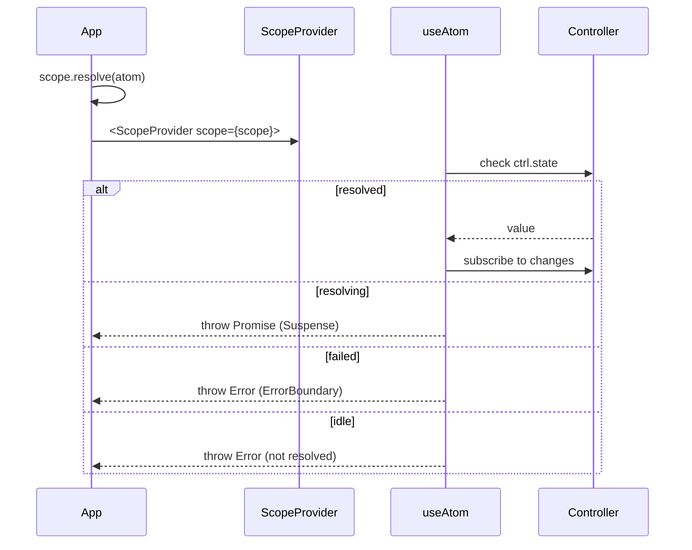
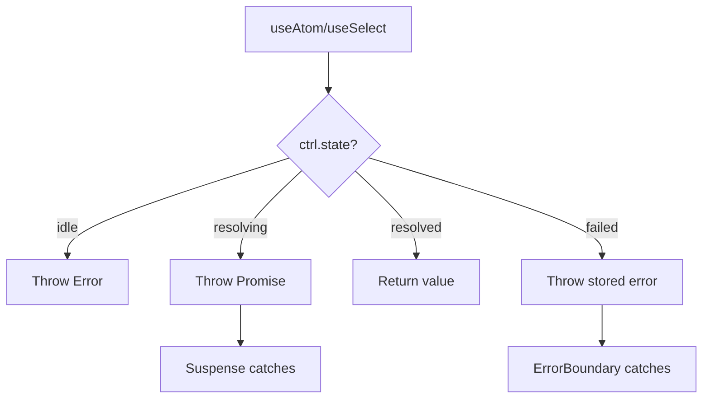
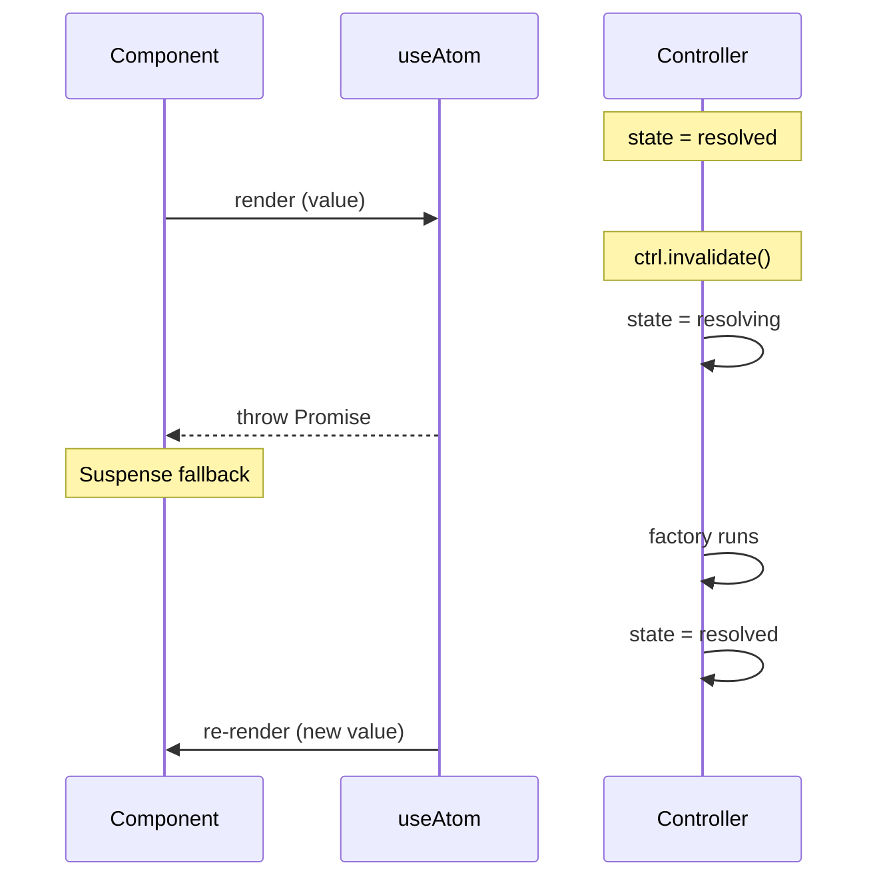

# @pumped-fn/react-lite

React bindings for `@pumped-fn/lite` with Suspense and ErrorBoundary integration.

**Zero dependencies** · **<2KB bundle** · **React 18+**

## How It Works



## State Handling



| State | Hook Behavior |
|-------|---------------|
| `idle` | Throws error — atom must be resolved before render |
| `resolving` | Throws promise — Suspense shows fallback |
| `resolved` | Returns value, subscribes to changes |
| `failed` | Throws stored error — ErrorBoundary catches |

## API

### ScopeProvider

Provides scope to component tree.

```tsx
import { createScope } from '@pumped-fn/lite'
import { ScopeProvider } from '@pumped-fn/react-lite'

const scope = createScope()
await scope.resolve(userAtom)

<ScopeProvider scope={scope}>
  <App />
</ScopeProvider>
```

### useScope

Access scope from context.

```tsx
const scope = useScope()
await scope.resolve(someAtom)
```

### useController

Get memoized controller for imperative operations.

```tsx
const ctrl = useController(counterAtom)
ctrl.set(10)
ctrl.update(n => n + 1)
ctrl.invalidate()
```

### useAtom

Subscribe to atom value with Suspense integration.

```tsx
function UserProfile() {
  const user = useAtom(userAtom)
  return <div>{user.name}</div>
}

// Wrap with Suspense + ErrorBoundary
<ErrorBoundary fallback={<Error />}>
  <Suspense fallback={<Loading />}>
    <UserProfile />
  </Suspense>
</ErrorBoundary>
```

### useSelect

Fine-grained selection — only re-renders when selected value changes.

```tsx
const name = useSelect(userAtom, user => user.name)
const count = useSelect(todosAtom, todos => todos.length, (a, b) => a === b)
```

## Invalidation

When an atom is invalidated, hooks automatically suspend during re-resolution:



## Testing

Use presets for test isolation:

```tsx
import { createScope, preset } from '@pumped-fn/lite'
import { ScopeProvider } from '@pumped-fn/react-lite'

const scope = createScope({
  presets: [preset(userAtom, { name: 'Test User' })]
})
await scope.resolve(userAtom)

render(
  <ScopeProvider scope={scope}>
    <UserProfile />
  </ScopeProvider>
)
```

## SSR

SSR-compatible by design:

- No side effects on import
- Uses `useSyncExternalStore` with server snapshot
- Scope passed as prop (no global state)

```tsx
// Server
const scope = createScope()
await scope.resolve(dataAtom)
const html = renderToString(<ScopeProvider scope={scope}><App /></ScopeProvider>)

// Client
const clientScope = createScope({
  presets: [preset(dataAtom, window.__DATA__)]
})
await clientScope.resolve(dataAtom)
hydrateRoot(root, <ScopeProvider scope={clientScope}><App /></ScopeProvider>)
```

## Full API

See [`dist/index.d.mts`](./dist/index.d.mts) for complete type definitions.

## License

MIT
