# Patterns

This is a sequence-diagram tour of Lite runtime behavior. Use it when you want to see how scopes,
contexts, resources, controllers, tags, service calls, and extensions move at runtime. For API details,
see `pkg/core/lite/dist/index.d.mts`.

## Boundary Ownership

Before adding helpers around the graph, keep ownership at the real boundary: composition roots and tests
own `createScope({ presets, tags, extensions })`; product work enters through atoms, flows, resources,
tags, controllers, flow handles, or `ctx.exec`; transport atoms wrap raw ambient IO; capability atoms
depend on transports; feature nodes depend on capabilities. For review rules, see the
[code review guide](../../../docs/code-review-guide.md).

For foreign integration, wrap the client in an adapter atom (the substitution seam) and instrument each call with `ctx.exec({ fn: () => client.method(args), name: "client.method", tags })` — one named, tag-able edge per call. `fn`-exec is the one way to trace a specific call; a flow is the one way for a capability that is a graph node.

## A. Fundamental Usage

### Request Lifecycle

Model a request boundary with cleanup and shared context.

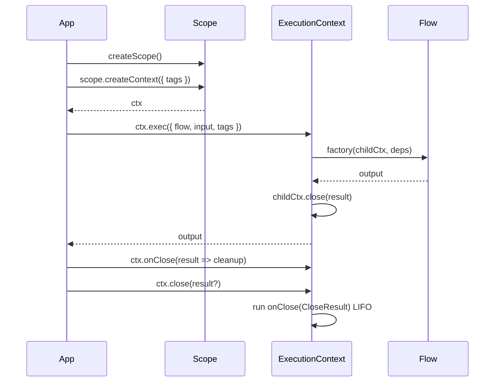

### Extensions Pipeline

Observe and wrap atoms/flows — logging, auth, tracing, transaction boundaries. Extensions register `onClose(CloseResult)` to finalize based on success or failure.

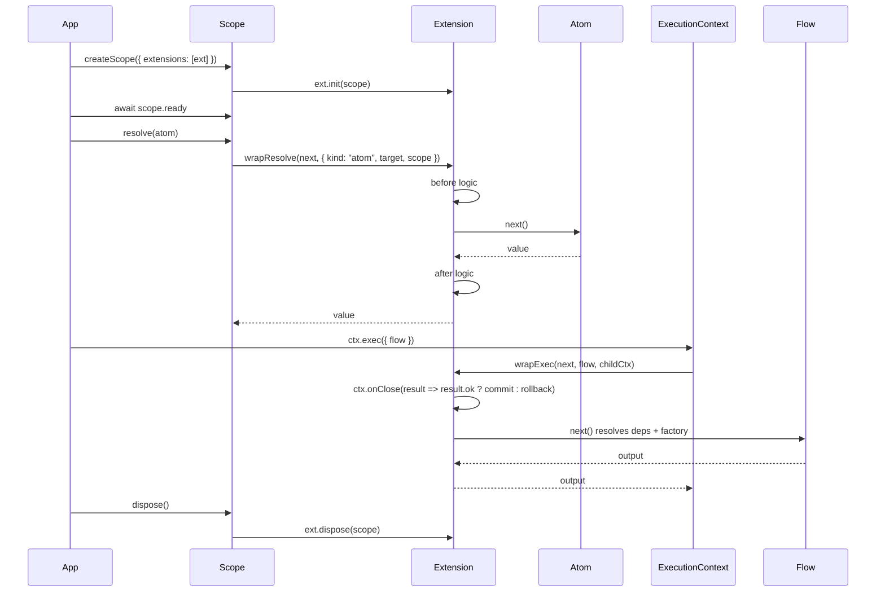

### Flow Composition Handles

Use `ctx.exec({ flow, input, tags })` at a boundary: route handler, job, CLI command, scheduler tick, UI
action, or test. Inside a flow or resource, compose child flows through `deps` so the graph edge is
visible and presettable.

Direct flow deps are lazy. Resolving the parent deps binds a handle to the current execution context; it
does not parse input, resolve child deps, call the child factory, create a child context, or trigger
`wrapExec`.

```ts
import { controller, flow, tag, tags, typed } from "@pumped-fn/lite"

const requestId = tag<string>({ label: "request.id" })

const writeAuditEntry = flow({
  name: "write-audit-entry",
  parse: typed<{ txId: string }>(),
  deps: { requestId: tags.required(requestId) },
  factory: (ctx, { requestId }) => `${requestId}:${ctx.input.txId}`,
})

const transferFunds = flow({
  name: "transfer-funds",
  parse: typed<{ txId: string }>(),
  deps: {
    writeAuditEntry: controller(writeAuditEntry, { name: "audit-step" }),
  },
  factory: async (ctx, { writeAuditEntry }) => {
    return writeAuditEntry.exec({ input: { txId: ctx.input.txId } })
  },
})

const settlePayment = flow({
  name: "settle-payment",
  parse: typed<{ paymentId: string }>(),
  deps: {
    writeAuditEntry: controller(writeAuditEntry, { name: "settle-audit", key: "settle-audit" }),
  },
  factory: async (ctx, { writeAuditEntry }) => {
    const step = writeAuditEntry.prepare({ input: { txId: ctx.input.paymentId } })
    return step.exec()
  },
})
```

> **Note:** Use `controller(flow, { name, tags, key })` only to preconfigure child-flow execution defaults. Do not mix flow controller options with atom/resource controller options: flows never accept `resolve`, `watch`, or `eq`; atoms and resources never accept flow execution defaults.

`prepare()` creates an invocation object for resumability, loops, fanout, policy checks, or retries.
`step.ready` activates the child's declared dependency tree in an isolated tagged lifetime without
running the child factory or `wrapExec`. `step.exec()` or `step.execStream()` awaits readiness, executes
once through the normal extension pipeline, then closes that lifetime.

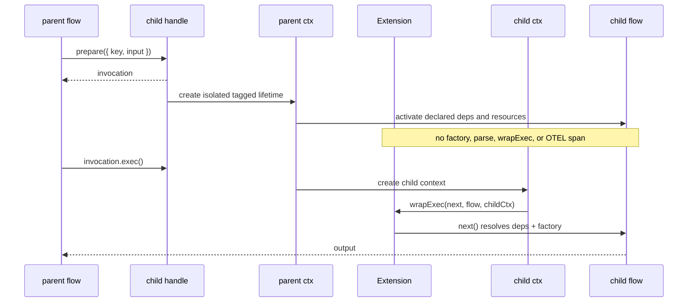

> **Note:** Extension authors do not need a readiness hook or wrapper-specific span logic. Normal `wrapExec` still sees one child execution per `exec()` or `execStream()` call; dependency resolution remains visible through the resolve pipeline.

### Scoped Isolation + Testing

Swap implementations and isolate tenants/tests.

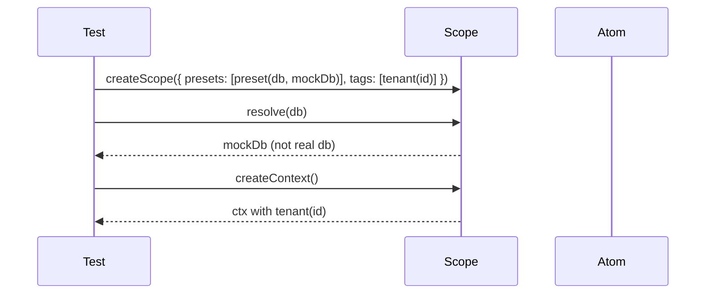

### Execution-Scoped Resource

Resolve resource values from an `ExecutionContext` when the value should live below the scope.

Choose ownership by use case:

| Ownership | Expectation | Use for |
|---|---|---|
| `boundary` | One request, job, or UI boundary shares the value and closes it together. | request loggers, trace data, per-request clients, UI sessions |
| `current` | One action or editor gets a private pocket. Nested `ctx.exec()` children can use it; sibling actions and nested explicit boundaries reset. | transactions, action audit buffers, form drafts, modal/editor state |

```ts
import { createScope, resource } from "@pumped-fn/lite"

const events: string[] = []

const tx = resource({
  name: "tx",
  ownership: "current",
  factory: (ctx) => {
    const tx = {
      commit: async () => {
        events.push("commit")
      },
      rollback: async () => {
        events.push("rollback")
      },
      release: async () => {
        events.push("release")
      },
    }

    ctx.onClose((result) => result.ok ? tx.commit() : tx.rollback())
    ctx.cleanup(() => tx.release())
    return tx
  },
})

const scope = createScope()
const ctx = scope.createContext()
await ctx.resolve(tx)
await ctx.close({ ok: true })

if (events.join(",") !== "commit,release") throw new Error("expected commit then release")

events.length = 0
const failed = scope.createContext()
await failed.resolve(tx)
await failed.close({ ok: false, error: new Error("failed") })

if (events.join(",") !== "rollback,release") throw new Error("expected rollback then release")

await scope.dispose()
```

Resource state is not stored in `ctx.data`. `ctx.data` is for tags and user data. The resolved value is stored on the owning execution context. Child executions can read visible resources, but `ctx.release(resource)` is owner-local.

> **`ctx.release(tx)` vs `ctx.close()`**: `ctx.release(tx)` runs only the resource's `ctx.cleanup` handlers (owner-local reset for mid-request recycle), but `onClose` handlers registered by that resource still fire when `ctx.close()` is eventually called. Do not follow `ctx.release(tx)` with `ctx.close()` if the resource registered an `onClose` side effect (e.g., commit) — the released resource will be committed again. Use `ctx.release` only when you need a fresh resource instance within the same open context and the `onClose` side effect is safe to run regardless.

### Resource Controller Dependency

Use `controller(resource)` only when a resource needs an infrastructure handle for another resource. Use `watch: true` only in resource deps, never in atom or flow deps. Product APIs should usually expose direct resource deps, flows, or domain actions instead of resource controllers.

```ts
import { controller, resource } from "@pumped-fn/lite"

const config = resource({
  factory: () => ({ namespace: "app", version: 1 }),
})

const cache = resource({
  deps: {
    config: controller(config, {
      resolve: true,
      watch: true,
      eq: (a, b) => a.namespace === b.namespace && a.version === b.version,
    }),
  },
  factory: (_ctx, { config }) => {
    const cfg = config.get()
    return new Map<string, unknown>([["namespace", cfg.namespace]])
  },
})
```

## B. Advanced Client/State Usage

### Controller Reactivity

Client-side state with lifecycle hooks and invalidation.

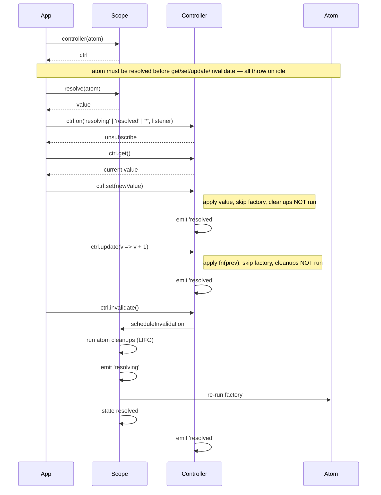

### Ambient Context (Tags)

Propagate values without wiring parameters. Tags serve three roles: scope-level config (consumed by atoms via `tags.required()`), per-context ambient data (requestId, locale), and role selection — a tag carrying a flow arrives in deps position as a context-bound `FlowHandle`, so composition roots pick which implementation fills a port (`tags.optional` yields handle-or-undefined, `tags.all` an array of handles). Use `tags.required()` in deps to declare that an atom or flow needs an ambient value (e.g., a transacted connection) — extensions or context setup provide the value, the consumer just depends on it.

Use `tag({ eq })` only to define value equality inside that tag family. `tag.same(a, b)` compares two already-created tagged records; it does not change lookup, source precedence, defaults, parsing, `tags.all()` multiplicity, tag discovery, or cache identity. Equal values should be fully substitutable for every consumer of that tag.

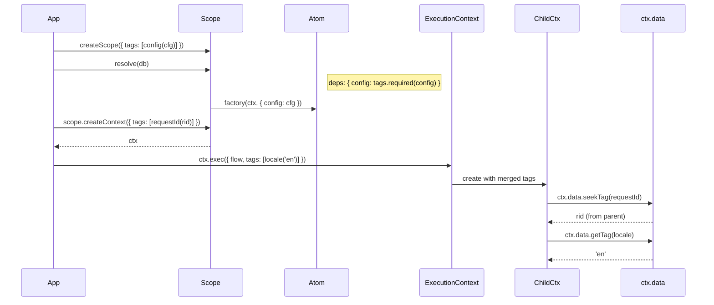

### Derived State (Select)

Subscribe to a slice of atom state with custom equality.

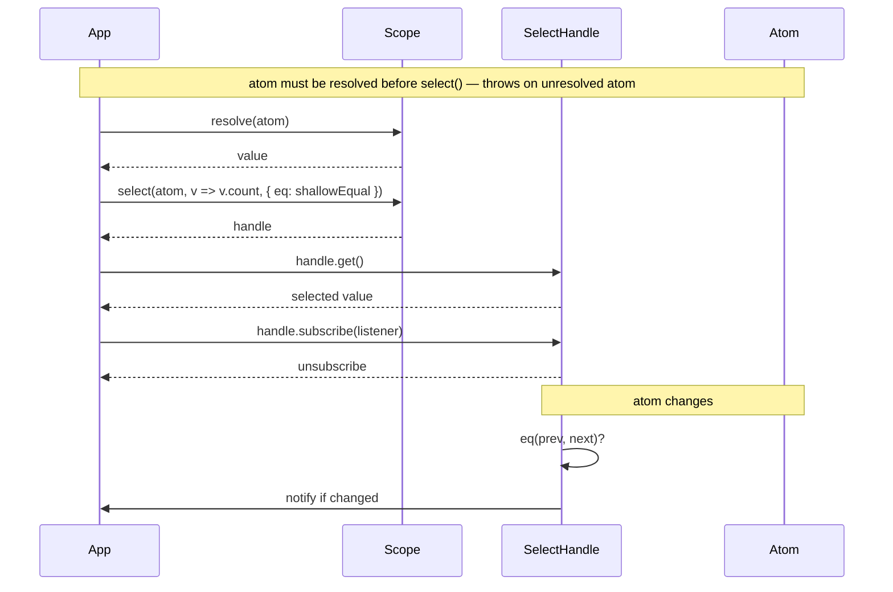

### Service Pattern

Constrain atom methods to ExecutionContext-first signature.

> **Note:** Invoke service methods through `ctx.exec` so a child context is created — extensions can observe the call, and cleanup is scoped.

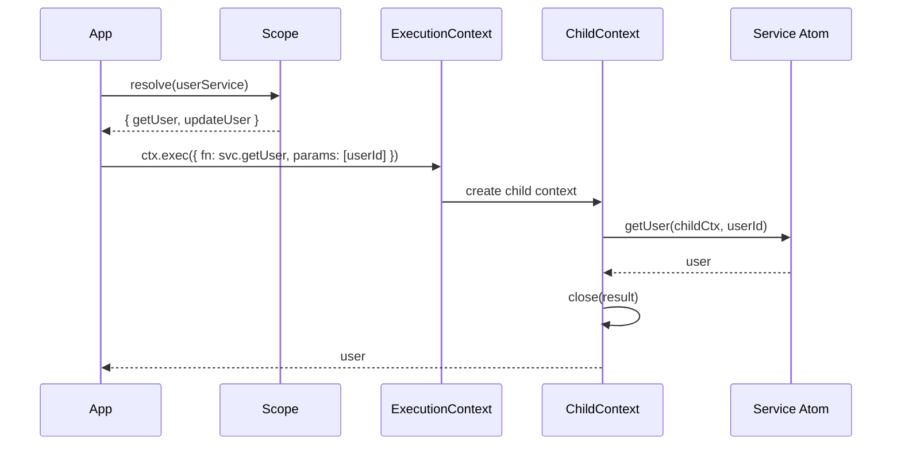

### Typed Flow Input

Type flow input without runtime parsing overhead.

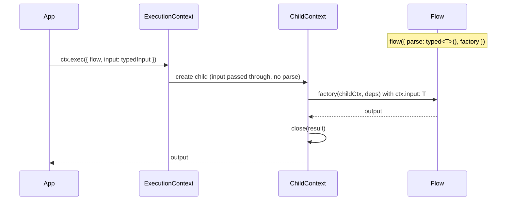

### Controller as Dependency

Receive a reactive handle instead of the resolved value in atom deps. Use `resolve: true` to pre-resolve before the factory runs. Add `watch: true` (atom deps only) to auto-invalidate the parent when the dep value changes — replaces manual `ctx.cleanup(ctx.scope.on('resolved', dep, () => ctx.invalidate()))`.

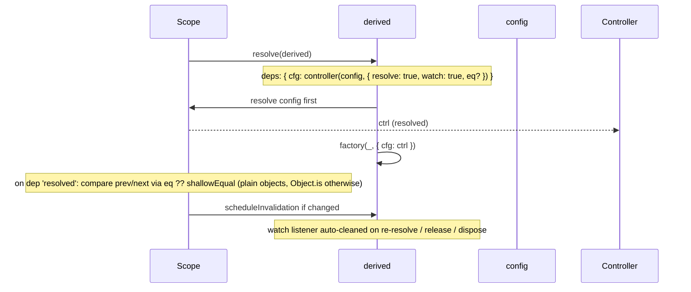

### Inline Function Execution

Execute ad-hoc logic within context without defining a flow.

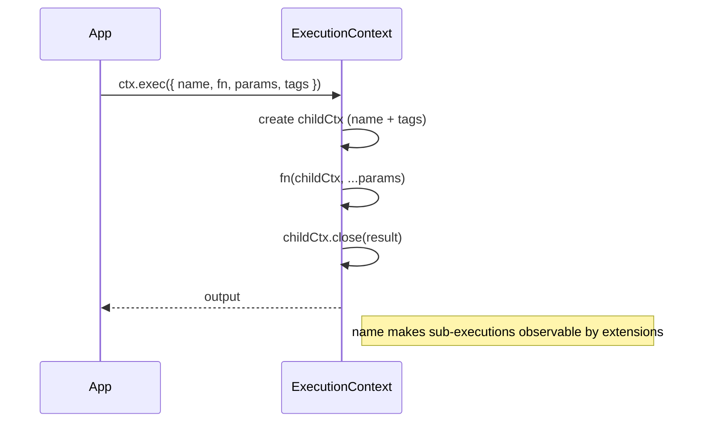

### Atom Retention (GC)

Control when atoms are garbage collected or kept alive indefinitely.

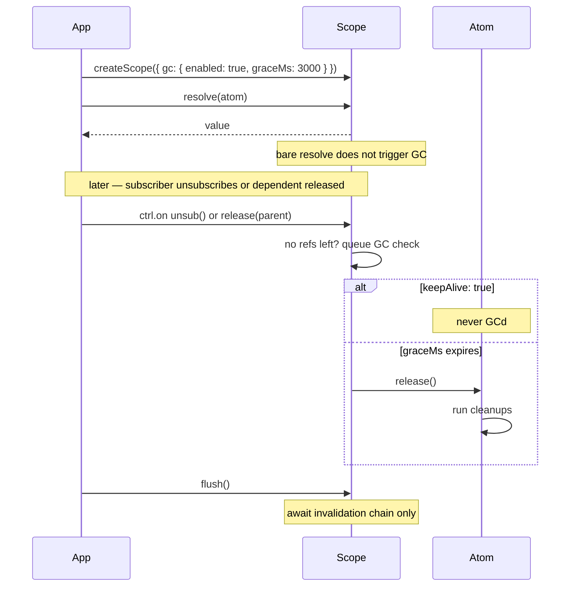

## Practical Example

The runnable practical example is [invoice-triage](../../../examples/invoice-triage/README.md). It carries
the canonical app surface for generator flows, `execStream`, child-flow composition, state-backed ingest
queues, scheduler cron, provider tags, and test substitution through the scope seam.

`@pumped-fn/lite-lint` turns those boundary rules into a lint-like scanner. It catches module mocks,
test-only product branches, definition-handle suffixes, product helpers that accept `scope`, raw ambient IO
outside transport/root declarations, stale example vocabulary, and React observer violations from
`@pumped-fn/lite-react`.

## Next

- [Lite README](./README.md)
- [Mental model](../../../docs/mental-model.md)
- [Invoice triage example](../../../examples/invoice-triage/README.md)
