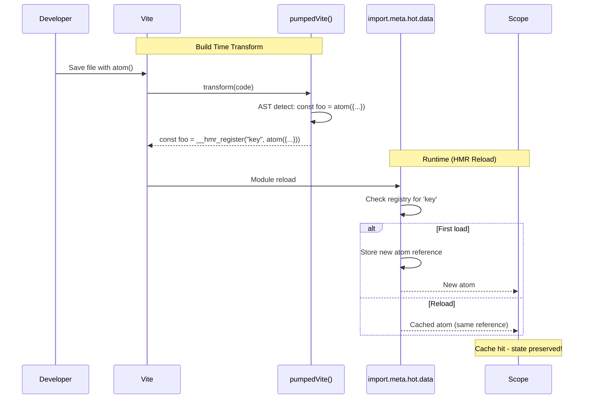

# @pumped-fn/lite-hmr

Vite plugin set for `@pumped-fn/lite` HMR, dev graph metadata, and opt-in production graph metadata.

**Dev HMR** · **Build metadata** · **Vite plugin**

## How It Works



## Usage

```typescript
// vite.config.ts
import { defineConfig } from 'vite'
import react from '@vitejs/plugin-react'
import { pumpedVite } from '@pumped-fn/lite-hmr'

export default defineConfig({
  plugins: [
    pumpedVite(),
    react()
  ]
})
```

`pumpedVite()` installs the dev HMR/feed plugin for `vite dev`. Add `graph: true` only when the production build should emit Lite graph metadata. Use `pumpedHmr()` or `pumpedGraph()` directly when a config needs one side without the preset.

## Transform Example

The plugin transforms named atom declarations at build time:

```typescript
// Your code
const config = atom({ factory: () => loadConfig() })

// Transformed (dev only)
const config = __hmr_register("src/atoms.ts:config", atom({ factory: () => loadConfig() }))
```

The `__hmr_register` helper stores atom references in `import.meta.hot.data`. On HMR reload, it refreshes the cached atom definition and returns the same reference, preserving Scope cache hits. Already-resolved Scope values stay under normal Lite invalidation rules; the new factory runs for future resolves after invalidation or in a new Scope.

## Devtools Feed

The plugin also exposes discovered Lite handles through a Vite virtual module. This is the compact feed a devtool can use to answer: which Lite handles did Vite see, which atoms received HMR keys, which static deps were visible, and where did the graph scanner find gaps?

```typescript
/// <reference types="@pumped-fn/lite-hmr/client" />
import { atoms, edges, handles, issues } from "virtual:pumped-fn/lite-hmr"

console.table(handles.map((handle) => ({
  kind: handle.kind,
  name: handle.name,
  file: handle.file,
  line: handle.line,
})))

console.table(atoms.map((atom) => ({ name: atom.name, key: atom.key })))

console.table(edges.map((edge) => ({
  from: edge.fromName,
  slot: edge.slot,
  to: edge.toName,
  via: edge.via,
  importId: edge.importId,
})))

console.table(issues.map((issue) => ({
  code: issue.code,
  handle: issue.fromName,
  slot: issue.slot,
  target: issue.target,
})))
```

The same feed is available during `vite dev` without adding code to the app. If Vite `base` is configured, prefix these URLs with that base.

| URL | Use |
| --- | --- |
| `/__pumped-fn/lite-hmr` | Compact handle, dependency, and issue inspector |
| `/__pumped-fn/lite-hmr.json` | JSON feed for external devtools |

These dev-server URLs expose source file paths and Lite handle names to anyone who can reach the Vite dev server.

When `pumpedVite()` is used, production builds also resolve this virtual module to an empty feed so devtools imports do not break builds. Use `pumpedVite({ graph: true })` when the production build should also emit the JSON graph asset.

Issue codes are intentionally narrow:

| Code | Meaning |
| --- | --- |
| `dynamic-dep` | A `deps` slot used an expression the scanner cannot turn into a stable edge. |
| `unknown-dep` | A `deps` slot points at a local identifier that is not a discovered Lite handle or import. |
| `untracked-atom` | An `atom()` call was not HMR-wrapped because it was nested, dynamic, or imported through a barrel instead of directly from `@pumped-fn/lite`. |

For imported deps, `importSource` is the source specifier from code and `importId` is the Vite-resolved module id, normalized relative to the Vite root when possible. Devtools can use `importId` to jump from a dependency slot to the actual file Vite resolved in dev or build. When the imported module is also in the feed and exports a matching Lite handle, `to` and `toKind` point at that handle.

## Build Metadata

`pumpedGraph()` emits `pumped-fn-lite.json` during production builds. It uses the same source scanner as the dev feed, but it does not transform application code or import the HMR runtime. The asset contains Lite handle names, source-relative file paths, and dependency shape; publish it only when that graph metadata is intended to be available with the built app.

```typescript
import { pumpedVite } from "@pumped-fn/lite-hmr"

export default defineConfig({
  plugins: [pumpedVite({ graph: true })]
})
```

```json
{
  "handles": [
    { "kind": "atom", "name": "config", "file": "src/atoms.ts", "line": 1 }
  ],
  "atoms": [
    { "name": "config", "key": "src/atoms.ts:config" }
  ],
  "edges": [
    { "fromName": "run", "slot": "config", "toName": "config", "via": "direct" },
    { "fromName": "run", "slot": "db", "toName": "external", "to": "src/external.ts:external", "toKind": "resource", "via": "controller", "importSource": "./external", "importId": "src/external.ts" }
  ],
  "issues": [
    { "code": "dynamic-dep", "fromName": "run", "slot": "config", "target": "make(config)" }
  ]
}
```

## What Gets Transformed

| Pattern | Transformed |
|---------|-------------|
| `const foo = atom({...})` | Yes |
| `let foo = atom({...})` | Yes |
| `export const foo = atom({...})` | Yes |
| `atoms.push(atom({...}))` | No; reports `untracked-atom` |
| `createAtom(() => atom({...}))` | No; reports `untracked-atom` |
| `import { atom } from "../lib/lite"` | No; use direct imports from `@pumped-fn/lite` for HMR wrapping |

## Options

```typescript
pumpedVite({
  hmr: {
    include: /\.[jt]sx?$/,  // Files to transform (default)
    exclude: /node_modules/ // Files to skip (default)
  },
  graph: {
    fileName: "pumped-fn-lite.json"
  }
})

pumpedHmr({
  include: /\.[jt]sx?$/,  // Files to transform (default)
  exclude: /node_modules/ // Files to skip (default)
})
```

## Production

`pumpedHmr()` only applies to Vite dev server runs. `pumpedGraph()` only applies to Vite build runs and emits metadata without injecting runtime code.

## License

MIT
