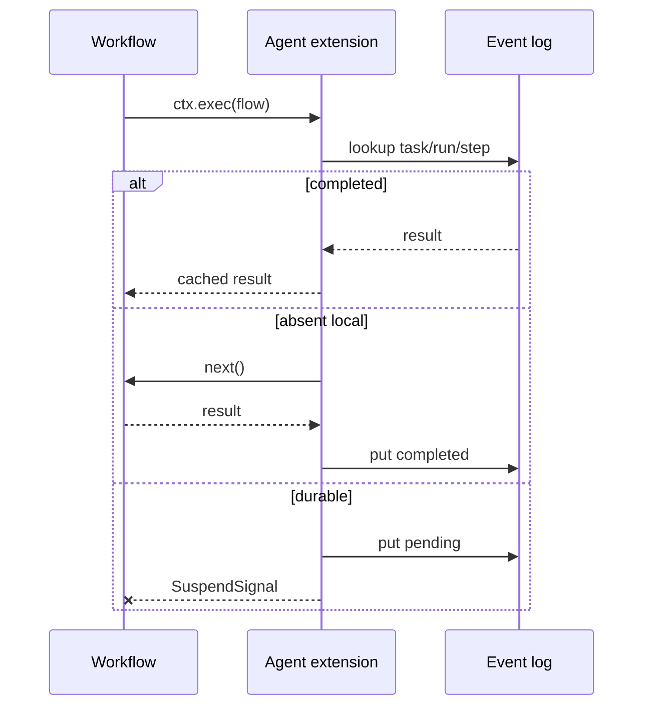

# Agent SDK Patterns

Use this package as a small convention layer over `@pumped-fn/lite`. If a use case can be expressed with `flow`, state/service, tags, and `ctx.exec`, do that before adding another primitive.

## 0. Standalone Suspense

Use suspense when the system needs deterministic replay or external resolution, but not agents, workers, or remote routing.

```ts
import { extension, runId, stepCounter, suspend, taskId } from "@pumped-fn/lite-extension-suspense"

const waitForCommit = flow({
  name: "wait-for-commit",
  parse: typed<{ revision: number }>(),
  tags: [suspend(true)],
  factory: () => {
    throw new Error("resolved by sync service")
  },
})

const scope = createScope({
  extensions: [extension({ log })],
})

const ctx = scope.createContext({
  tags: [
    taskId("doc-123"),
    runId("sync-42"),
    stepCounter({ next: 0 }),
  ],
})
```

Suspense has no agent knowledge. It sees tagged `ctx.exec` calls, assigns `(taskId, runId, step)`, returns completed/resolved log entries, writes pending entries for suspended steps, and throws `SuspendSignal`.

## 1. Workflow Flow

Use a workflow flow when code chooses order, branching, retries, and fan-out.

```ts
import { createScope, flow, tags, typed } from "@pumped-fn/lite"
import {
  runtime,
  step,
  workflow as workflowRuntime,
  workflowRun,
  workerRegistry,
  workers,
} from "@pumped-fn/sdk"
import { kit } from "@pumped-fn/sdk-test"

export const processPr = flow({
  name: "process_pr",
  parse: typed<PrEvent>(),
  tags: [
    step({ workflow: true }),
    workers(workerRegistry([lint, test, security])),
  ],
  deps: {
    workflow: tags.required(workflowRuntime),
    runtime: tags.required(runtime),
  },
  factory: async (ctx, { workflow, runtime }) => {
    const lintResult = await runtime.delegate<{ failed: boolean }>("lint", { sha: ctx.input.sha })
    if (lintResult.failed) return { taskId: workflow.taskId, status: "lint-failed" }

    const [tests, security] = await Promise.all([
      runtime.delegate("test", { sha: ctx.input.sha }),
      runtime.delegate("security", { sha: ctx.input.sha }),
    ])

    return { taskId: workflow.taskId, status: "ok", tests, security }
  },
})

export async function runProcessPr(input: PrEvent) {
  const { extensions } = kit()
  const scope = createScope({ extensions })
  const ctx = scope.createContext({
    tags: [workflowRun({ taskId: input.sha, runId: "run-1" })],
  })

  try {
    return await ctx.exec({ flow: processPr, input })
  } finally {
    await ctx.close()
    await scope.dispose()
  }
}
```

Why: normal TypeScript control flow stays visible. Replay still works because expensive work is behind `ctx.exec()` through `runtime.delegate()`.

`step({ workflow: true })` marks the flow as workflow policy surface. `workflowRun()` is a context tag for run metadata, passed through `createContext({ tags: [...] })`. `workflow` and `runtime` tags are required deps, so missing extensions fail before the factory runs. Event-log policy and remote routing stay normal extension composition.

## 2. Worker Flow

Use a worker flow for one executable unit. `step()` says how it may run.

```ts
export const lint = flow({
  name: "lint",
  parse: typed<{ sha: string }>(),
  tags: [step({ remote: true, kind: "code", timeoutMs: 30_000 })],
  factory: async (ctx) => runLinter(ctx.input.sha),
})
```

`remote: true` means the extension may route it to a worker runner. Without a remote runner, the default test helper runs it locally through `next()`.

## 3. LLM Provider

Providers are implementor flows carried by the `model` tag. Consumers exec the `complete` port flow, which owns the `kind: "llm"` step span; the consuming flow owns prompt shape and output parsing.

```ts
import { flow, typed } from "@pumped-fn/lite"
import { complete, model, type Model, type ModelRequest } from "@pumped-fn/sdk"

const live: Model = flow({
  name: "live-model",
  parse: typed<ModelRequest>(),
  factory: async (ctx) => ({
    content: await new ClaudeModel().complete(ctx.input.messages),
    stop: true,
  }),
})

export const classify = flow({
  name: "classify",
  parse: typed<{ text: string }>(),
  deps: { complete },
  factory: async (ctx, { complete }) => {
    const response = await complete.exec({
      input: {
        agentName: "classify",
        instructions: "Return JSON only.",
        messages: [{ role: "user", content: ctx.input.text }],
        tools: [],
        skills: [],
        loadedSkills: [],
        subagents: [],
        round: 0,
      },
    })
    return JSON.parse(response.content) as { label: string }
  },
})
```

Test by rebinding the tag, not by special agent hooks:

```ts
import { modelStub } from "@pumped-fn/sdk-test"

const scope = createScope({
  tags: [model(modelStub(() => ({ content: '{"label":"test"}', stop: true })))],
})
```

## 4. Agent Application

Use `agent()` when the model should choose tools or delegate to another role. Keep the executable work as flows, and keep the model as a provider that can be tagged or faked.

```ts
const loadTicket = tool({
  description: "Load ticket details.",
  flow: flow({
    name: "load-ticket",
    parse: typed<{ id: string }>(),
    factory: (ctx) => ({ id: ctx.input.id, title: `ticket:${ctx.input.id}` }),
  }),
})

const provider: Model = flow({
  name: "triage-model",
  parse: typed<ModelRequest>(),
  factory: (ctx) => ctx.input.loadedSkills.length === 0
    ? {
        content: "need routing policy",
        skillCalls: [{ name: "routing-policy" }],
      }
    : ctx.input.round === 1
    ? {
        content: "loading",
        toolCalls: [{ name: "load-ticket", input: { id: "42" } }],
      }
    : {
        content: "ready",
        stop: true,
      },
})

const triage = agent({
  name: "triage",
  tags: [model(provider)],
  skills: [
    skill({
      name: "routing-policy",
      description: "Support routing rules.",
      content: "Route billing tickets to support.",
    }),
  ],
  tools: [loadTicket],
})

const result = await ctx.exec({
  flow: triage.turn,
  input: { prompt: "triage ticket 42" },
})
```

## 4.1 Managed Tools (2.x)

Use `currentTool()` when a tool flow needs context-owned dependencies. Put those resources in the keyed `tools` record passed to `currentAgent()`; resolution creates one frozen, ordered snapshot of validated projected flow handles before `turn()` calls the model. The model provider remains the `model` tag used by `complete`.

```ts
import { createScope, tags } from "@pumped-fn/lite"
import { currentAgent, currentTool, model, turn, validation } from "@pumped-fn/sdk"
import * as z from "zod"

const search = currentTool({
  description: "Search records.",
  inputSchema: z.object({ query: z.string().min(1) }),
  flow: searchFlow,
  deps: { backend: tags.required(searchBackend) },
})

const managed = currentAgent({
  name: "managed-search",
  tools: { search },
})

const run = turn({ agent: managed })
const scope = createScope({
  tags: [
    model(provider),
    validation.engine(validation.standard<z.ZodType>((schema) => z.toJSONSchema(schema))),
  ],
})
const ctx = scope.createContext()
const result = await ctx.exec({ flow: run, input: { prompt: "find 42" } })
```

The managed agent has no `.turn` member. A tool call can only dispatch through the exact flow handle and input schema advertised in its resolved snapshot. Invalid model input fails before the flow starts. Model input cannot provide required tags or replace the backend dependency. There is no default validation engine.

Valibot uses the same graph. Only the scope tag changes:

```ts
import { toJsonSchema } from "@valibot/to-json-schema"
import * as v from "valibot"

validation.engine(validation.standard<v.GenericSchema>((schema) => toJsonSchema(schema)))
```

Why: tools and subagent turns still run through `ctx.exec()`, so the same workflow extension can replay, suspend, route, or time out the work. `events` is a boundary resource, so run inspection is testable without a global observer.

## 5. Agent Evals

Use deterministic checks for exact requirements and judges for qualitative requirements. A subjective eval with exactly one judge is rejected.

```ts
const accepts = judge({
  name: "accepts",
  evaluate: () => ({ name: "accepts", passed: true }),
})

const grounded = judge({
  name: "grounded",
  evaluate: () => ({ name: "grounded", passed: true }),
})

const evaluation = suite({
  name: "triage-quality",
  agent: triage,
  cases: [
    {
      name: "uses the loader",
      input: { prompt: "triage ticket 42" },
      checks: [used("load-ticket"), includes("ready")],
    },
  ],
  judges: [accepts, grounded],
})

const report = await runEval(ctx, evaluation)
const artifact = summary(report)
```

## 6. Run Inspection And HTTP

Use `inspect()` against a `RunLog` to read workflow steps by `(taskId, runId)`.

```ts
const run = await inspect(log, { taskId: "triage-42", runId: "run-1" })
```

Use `http()` to adapt a Fetch request to an agent turn without adding a server framework dependency.

```ts
const handle = http({ agent: triage })
const response = await ctx.exec({
  flow: handle,
  input: new Request("https://agent.local/run", {
    method: "POST",
    body: JSON.stringify({ prompt: "triage ticket 42" }),
  }),
})
```

## 7. Channels and Schedules

Use channel and schedule flows at the boundary. They should translate external shape into `TurnInput`, then let the agent turn own model/tool/subagent execution.

```ts
const slack = channel({
  name: "slack-message",
  parse: typed<{ text: string }>(),
  agent: triage,
  input: (ctx) => ({ prompt: ctx.input.text }),
})

const daily = schedule({
  name: "daily-digest",
  agent: triage,
  input: () => ({ prompt: "daily digest" }),
})
```

Why: Slack, HTTP, cron, queues, and CLIs stay adapters. The agent runtime still sees a flow input and a scoped execution context.

## 8. Sessions

Use `session()` for continuing message history. It is a material, so it uses the same patch and revision behavior as other task state.

```ts
const thread = session("support-session")

await send(ctx, thread, triage, { prompt: "triage ticket 42" })
await send(ctx, thread, triage, { prompt: "summarize the route" })
```

## 9. Sandbox Capability

Use `sandbox` as an injected capability, not as a global file or process API.

```ts
const readWorkspace = tool({
  description: "Read a file from the workspace.",
  flow: flow({
    name: "read-workspace",
    parse: typed<{ path: string }>(),
    deps: { sandbox: tags.required(sandbox) },
    factory: (ctx, deps) => deps.sandbox.readFile(ctx.input.path),
  }),
})

const scope = createScope({
  tags: [
    sandbox({
      readFile: (path) => `file:${path}`,
      writeFile: () => undefined,
      exec: (command, args = []) => ({
        stdout: [command, ...args].join(" "),
        stderr: "",
        exitCode: 0,
      }),
    }),
  ],
})
```

## 10. CLI Worker Adapter

Use provider packages when the runtime must call real local tools like Claude or Codex as the agent model provider. Keep the agent graph provider-free and choose the provider with scope or context tags.

```ts
import { createScope } from "@pumped-fn/lite"
import { agent, model } from "@pumped-fn/sdk"
import { claude, claudeConfig } from "@pumped-fn/sdk-claude"
import { codex, codexConfig } from "@pumped-fn/sdk-codex"

const reviewer = agent({
  name: "reviewer",
})

const codexScope = createScope({
  tags: [codex, codexConfig({ auth: { kind: "global" }, sandbox: "read-only" })],
})
const claudeScope = createScope({
  tags: [claude, claudeConfig({ auth: { kind: "global" } })],
})
```

`codex` and `claude` are stable module-level `model` tags. Their config is explicit through `codexConfig` and `claudeConfig`. Replace either provider with `model(fake)` at the same seam for tests, or preset the provider's effect flow for a narrower unit test.

The providers run `codex exec --ephemeral --ignore-user-config` and `claude -p --no-session-persistence`; Claude rejects `--bare`. Keep CLI workers at the edge and bind writable auth state when isolation is enabled.

## 11. Durable Step

Use `step({ durable: true })` for a step that should suspend until another process resolves it.

```ts
const approve = flow({
  name: "approve",
  parse: typed<{ title: string }>(),
  tags: [step({ durable: true })],
  factory: () => {
    throw new Error("durable step should be resolved externally")
  },
})
```

First run writes a pending log entry and throws `SuspendSignal`. Replay returns the resolved value and continues.

## 12. Remote Runner

Remote routing belongs in `RemoteRunner`, not inside workflow code.

```ts
const scope = createScope({
  extensions: [
    workflowExtension({ log }),
    extension({
      remoteRunner: {
        run: async (event, next) => {
          if (canRoute(event.target)) return publishAndAwaitReply(event)
          return next()
        },
      },
    }),
  ],
})
```

The runner may short-circuit before worker dependencies resolve. If it calls `next()`, the worker runs locally.

## 13. Materials

Use materials for task state the workflow or workers must patch.

```ts
const inventory = material("inventory", {
  kind: "json",
  initialState: { items: [] as string[] },
})

await patchMaterial(ctx, inventory, [
  { op: "add", path: "/items/-", value: "typescript" },
])
```

Use derived materials for pure projections:

```ts
const count = derivedMaterial("inventory-count", inventory, (state) => state.items.length, {
  kind: "json",
})
```

## 14. Event Log Boundary

The event log key is `(taskId, runId, step)`. The step increments in standalone suspense `wrapExec`; `workflowExtension()` composes that lower layer.



Because lite wraps the full executable step, cached replay and remote routing skip both dependency resolution and factory execution.

## 9. Failure Ownership

| Failure | Owner |
|---|---|
| Parse error | Flow boundary |
| Missing worker | `WorkerRegistry` / caller setup |
| CLI exit or timeout | `cliWorker()` |
| Material revision mismatch | Material writer |
| Pending durable step | Resolver / event log |
| Replay mismatch | Workflow determinism and event log |

Tests should prove the owning layer. Do not hide a missing dependency by adding a broad fake runner. Make the fake prove the exact behavior under test.

## 10. Add No Primitive Unless Forced

Before adding an agent SDK primitive, ask:

1. Can this be a tag on a `flow`?
2. Can this be a state/service dependency?
3. Can this be a `ctx.exec()` helper?
4. Can this be an extension policy?

Only add a primitive when all four answers are no and the new concept has its own lifecycle or type boundary.
