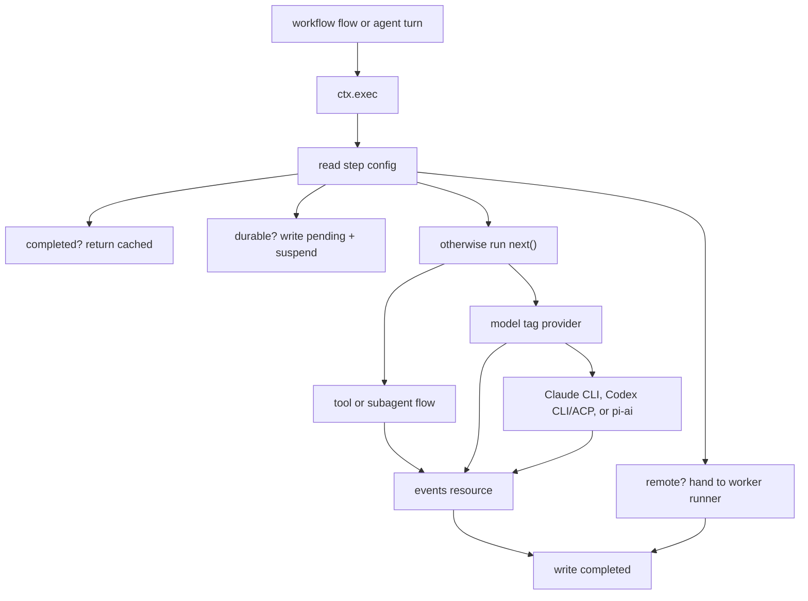

# @pumped-fn/sdk

## 2.x Compatibility

The legacy `tool()` and `agent()` APIs remain unchanged. The 2.x managed-tool API adds `currentTool()`, `currentAgent()`, and `turn()` for an explicitly resolved tool snapshot: tools and their Standard Schema inputs resolve before the model call, and each advertised tool validates through the scope-injected `validation.engine` before dispatching through the exact projected flow handle captured in that snapshot. Zod and Valibot are supported without a built-in default.

Generic runtime primitives on top of `@pumped-fn/lite`: durable workflow steps, sessions,
materials, event buffers, guards, sandboxes, CLI workers, and an eval harness. Agents and models
are one primitive family built on the same seam, not the headline.

> **Note:** Durability is delegated to the `WorkflowEventLog` backend you provide. The in-repo `MemoryWorkflowLog` is in-memory and for tests; bring a persistent backend for real durability.

`@pumped-fn/sdk` is the counterpart to `@pumped-fn/pumped`: this package provides the primitives —
`pumped` discovers, assembles, and runs them as an application.

Primitive families in this package:

- **Durable workflow steps** — `step()`, `workflowExtension()`, `ctx.exec()` replay/suspend/timeout/remote-routing contract.
- **Sessions and materials** — `session()`, `send()`, `material()`, `patchMaterial()`, `derivedMaterial()` for patch/revision state.
- **Event buffers** — `events`, `inspect()`, `RunLog` for per-run and per-boundary inspection.
- **Guards** — `guard()` for anti-goal state shared across runs.
- **Sandboxes** — `sandbox` tag and CLI harness bwrap isolation.
- **CLI workers** — `cliWorker()` and `WorkerRegistry`; provider-specific workers live in provider packages.
- **Eval harness** — `suite()`, `runEval()`, deterministic checks, judge quorum, `summary()`.
- **Agents and models** — `agent()`, `tool()`, `skill()`, `sub()`, `model` tag: one family of primitives, built on the same `ctx.exec()` seam as everything else.

This package does not add a hosted runtime or filesystem framework. It gives names and conventions to the primitives lite already has:

| Lite primitive | SDK use |
|---|---|
| `flow()` + `step({ workflow: true })` | Workflow boundary |
| `flow()` | Worker, tool, subagent turn, durable step, CLI-backed LLM call |
| state/service/atom | Provider, config, registry, material state |
| `resource()` | Per-run event capture |
| typed tag | Routing config, ambient run data, model and sandbox capabilities |
| `ctx.exec()` | Step boundary for replay, remote routing, timeout, and suspend |
| `workflowExtension()` | Replay, suspend, timeout, and event-log policy |
| `extension()` | Remote-routing policy |

The core idea: author orchestration as normal TypeScript `flow()` code. Put every side effect behind `ctx.exec()`. Then an extension can replay, memoize, route, or suspend those steps without changing workflow code.



## What Is In This Package

- `workflow` runtime tag for workflow-scoped deps.
- `workflowExtension()` for replay, suspend, timeout, and event-log policy.
- `extension()` for agent remote dispatch.
- `step()` config: `workflow`, `remote`, `durable`, `kind`, `timeoutMs`.
- `workflowRun()` context tag for workflow-scoped run data.
- `abortSignal` tag for cooperative timeout cancellation.
- `runtime` tag for named worker delegation.
- `WorkerRegistry` for named worker calls through `runtime.delegate()`.
- `agent()`, `tool()`, `skill()`, and `sub()` for an agent application surface over lite.
- `skillCalls` and `loadedSkills` for on-demand skill content.
- `agent.turn` flow for model rounds that execute tools and subagents through `ctx.exec()`.
- `session()` and `send()` for continuing message history backed by materials.
- `events` for per-boundary run inspection.
- `model` and `sandbox` for swappable provider and execution capabilities.
- `guard()` for harness anti-goal state collected from the first model run.
- `channel()` and `schedule()` for inbound and clock-driven adapter flows.
- `suite()`, `runEval()`, deterministic checks, and judge quorum helpers.
- `inspect()` for workflow-log run inspection.
- `summary()` for JSON-safe eval reports.
- `http()` for Fetch request adapters.
- `material()`, `patchMaterial()`, and `derivedMaterial()` for small task-scoped JSON materials.
- `cliWorker()` for generic real CLI-backed work.
- `formatModelPrompt()` and `parseModelResponse()` as reference-level provider building blocks.

`step()` is one defaulted config tag. Flow tags set defaults. Exec tags override per call.

Transport is outside this core package. Tests use `@pumped-fn/sdk-test` with an in-memory event log. A NATS, HTTP, or queue package can implement the same `WorkflowEventLog` and `RemoteRunner` contracts.

## Agent Application

Use `agent()` when a model should choose tools or delegate to subagents, but keep every executable capability as a lite flow. A model is just a swappable provider. Tools and subagent turns run through `ctx.exec()`, so workflow replay, remote routing, timeouts, and event capture still apply at the same seam as the rest of the graph.

```ts
import { createScope, flow, typed } from "@pumped-fn/lite"
import {
  events,
  agent,
  model,
  skill,
  sub,
  tool,
  type Model,
  type ModelRequest,
} from "@pumped-fn/sdk"

const lookupTicket = tool({
  description: "Load a ticket by id.",
  flow: flow({
    name: "lookup-ticket",
    parse: typed<{ id: string }>(),
    factory: (ctx) => ({ id: ctx.input.id, title: `ticket:${ctx.input.id}` }),
  }),
})

const summarizeModel: Model = flow({
  name: "summarize-model",
  parse: typed<ModelRequest>(),
  factory: (ctx) => ({
    content: `summary:${ctx.input.messages.at(-1)?.content ?? ""}`,
    stop: true,
  }),
})

const summarize = agent({
  name: "summarize-ticket",
  tags: [model(summarizeModel)],
  instructions: "Summarize the ticket context.",
})

const triageModel: Model = flow({
  name: "triage-model",
  parse: typed<ModelRequest>(),
  factory: (ctx) => ctx.input.loadedSkills.length === 0
    ? {
        content: "need policy",
        skillCalls: [{ name: "triage-policy" }],
      }
    : ctx.input.round === 1
    ? {
        content: "checking",
        toolCalls: [{ name: "lookup-ticket", input: { id: "42" } }],
        subagentCalls: [{ name: "summarize-ticket", input: { prompt: "ticket 42" } }],
      }
    : {
        content: `ready:${ctx.input.messages.map((message) => message.content).join("|")}`,
        stop: true,
      },
})

const triage = agent({
  name: "triage-ticket",
  tags: [model(triageModel)],
  instructions: "Triage tickets with tools and delegated summaries.",
  skills: [
    skill({
      name: "triage-policy",
      description: "Ticket triage policy.",
      content: "Escalate unclear incidents.",
    }),
  ],
  tools: [lookupTicket],
  subagents: [
    sub({
      description: "Summarizes ticket context.",
      agent: summarize,
    }),
  ],
})

const scope = createScope()
const ctx = scope.createContext()
const result = await ctx.exec({
  flow: triage.turn,
  input: { prompt: "triage FEAT-42" },
})
const trace = await ctx.resolve(events)
await ctx.close()
await scope.dispose()
```

`result.toolResults`, `result.subagentResults`, and `trace.events` are deterministic inspection surfaces. Tests can set a default model with scope tags, define one on the agent flow, or override one turn with exec tags without module mocks.

## Sessions

Use `session()` when a continuing agent needs message history. The session is a material, so history is ordinary scope state with revisioned patches.

```ts
import { session, send } from "@pumped-fn/sdk"

const thread = session("triage-session")

await send(ctx, thread, triage, { prompt: "triage FEAT-42" })
await send(ctx, thread, triage, { prompt: "summarize the decision" })
```

For persistent durability, pair the session material with a workflow event-log adapter. The core session API stays storage-agnostic.

## Evals

`suite()` accepts deterministic checks and zero or at least two judges. One judge is rejected because a subjective gate should not rest on a single model answer.

```ts
import {
  suite,
  judge,
  includes,
  runEval,
  summary,
} from "@pumped-fn/sdk"

const accepts = judge({
  name: "accepts",
  evaluate: () => ({ name: "accepts", passed: true, score: 1 }),
})

const grounded = judge({
  name: "grounded",
  evaluate: () => ({ name: "grounded", passed: true, score: 1 }),
})

const evaluation = suite({
  name: "triage-quality",
  agent: triage,
  cases: [
    {
      name: "answers with readiness",
      input: { prompt: "triage FEAT-42" },
      checks: [includes("ready")],
    },
  ],
  judges: [accepts, grounded],
})

const report = await runEval(ctx, evaluation)
const artifact = summary(report)
```

## Runs And HTTP

Use `inspect()` with any log that implements `RunLog`. `@pumped-fn/sdk-test` provides an in-memory log; production packages can back the same contract with SQL, NATS, object storage, or a trace backend.

```ts
import { inspect, workflowRun } from "@pumped-fn/sdk"

const ctx = scope.createContext({
  tags: [workflowRun({ taskId: "triage-42", runId: "run-1" })],
})

await ctx.exec({
  flow: triage.turn,
  input: { prompt: "triage FEAT-42" },
})
const run = await inspect(log, { taskId: "triage-42", runId: "run-1" })
```

Use `http()` when an existing Fetch-compatible server should expose an agent turn. Auth, routing, and provider request verification stay outside the core package.

```ts
import { http } from "@pumped-fn/sdk"

const handle = http({ agent: triage })
const response = await ctx.exec({
  flow: handle,
  input: new Request("https://agent.local/run", {
    method: "POST",
    body: JSON.stringify({ prompt: "triage FEAT-42" }),
  }),
})
```

## Channels, Schedules, and Sandboxes

Channels and schedules are flow adapters. They translate an external event or clock tick into an agent turn input, then execute that turn through `ctx.exec()`.

```ts
import { createScope, flow, tags, typed } from "@pumped-fn/lite"
import {
  channel,
  schedule,
  tool,
  sandbox,
} from "@pumped-fn/sdk"

const readWorkspace = tool({
  description: "Read a file from the agent workspace.",
  flow: flow({
    name: "read-workspace",
    parse: typed<{ path: string }>(),
    deps: { sandbox: tags.required(sandbox) },
    factory: (ctx, deps) => deps.sandbox.readFile(ctx.input.path),
  }),
})

const slack = channel({
  name: "slack-message",
  parse: typed<{ text: string }>(),
  agent: triage,
  input: (ctx) => ({ prompt: ctx.input.text }),
})

const daily = schedule({
  name: "daily-digest",
  agent: triage,
  input: () => ({ prompt: "daily digest" }),
})

const scope = createScope({
  tags: [
    sandbox({
      readFile: (path) => `file:${path}`,
      writeFile: () => undefined,
      exec: (command, args = []) => ({
        stdout: [command, ...args].join(" "),
        stderr: "",
        exitCode: 0,
      }),
    }),
  ],
})
```

## Standalone Suspense

Suspense is the reusable substrate under the workflow extension. It only knows about `(taskId, runId, step)`, an event log, and `ctx.exec()`. Mark replayable steps with `replay(true)` and externally resolved steps with `suspend(true)`.

```ts
import { createScope, flow } from "@pumped-fn/lite"
import {
  extension,
  suspend,
  taskId,
  runId,
  stepCounter,
} from "@pumped-fn/lite-extension-suspense"

const externalSync = flow({
  name: "external-sync",
  tags: [suspend(true)],
  factory: () => "unreachable until resolved",
})

const log = makeEventLog()
const scope = createScope({
  extensions: [extension({ log })],
})

const ctx = scope.createContext({
  tags: [
    taskId("doc-1"),
    runId("sync-1"),
    stepCounter({ next: 0 }),
  ],
})

await ctx.exec({ flow: externalSync })
```

First run writes a pending entry and throws `SuspendSignal`. A resolver writes the value into the log, then replay returns the resolved value and continues. Sync can use the same shape for "wait until remote commit arrives", "wait until peer state catches up", or "resume after external acknowledgement".

## Minimal Workflow

```ts
import { createScope, flow, tags, typed } from "@pumped-fn/lite"
import {
  runtime,
  extension,
  workflowRun,
  workflow as workflowRuntime,
  workflowExtension,
  step,
  workerRegistry,
  workers,
} from "@pumped-fn/sdk"

const summarize = flow({
  name: "summarize",
  parse: typed<{ text: string }>(),
  tags: [step({ kind: "llm" })],
  factory: async (ctx) => `summary: ${ctx.input.text}`,
})

const processIssue = flow({
  name: "process_issue",
  parse: typed<{ body: string }>(),
  tags: [
    step({ workflow: true }),
    workers(workerRegistry([summarize])),
  ],
  deps: {
    workflow: tags.required(workflowRuntime),
    runtime: tags.required(runtime),
  },
  factory: async (ctx, { workflow, runtime }) => {
    const summary = await runtime.delegate<string, { text: string }>("summarize", {
      text: ctx.input.body,
    })
    return { taskId: workflow.taskId, summary }
  },
})

const eventLog = makeEventLog()
const scope = createScope({
  extensions: [
    workflowExtension({ log: eventLog }),
    extension(),
  ],
})

const ctx = scope.createContext({
  tags: [workflowRun({
    taskId: "issue-123",
    runId: "run-1",
  })],
})

const result = await ctx.exec({ flow: processIssue, input: { body: "..." } })
```

`workflowRun()` is a tag and belongs in `createContext({ tags: [...] })`. `runtime.delegate()` is just `ctx.exec({ flow, input })` plus a registry lookup. Supply that registry through a `workers(registry)` flow or context tag. `workflow` and `runtime` are required deps; if the matching extension is missing, dependency resolution fails before the factory runs.

## AI Is Just A Provider

Claude, Codex, Anthropic SDK, OpenAI SDK, local model, and test fake should all fit behind the same shape: an implementor flow carried by the `model` tag. Consumers exec the `complete` port flow, which owns the `kind: "llm"` step span once — no consumer tagging, no ctx passed to providers.

```ts
import { createScope, flow, typed } from "@pumped-fn/lite"
import { complete, model, type Model, type ModelRequest } from "@pumped-fn/sdk"
import { modelStub } from "@pumped-fn/sdk-test"

const live: Model = flow({
  name: "live-model",
  parse: typed<ModelRequest>(),
  factory: async (ctx) => ({
    content: await runRealModel(ctx.input.messages.at(-1)?.content ?? ""),
    stop: true,
  }),
})

export const classify = flow({
  name: "classify",
  parse: typed<{ text: string }>(),
  deps: { complete },
  factory: async (ctx, { complete }) => {
    const response = await complete.exec({
      input: {
        agentName: "classify",
        instructions: "Classify the text.",
        messages: [{ role: "user", content: `Classify:\n${ctx.input.text}` }],
        tools: [],
        skills: [],
        loadedSkills: [],
        subagents: [],
        round: 0,
      },
    })
    return JSON.parse(response.content) as { label: string }
  },
})

const scope = createScope({ tags: [model(live)] })

const testScope = createScope({
  tags: [model(modelStub(() => ({ content: JSON.stringify({ label: "test" }), stop: true })))],
})
```

The CLI helpers are convenience adapters. Harnesses turn popular local CLIs into `Model` providers for `agent()`. Application composition should usually use the provider packages so the core SDK stays transport-neutral and the model is swappable at the scope seam.

```ts
import { createScope } from "@pumped-fn/lite"
import { agent } from "@pumped-fn/sdk"
import { claude, claudeConfig } from "@pumped-fn/sdk-claude"
import { codex, codexConfig } from "@pumped-fn/sdk-codex"

const reviewer = agent({
  name: "reviewer",
})

const scope = createScope({
  tags: [
    codex,
    codexConfig({
      auth: { kind: "global" },
      sandbox: "read-only",
      timeoutMs: 120_000,
    }),
  ],
})

const otherScope = createScope({ tags: [claude, claudeConfig({ auth: { kind: "global" } })] })
```

`@pumped-fn/sdk-codex`, `@pumped-fn/sdk-claude`, and `@pumped-fn/sdk-pi` export stable module-level `model` tags. Their sibling config tags carry auth and provider settings. Replace a provider with another provider tag or `model(fake)` at `createScope` or `createContext` without changing the agent graph.

The CLI providers run `codex exec --ephemeral --ignore-user-config` and `claude -p --no-session-persistence`. Claude rejects `--bare`. Explicit isolation remains available through config; global auth directories must be writable when isolated.

For stable tests, prefer provider state plus presets.

## Replay Contract

`ctx.exec()` is the durable step boundary. On first execution, the workflow extension assigns `(taskId, runId, step)` and writes the result. On replay, the same code runs from the top, but completed steps return cached values before dependencies or factory code run.

That means workflow bodies must be deterministic between `ctx.exec()` calls:

- Use `ctx.exec({ flow })` for side effects.
- Use provider state/services for swappable integrations.
- Do not read time, random, network, filesystem, or process state directly in workflow orchestration code.
- Keep dependency factories pure enough that replay skipping them is valid.
- `timeoutMs` rejects the step promise and aborts the `abortSignal` tag. Work must observe the signal to stop cooperatively.

## Materials

Materials are state-backed task data with a patch-oriented API. Patches serialize per material; pass `expectedRevision` when callers need optimistic conflict detection. Materials are keep-alive by default and can opt out with `keepAlive: false`.

```ts
const status = material("pr-status", {
  kind: "json",
  initialState: { prs: {} as Record<string, unknown> },
})

await patchMaterial(ctx, status, [
  { op: "add", path: "/prs/12", value: { state: "ok" } },
])
```

Derived materials are plain derived state that recomputes from source material state.

```ts
const html = derivedMaterial("status-html", status, renderStatus, { kind: "text" })
```

## Testing

Use `@pumped-fn/sdk-test` for in-memory replay and fake remote routing:

```ts
import { kit } from "@pumped-fn/sdk-test"

const { extensions, log } = kit({
  remoteRunner: {
    run: async (event) => ({ routed: event.targetName }),
  },
})
```

Use `extensions` in `createScope({ extensions })`. This keeps tests fast and proves the same extension contract a NATS-backed runtime will use.

---
Part of [pumped-fn](https://github.com/pumped-fn/pumped-fn) — start with the [docs](https://github.com/pumped-fn/pumped-fn/tree/main/docs) or the [mental model](https://github.com/pumped-fn/pumped-fn/blob/main/docs/mental-model.md).
