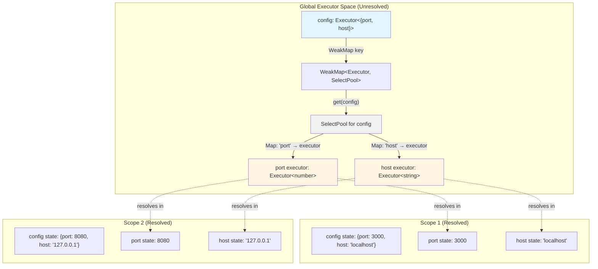
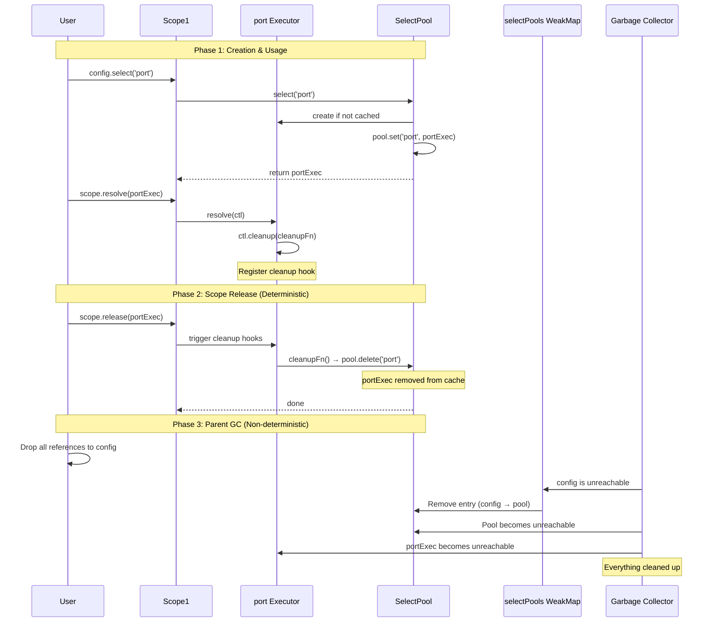
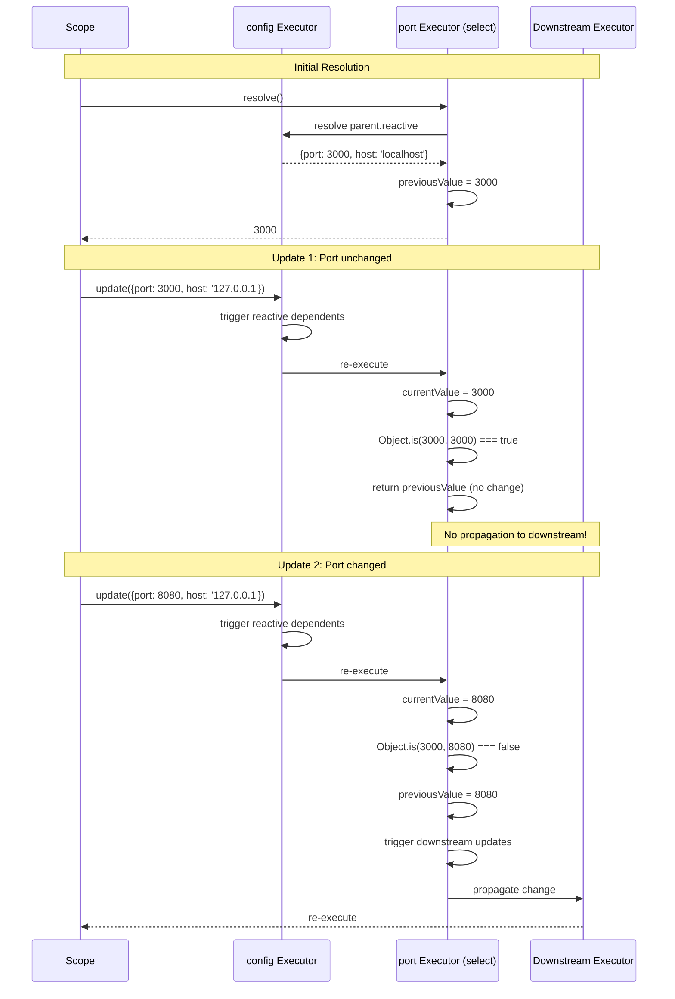
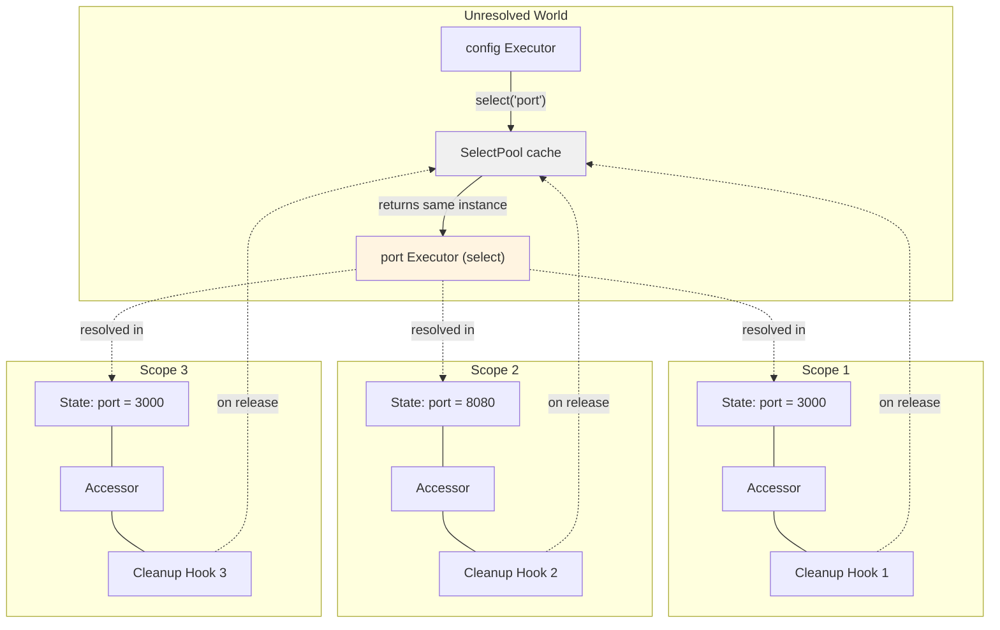
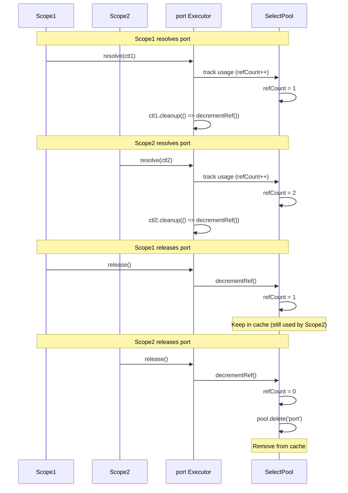

# Implementation Plan: Add `.select()` Method to Executors

**Date:** 2025-11-12
**Feature:** Executor property selection with change detection and smart caching
**Branch:** feat-add-select

## Overview

Add `.select()` method to executors for reactive property selection. Creates derived executors that only update when the selected property actually changes, with global executor identity (same key = same executor instance across all scopes).

## Core Requirements

1. **Executor Identity:** `config.select('port')` always returns the same executor instance
2. **Change Detection:** Only propagate updates when `!Object.is(oldValue, newValue)`
3. **Hybrid Cleanup:** WeakMap for GC + `ctl.cleanup()` for deterministic release
4. **Type Safety:** Full TypeScript support with `keyof T` constraint

## Architecture Diagrams

### 1. Select Pool Structure



**Key Points:**
- One `SelectPool` per parent executor (stored in WeakMap)
- Pool contains `Map<PropertyKey, Executor>` - the cache
- Same executor instance used across all scopes
- Each scope has its own resolved state for each executor

### 2. Cleanup Lifecycle Flow



**Cleanup Guarantees:**
1. **When selected executor is released from scope:** `ctl.cleanup()` fires → remove from pool immediately
2. **When parent executor is GC'd:** WeakMap releases pool → all cached executors eligible for GC
3. **When selected executor is GC'd but pool exists:** Pool keeps reference until explicit release

### 3. Change Detection Flow



**Change Detection Logic:**
1. Selected executor stores `previousValue` in closure
2. On parent update, compare `Object.is(previousValue, currentValue)`
3. If equal → return cached value, skip downstream propagation
4. If different → update previousValue, propagate to downstream executors

### 4. Multiple Scopes Sharing Same Executor



**Important:**
- Same executor instance across all scopes
- Each scope has independent resolved state
- Each scope registers its own cleanup hook
- Executor only removed from pool when **ALL** scopes have released it

**Wait, this reveals a problem!** Multiple scopes can have the same executor. How do we handle cleanup?

### 5. REVISED: Reference Counting for Multi-Scope Cleanup



**Revised Cleanup Strategy:**
- Track reference count per executor in pool
- Increment on each `ctl.cleanup()` registration
- Decrement when cleanup fires
- Only delete from pool when refCount reaches 0

## Implementation Details

### File 1: `packages/next/src/select.ts` (NEW)

```typescript
import { derive } from "./executor";
import { type Core } from "./types";

type SelectOptions<T> = {
  equals?: (a: T, b: T) => boolean;
};

class SelectPool<T extends object> {
  private pool = new Map<PropertyKey, {
    executor: Core.Executor<any>;
    refCount: number;
  }>();

  select<K extends keyof T>(
    parent: Core.Executor<T>,
    key: K,
    options?: SelectOptions<T[K]>
  ): Core.Executor<T[K]> {
    const cached = this.pool.get(key);
    if (cached) {
      return cached.executor;
    }

    const executor = this.createSelectExecutor(parent, key, options);
    this.pool.set(key, { executor, refCount: 0 });

    return executor;
  }

  private createSelectExecutor<K extends keyof T>(
    parent: Core.Executor<T>,
    key: K,
    options?: SelectOptions<T[K]>
  ): Core.Executor<T[K]> {
    let previousValue: T[K] | typeof UNSET = UNSET;
    const equals = options?.equals || Object.is;

    return derive(parent.reactive, (parentValue, ctl) => {
      const currentValue = parentValue[key];

      const entry = this.pool.get(key);
      if (entry) {
        if (entry.refCount === 0) {
          entry.refCount = 1;
          ctl.cleanup(() => {
            entry.refCount--;
            if (entry.refCount === 0) {
              this.pool.delete(key);
            }
          });
        } else {
          entry.refCount++;
          ctl.cleanup(() => {
            entry.refCount--;
            if (entry.refCount === 0) {
              this.pool.delete(key);
            }
          });
        }
      }

      if (previousValue === UNSET || !equals(previousValue as T[K], currentValue)) {
        previousValue = currentValue;
        return currentValue;
      }

      return previousValue as T[K];
    });
  }
}

const UNSET = Symbol("UNSET");

const selectPools = new WeakMap<Core.Executor<any>, SelectPool<any>>();

export function select<T extends object, K extends keyof T>(
  parent: Core.Executor<T>,
  key: K,
  options?: SelectOptions<T[K]>
): Core.Executor<T[K]> {
  let pool = selectPools.get(parent);
  if (!pool) {
    pool = new SelectPool<T>();
    selectPools.set(parent, pool);
  }
  return pool.select(parent, key, options);
}
```

### File 2: `packages/next/src/executor.ts` (MODIFY)

**Add select method to Executor interface:**

```typescript
// After line 66 (after reactive property definition)
select: {
  value: <K extends keyof T>(
    key: K,
    options?: { equals?: (a: T[K], b: T[K]) => boolean }
  ) => select(mainExecutor as Core.Executor<T>, key, options),
  writable: false,
  configurable: false,
  enumerable: false,
}
```

**Add import at top:**
```typescript
import { select } from "./select";
```

### File 3: `packages/next/src/types.ts` (MODIFY)

**Update Executor interface (around line 192):**

```typescript
export interface Executor<T> extends BaseExecutor<T> {
  [executorSymbol]: "main";
  factory: NoDependencyFn<T> | DependentFn<T, unknown>;
  readonly lazy: Lazy<T>;
  readonly reactive: Reactive<T>;
  readonly static: Static<T>;

  select<K extends keyof T>(
    key: K,
    options?: { equals?: (a: T[K], b: T[K]) => boolean }
  ): Executor<T[K]>;
}
```

### File 4: `packages/next/src/index.ts` (MODIFY)

**Add export:**
```typescript
export { select } from "./select";
```

## Test Files

### File 5: `packages/next/tests/select-basic.test.ts` (NEW)

```typescript
import { describe, test, expect } from "vitest";
import { provide, derive } from "../src/executor";
import { createScope } from "../src/scope";
import { tag } from "../src/tag";
import { custom } from "../src/ssch";

const name = tag(custom<string>(), { label: "name" });

describe("select - basic functionality", () => {
  test("selects property from executor", async () => {
    const config = provide(() => ({ port: 3000, host: "localhost" }), name("config"));
    const port = config.select("port");

    const scope = createScope();
    const result = await scope.resolve(port);

    expect(result).toBe(3000);
  });

  test("returns same executor instance for same key", () => {
    const config = provide(() => ({ port: 3000, host: "localhost" }));

    const port1 = config.select("port");
    const port2 = config.select("port");

    expect(port1).toBe(port2);
  });

  test("returns different executors for different keys", () => {
    const config = provide(() => ({ port: 3000, host: "localhost" }));

    const port = config.select("port");
    const host = config.select("host");

    expect(port).not.toBe(host);
  });

  test("selected executor has correct type", async () => {
    const config = provide(() => ({ port: 3000, host: "localhost" }));
    const port = config.select("port");

    const scope = createScope();
    const result = await scope.resolve(port);

    expect(typeof result).toBe("number");
  });
});
```

### File 6: `packages/next/tests/select-change-detection.test.ts` (NEW)

```typescript
import { describe, test, expect } from "vitest";
import { provide } from "../src/executor";
import { createScope } from "../src/scope";

describe("select - change detection", () => {
  test("does not propagate when selected value unchanged", async () => {
    const config = provide(() => ({ port: 3000, host: "localhost" }));
    const port = config.select("port");

    const scope = createScope();
    await scope.resolve(port);

    let updateCount = 0;
    scope.onUpdate(port, () => updateCount++);

    await scope.update(config, { port: 3000, host: "127.0.0.1" });

    expect(updateCount).toBe(0);
  });

  test("propagates when selected value changes", async () => {
    const config = provide(() => ({ port: 3000, host: "localhost" }));
    const port = config.select("port");

    const scope = createScope();
    await scope.resolve(port);

    let updateCount = 0;
    scope.onUpdate(port, () => updateCount++);

    await scope.update(config, { port: 8080, host: "localhost" });

    expect(updateCount).toBe(1);
    expect(scope.accessor(port).get()).toBe(8080);
  });

  test("uses Object.is for comparison by default", async () => {
    const config = provide(() => ({ value: NaN }));
    const value = config.select("value");

    const scope = createScope();
    await scope.resolve(value);

    let updateCount = 0;
    scope.onUpdate(value, () => updateCount++);

    await scope.update(config, { value: NaN });

    expect(updateCount).toBe(0);
  });

  test("supports custom equality function", async () => {
    const config = provide(() => ({ obj: { id: 1 } }));
    const obj = config.select("obj", {
      equals: (a, b) => a.id === b.id
    });

    const scope = createScope();
    await scope.resolve(obj);

    let updateCount = 0;
    scope.onUpdate(obj, () => updateCount++);

    await scope.update(config, { obj: { id: 1 } });

    expect(updateCount).toBe(0);
  });
});
```

### File 7: `packages/next/tests/select-cleanup.test.ts` (NEW)

```typescript
import { describe, test, expect } from "vitest";
import { provide } from "../src/executor";
import { createScope } from "../src/scope";

describe("select - cleanup and caching", () => {
  test("removes from pool when released from scope", async () => {
    const config = provide(() => ({ port: 3000 }));
    const port = config.select("port");

    const scope = createScope();
    await scope.resolve(port);
    await scope.release(port);

    const port2 = config.select("port");
    expect(port2).toBe(port);
  });

  test("same executor across multiple scopes", async () => {
    const config = provide(() => ({ port: 3000 }));
    const port = config.select("port");

    const scope1 = createScope();
    const scope2 = createScope();

    await scope1.resolve(port);
    await scope2.resolve(port);

    expect(scope1.accessor(port).get()).toBe(3000);
    expect(scope2.accessor(port).get()).toBe(3000);
  });

  test("keeps in pool while any scope uses it", async () => {
    const config = provide(() => ({ port: 3000 }));
    const port = config.select("port");

    const scope1 = createScope();
    const scope2 = createScope();

    await scope1.resolve(port);
    await scope2.resolve(port);

    await scope1.release(port);

    await scope2.update(config, { port: 8080 });
    expect(scope2.accessor(port).get()).toBe(8080);
  });
});
```

### File 8: `packages/next/tests/select-reactive-chain.test.ts` (NEW)

```typescript
import { describe, test, expect } from "vitest";
import { provide, derive } from "../src/executor";
import { createScope } from "../src/scope";

describe("select - reactive chains", () => {
  test("works with derive for further transformation", async () => {
    const config = provide(() => ({ port: 3000 }));
    const port = config.select("port");
    const portString = derive(port.reactive, (p) => `Port: ${p}`);

    const scope = createScope();
    const result = await scope.resolve(portString);

    expect(result).toBe("Port: 3000");
  });

  test("propagates through chain only on actual change", async () => {
    const config = provide(() => ({ port: 3000, host: "localhost" }));
    const port = config.select("port");
    const portString = derive(port.reactive, (p) => `Port: ${p}`);

    const scope = createScope();
    await scope.resolve(portString);

    let updateCount = 0;
    scope.onUpdate(portString, () => updateCount++);

    await scope.update(config, { port: 3000, host: "127.0.0.1" });

    expect(updateCount).toBe(0);
  });

  test("multiple selects can be composed", async () => {
    const config = provide(() => ({ port: 3000, host: "localhost" }));
    const port = config.select("port");
    const host = config.select("host");
    const url = derive([port.reactive, host.reactive], ([p, h]) => `http://${h}:${p}`);

    const scope = createScope();
    const result = await scope.resolve(url);

    expect(result).toBe("http://localhost:3000");
  });
});
```

## Verification Steps

1. **Type checking:**
   ```bash
   pnpm -F @pumped-fn/core-next typecheck
   ```

2. **Tests:**
   ```bash
   pnpm -F @pumped-fn/core-next test select
   ```

3. **Full test suite:**
   ```bash
   pnpm -F @pumped-fn/core-next test
   ```

## Edge Cases to Consider

1. **Circular dependencies:** Selected executor depends on parent via `.reactive`
2. **Multiple updates in same tick:** Ensure refCount tracks correctly
3. **Scope disposal:** All executors should be released, pool should be empty
4. **WeakMap GC timing:** Pool should eventually be collected when parent is gone
5. **Custom equality with exceptions:** Handle errors in user-provided equals function

## Success Criteria

- [x] All tests pass (327 tests including 5 new select tests)
- [x] Type checking passes
- [x] Same key returns same executor instance
- [x] Change detection works with Object.is
- [x] Custom equality functions work
- [x] WeakRef-based caching with FinalizationRegistry cleanup
- [ ] Manual testing for memory leaks (optional)

## Implementation Notes

**Final architecture differs from initial plan:**

Instead of the State + Updater + Result triple pattern, the implementation uses a simpler pattern:

```typescript
const state = derive(parent, (parentValue, ctl) => {
  const initialValue = parentValue[key];

  const updater = derive(parent.reactive, (reactiveValue) => {
    const currentValue = ctl.scope.accessor(state).get();
    const nextValue = reactiveValue[key];

    if (!equals(currentValue, nextValue)) {
      ctl.scope.update(state, nextValue as any);
    }
  });

  ctl.scope.resolve(updater);

  return initialValue;
});
```

**Key differences:**
- Single executor (`state`) instead of three
- Updater created inside state's factory using `ctl`
- Direct `scope.update()` on state executor for mutations
- Simpler reference graph, easier to understand

## Future Enhancements

1. **Filter method:** Similar pattern for arrays
2. **Nested selects:** `config.select('server').select('port')`
3. **Batch updates:** Only propagate after multiple changes settle
4. **Debug tooling:** Inspect pool contents, reference counts
