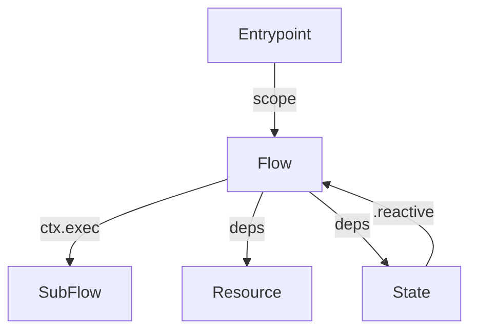

# Pumped Design Skill Implementation Plan

> **For Claude:** REQUIRED SUB-SKILL: Use superpowers:executing-plans to implement this plan task-by-task.

**Goal:** Align pumped-design skill with updated architecture/testing/routing guidance for pumped-fn/core-next.

**Architecture:** Update `.claude/skills/pumped-design/SKILL.md` to reflect phased workflow (architecture sweep, testing playbooks, routing matrix) and ensure references document ctx.exec-first orchestration across resources, states, and sub-flows.

**Tech Stack:** Markdown skill docs in `.claude/skills/pumped-design/`; pumped-fn/core-next APIs (`provide/derive/preset`, `flow`, `ctx.exec`).

### Task 1: Refresh SKILL overview with phased workflow

**Files:**
- Modify: `.claude/skills/pumped-design/SKILL.md`

**Step 1: Update Overview + When to Use**

Add text describing the three phases (architecture sweep, testing playbooks, routing matrix). Mention that flows must use `ctx.exec` for sub-flows and fn operations. Example snippet to insert under Overview:

```markdown
**Phases:** 1) Architecture sweep (entrypoint/resource/state/flow layout + ctx.exec orchestration)
2) Testing playbooks (utilities vs flows vs integrations)
3) Routing matrix (compose sub-skills per component/operation)
```

**Step 2: Expand Key Patterns + Quick Reference**

Update quick reference to highlight `ctx.exec({ fn, params, key })` replacing `ctx.run`, note state `.reactive` dependencies, and include mermaid diagram showing entrypoint → flow → resource/state → sub-flow. Example block:

```markdown

```

**Step 3: Add Testing Playbook section**

Introduce concise bullets summarizing how to test utilities, flows, and integrations. Reference commands `pnpm -F @pumped-fn/core-next typecheck`, `... typecheck:full`, `... test`.

**Step 4: Document Routing Instructions**

Create subsection describing matrix inputs (component, operation, dependency depth, integration, execution concern) and requirement to announce sub-skill loads.

**Step 5: Save file**

No command yet; editing occurs during implementation.

### Task 2: Update reference docs with ctx.exec + state coverage

**Files:**
- Modify: `.claude/skills/pumped-design/references/flow-subflows.md`
- Modify: `.claude/skills/pumped-design/references/flow-context.md`
- Modify: `.claude/skills/pumped-design/references/resource-basic.md`
- Modify: `.claude/skills/pumped-design/references/state-basic.md`
- Modify: `.claude/skills/pumped-design/references/testing-flows.md`

**Step 1: flow-subflows**

Replace any `ctx.run` examples with `ctx.exec` config usage and add explicit example chaining flow → sub-flow → resource/state. Provide snippet such as:

```typescript
const downstream = await ctx.exec(otherFlow, input)
const persisted = await ctx.exec({ fn: persistUser, params: [downstream.user], key: 'persist-user' })
```

**Step 2: flow-context**

Explain journaling via `ctx.exec({ key })`, cover `resetJournal`, mention tags, show context snapshot usage when testing.

**Step 3: resource/state references**

Ensure state docs mention `.reactive` dependencies for flows and `.static` controllers for mutations. Resource doc should remind to expose deterministic factories, highlight `provide/derive/preset`, and mention state/res interplay.

**Step 4: testing-flows**

Add playbook emphasizing per-branch coverage, use of `preset` and `createScope`, and referencing new exec API.

**Step 5: Save files**

No commands yet.

### Task 3: Verification + catalog alignment placeholder

**Files:**
- Modify: `plans/2025-11-17-pumped-design-skill.md` (append verification status)

**Step 1: Manual review**

Read updated docs ensuring instructions match pumped-fn/core-next API (ctx.exec). Confirm mermaid diagrams consistent.

**Step 2: Record verification**

Append to design doc a short “Verification” section noting docs updated and referencing manual proofread.

**Step 3: git status**

Run `git status -sb` to confirm touched files.

**Step 4: Prepare for commit**

Stage files and summarize changes.
