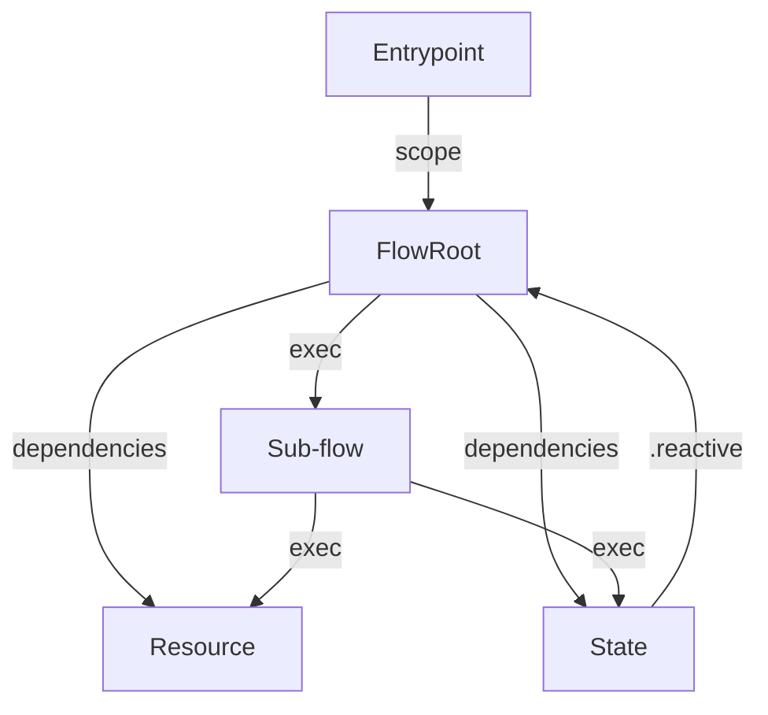

## Architecture Phase

- Load pumped-design coding standards and catalog summary before design
- Enumerate components: entrypoint (`entrypoint.*.ts`), resource (`resource.*.ts`), state (`state.*.ts`), flow (`flow.*.ts`), utilities
- Entrypoints own scope creation via `createScope`, apply presets/tags, register extensions, dispatch exported flows only
- Resources/states both use `provide/derive/preset`; resources wrap external systems, states implement in-memory reactive data with `.static` controllers and `.reactive` dependencies
- Flows created via `flow({ name, version, input, output })` with explicit dependencies; handlers must use `ctx.exec` for both sub-flows and fn operations, enforce discriminated unions
- Include canonical diagram covering sub-flow orchestration:

- Architecture phase decides which sub-skills to load (resource-basic/derived/lazy, state-basic/derived, flow-subflows, flow-context, entrypoint-patterns)

## Testing Playbooks

- Utilities: unit tests with deterministic presets, exhaustive branches, failure messages referencing step names
- Flows: integration-style tests via `flow.execute` and `createScope`, preset dependencies, one test per discriminated outcome (success + each error), assert on structured results; snapshot `execution.ctx` when needed
- Integrations (Hono/Next/TanStack): contract tests verifying request mapping and flow invocation boundaries; rely on integration sub-skills for adapters but keep flows as the verification anchor
- Enforce type safety by running `pnpm -F @pumped-fn/core-next typecheck` (and `typecheck:full` when needed) plus `pnpm -F @pumped-fn/core-next test`
- Reference `testing-utilities.md`, `testing-flows.md`, `testing-integration.md` for deeper guidance

## Routing & Composition

- Classify current work into phase bundles: design, implementation, troubleshooting, verification
- Use component × operation × dependency depth × integration context × execution concern matrix to select sub-skills
- Require explicit announcements when loading references (e.g., “Opening flow-subflows for ctx.exec patterns”)
- Encourage catalog consultation (docs/catalog diagrams) before pulling sub-skills to keep dependency mapping accurate
- Keep routing modular: load only the sub-skills necessary for the immediate task, but allow stacking for complex operations (e.g., design flow with derived state + Hono integration → load flow-subflows, state-derived, integration-hono)

## Next Steps

1. Integrate this design into `.claude/skills/pumped-design/SKILL.md`
2. Update references with unified ctx.exec examples
3. Ensure catalog diagrams mirror sub-flow/state relationships

## Verification

- [x] `.claude/skills/pumped-design/SKILL.md` updated with phased workflow + ctx.exec architecture
- [x] References (`flow-subflows.md`, `flow-context.md`, `resource-basic.md`, `state-basic.md`, `testing-flows.md`, extension docs) reviewed to confirm ctx.exec-only guidance
