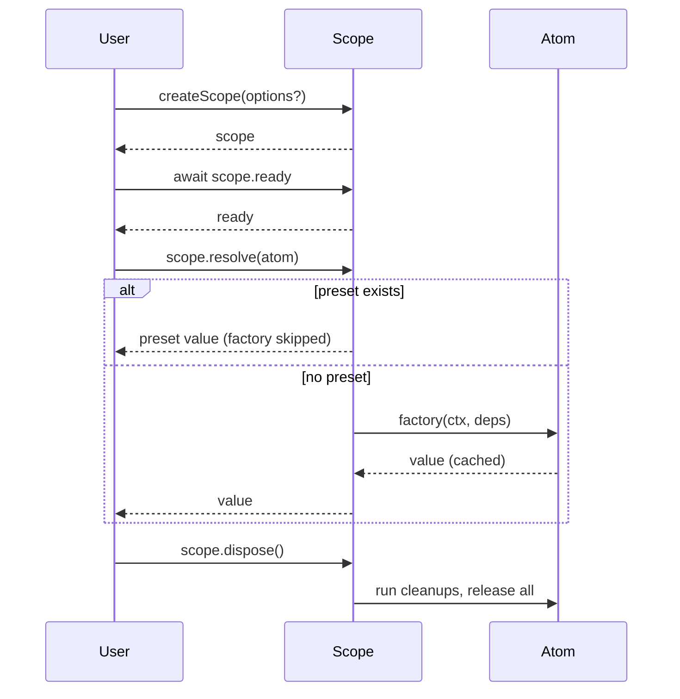
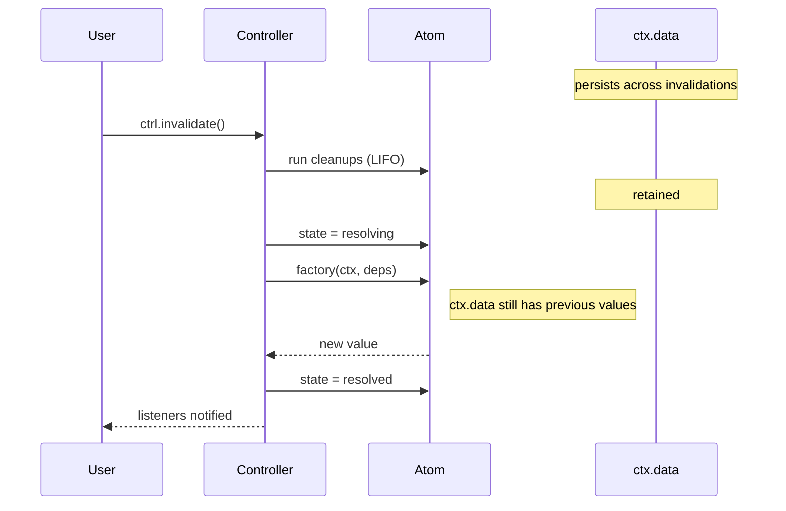
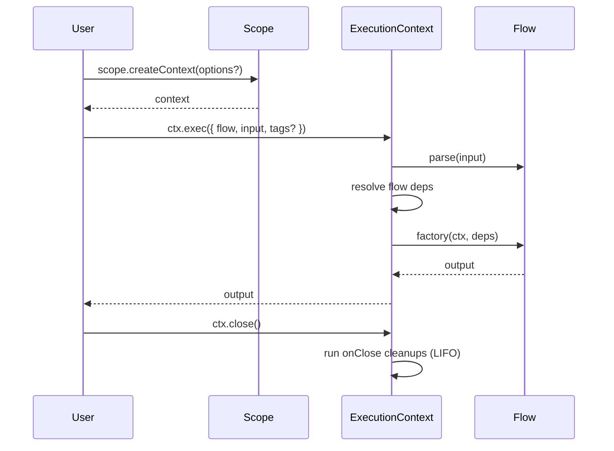
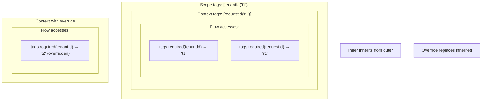
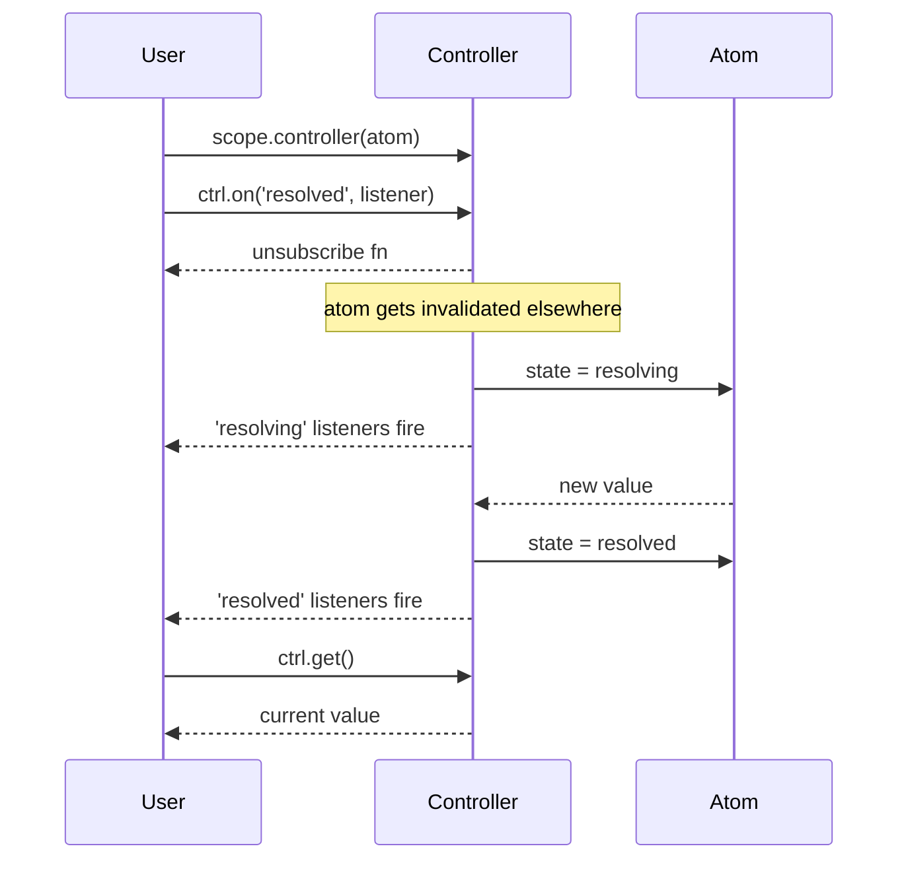

# README Documentation Strategy for @pumped-fn/lite

## Overview

**Principle:** README teaches *what's possible*, `index.d.mts` documents *what's available*.

**Goal:** Users understand the library's capabilities and patterns without wading through API details that types already provide.

## Format Rules

Choose format based on what communicates best:

- **Diagrams** — when relationships, flows, or timing matter
- **Sentences** — when capability is self-explanatory
- **Minimal snippets** — only when syntax isn't obvious from types

## Structure

```
1. Header (name, one-liner, badges)
2. Diagrams (focused, multiple)
3. Primitives (one section each, capability lists)
4. Footer (pointer to .d.mts, license)
```

## Diagrams

Five focused diagrams, each small and single-purpose:

### 1. Scope Lifecycle

Shows: createScope → ready → resolve (with preset branch) → dispose



### 2. Invalidation Flow

Shows: invalidate → cleanups run → ctx.data retained → factory re-runs → resolved



### 3. Flow Execution

Shows: createContext → exec → close



### 4. Tag Inheritance

Shows: Scope → Context → Flow (with override)



### 5. Controller Reactivity

Shows: observe → state changes → listener fires



## Primitives Sections

Each primitive gets a short section with capabilities listed. Format per primitive:

### Scope
- Entry point for everything
- Manages atom lifecycles
- Capabilities: resolve, controller, release, dispose, flush, createContext, on, select

### Atom
- Long-lived cached dependency
- Capabilities:
  - Dependencies on other atoms
  - ctx.cleanup() — runs on invalidate and release
  - ctx.invalidate() — schedules re-resolution
  - ctx.data — storage that survives invalidation

### Flow
- Short-lived operation with input/output
- Capabilities:
  - parse — validate/transform input before factory
  - Dependencies on atoms
  - ctx.input — typed input access
  - ctx.onClose() — cleanup when context closes

### Tag
- Contextual value passed through execution
- Capabilities:
  - default — fallback when not set
  - parse — validate on creation
  - tags.required/optional/all — dependency modes

### Controller
- Reactive handle for atom observation
- Capabilities:
  - state — sync access to current state
  - get() — sync access to value (if resolved)
  - resolve() — async resolution
  - invalidate() — trigger re-resolution
  - on() — subscribe to state changes

### Preset
- Value injection for testing
- Bypasses factory entirely
- Can inject value or redirect to another atom

### Extension
- AOP-style middleware
- Capabilities:
  - init — setup when scope created
  - wrapResolve — intercept atom resolution
  - wrapExec — intercept flow execution
  - dispose — cleanup when scope disposed

## Footer

```markdown
## Full API

See [`dist/index.d.mts`](./dist/index.d.mts) for complete type definitions.

## License

MIT
```

## Migration from Current README

**Remove:**
- API reference tables (redundant with .d.mts)
- Full code examples (replaced with diagrams + capability lists)
- Installation section (users already have it installed)
- Duplicate explanations

**Keep:**
- One-liner description
- Badges
- License

**Target size:** ~150-200 lines (down from ~530)

## Success Criteria

A user reading this README should:
1. Understand what each primitive does (from sections)
2. Understand how they interact (from diagrams)
3. Know what capabilities exist (from lists)
4. Know where to find exact API (pointer to .d.mts)

Without:
- Reading code examples
- Scrolling through API tables
- Guessing at relationships between concepts
