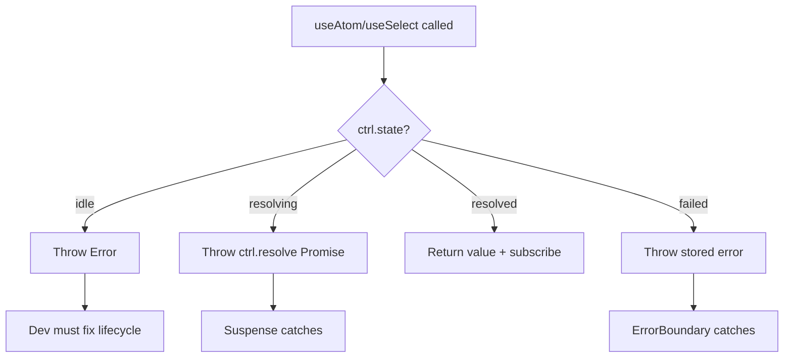

# @pumped-fn/react-lite Design

## Overview

Minimal React bindings for `@pumped-fn/lite` with Suspense and ErrorBoundary integration.

**Goals:**
- Thin wrappers around existing lite primitives
- SSR-compatible (no SSR management, just don't break)
- Full React 18+ integration (Suspense, ErrorBoundary, useSyncExternalStore)
- Explicit lifecycle - hooks observe, don't trigger resolution

**Non-goals:**
- SSR state serialization/hydration (user's responsibility)
- Auto-resolution with reference counting
- Framework-specific adapters (Next.js, Remix)

## Package Structure

```
packages/react-lite/
├── src/
│   ├── index.ts          # Public exports
│   ├── context.tsx       # ScopeProvider, ScopeContext
│   ├── hooks.ts          # useScope, useAtom, useSelect, useController
│   └── types.ts          # React-specific types (if needed)
├── package.json
├── tsconfig.json
└── tsdown.config.ts
```

**Dependencies:**
```json
{
  "peerDependencies": {
    "react": ">=18.0.0",
    "@pumped-fn/lite": "^1.4.0"
  }
}
```

## Public API

```typescript
// Context
export { ScopeProvider } from './context'
export { ScopeContext } from './context'  // For advanced use cases

// Hooks
export { useScope } from './hooks'
export { useAtom } from './hooks'
export { useSelect } from './hooks'
export { useController } from './hooks'
```

**4 exports total** - minimal surface area.

## State Handling

Hooks handle the four atom states:

| State | Hook Behavior |
|-------|---------------|
| `idle` | Throw `Error("Atom not resolved. Call scope.resolve() before rendering.")` |
| `resolving` | Throw `Promise` from `ctrl.resolve()` - Suspense catches |
| `resolved` | Return value, subscribe to changes |
| `failed` | Throw stored error - ErrorBoundary catches |



**Key insight:** When an atom is invalidated (`resolved → resolving → resolved`), the hook throws a Promise during `resolving`. Suspense automatically shows fallback during re-resolution.

## Hook Implementations

### ScopeProvider & useScope

```tsx
import { createContext, useContext, type ReactNode } from 'react'
import type { Lite } from '@pumped-fn/lite'

const ScopeContext = createContext<Lite.Scope | null>(null)

interface ScopeProviderProps {
  scope: Lite.Scope
  children: ReactNode
}

function ScopeProvider({ scope, children }: ScopeProviderProps) {
  return (
    <ScopeContext.Provider value={scope}>
      {children}
    </ScopeContext.Provider>
  )
}

function useScope(): Lite.Scope {
  const scope = useContext(ScopeContext)
  if (!scope) {
    throw new Error("useScope must be used within a ScopeProvider")
  }
  return scope
}
```

### useController

Low-level hook - returns Controller instance for advanced use cases.

```typescript
function useController<T>(atom: Lite.Atom<T>): Lite.Controller<T> {
  const scope = useScope()
  return useMemo(() => scope.controller(atom), [scope, atom])
}
```

### useAtom

Subscribe to atom value with Suspense/ErrorBoundary integration.

```typescript
function useAtom<T>(atom: Lite.Atom<T>): T {
  const ctrl = useController(atom)

  const getSnapshot = useCallback((): T => {
    switch (ctrl.state) {
      case 'idle':
        throw new Error("Atom not resolved. Call scope.resolve() before rendering.")
      case 'resolving':
        throw ctrl.resolve()
      case 'failed':
        throw ctrl.get()  // ctrl.get() throws stored error when failed
      case 'resolved':
        return ctrl.get()
    }
  }, [ctrl])

  const subscribe = useCallback(
    (onStoreChange: () => void) => ctrl.on('*', onStoreChange),
    [ctrl]
  )

  return useSyncExternalStore(subscribe, getSnapshot, getSnapshot)
}
```

### useSelect

Fine-grained selection with memoization.

```typescript
function useSelect<T, S>(
  atom: Lite.Atom<T>,
  selector: (value: T) => S,
  eq?: (a: S, b: S) => boolean
): S {
  const scope = useScope()
  const ctrl = useController(atom)

  const selectorRef = useRef(selector)
  const eqRef = useRef(eq)
  useEffect(() => {
    selectorRef.current = selector
    eqRef.current = eq
  })

  const handleRef = useRef<Lite.SelectHandle<S> | null>(null)

  const getSnapshot = useCallback((): S => {
    switch (ctrl.state) {
      case 'idle':
        throw new Error("Atom not resolved. Call scope.resolve() before rendering.")
      case 'resolving':
        throw ctrl.resolve()
      case 'failed':
        throw ctrl.get()
      case 'resolved':
        if (!handleRef.current) {
          handleRef.current = scope.select(atom, selectorRef.current, { eq: eqRef.current })
        }
        return handleRef.current.get()
    }
  }, [scope, atom, ctrl])

  const subscribe = useCallback((onStoreChange: () => void) => {
    if (ctrl.state !== 'resolved') {
      return () => {}
    }
    if (!handleRef.current) {
      handleRef.current = scope.select(atom, selectorRef.current, { eq: eqRef.current })
    }
    return handleRef.current.subscribe(onStoreChange)
  }, [scope, atom, ctrl])

  return useSyncExternalStore(subscribe, getSnapshot, getSnapshot)
}
```

## Usage Patterns

### Basic Usage

```tsx
import { createScope, atom } from '@pumped-fn/lite'
import { ScopeProvider, useAtom } from '@pumped-fn/react-lite'

const userAtom = atom({
  factory: async () => {
    const res = await fetch('/api/user')
    return res.json()
  }
})

// Bootstrap (before render)
const scope = createScope()
await scope.resolve(userAtom)

// App
function App() {
  return (
    <ScopeProvider scope={scope}>
      <ErrorBoundary fallback={<ErrorPage />}>
        <Suspense fallback={<Loading />}>
          <UserProfile />
        </Suspense>
      </ErrorBoundary>
    </ScopeProvider>
  )
}

function UserProfile() {
  const user = useAtom(userAtom)
  return <div>{user.name}</div>
}
```

### Invalidation with Suspense

```tsx
function UserProfile() {
  const user = useAtom(userAtom)
  const ctrl = useController(userAtom)

  const refresh = () => {
    ctrl.invalidate()  // Triggers resolving → Suspense shows fallback
  }

  return (
    <div>
      <h1>{user.name}</h1>
      <button onClick={refresh}>Refresh</button>
    </div>
  )
}
```

### Fine-Grained Selection

```tsx
function TodoItem({ id }: { id: string }) {
  const todo = useSelect(
    todosAtom,
    todos => todos.find(t => t.id === id),
    (a, b) => a?.updatedAt === b?.updatedAt
  )

  if (!todo) return null
  return <div>{todo.title}</div>
}
```

### Direct Value Updates

```tsx
function Counter() {
  const count = useAtom(countAtom)
  const ctrl = useController(countAtom)

  return (
    <div>
      <span>{count}</span>
      <button onClick={() => ctrl.update(n => n + 1)}>+</button>
      <button onClick={() => ctrl.set(0)}>Reset</button>
    </div>
  )
}
```

## Testing

Wrap components with ScopeProvider and use presets:

```tsx
import { createScope, preset } from '@pumped-fn/lite'
import { ScopeProvider } from '@pumped-fn/react-lite'
import { render, screen } from '@testing-library/react'

test('renders user name', async () => {
  const scope = createScope({
    presets: [preset(userAtom, { name: 'Test User', id: '123' })]
  })

  await scope.resolve(userAtom)

  render(
    <ScopeProvider scope={scope}>
      <UserProfile />
    </ScopeProvider>
  )

  expect(screen.getByText('Test User')).toBeInTheDocument()
})
```

### Test Helper (Optional)

```typescript
async function renderWithScope(
  ui: React.ReactElement,
  options: {
    presets?: Lite.Preset<unknown>[]
    resolveAtoms?: Lite.Atom<unknown>[]
  } = {}
) {
  const scope = createScope({ presets: options.presets })

  const atomsToResolve = [
    ...(options.presets?.map(p => p.atom) ?? []),
    ...(options.resolveAtoms ?? [])
  ]

  for (const atom of atomsToResolve) {
    await scope.resolve(atom)
  }

  return render(
    <ScopeProvider scope={scope}>{ui}</ScopeProvider>
  )
}
```

## SSR Compatibility

The design is SSR-compatible because:

1. **No side effects on import** - All hooks are pure
2. **useSyncExternalStore** - Has `getServerSnapshot` parameter for SSR
3. **No window/document access** - Works in Node.js
4. **Scope is passed as prop** - No global state, hydration-friendly

For SSR applications:

```tsx
// Server
const scope = createScope()
await scope.resolve(userAtom)
await scope.resolve(settingsAtom)

const html = renderToString(
  <ScopeProvider scope={scope}>
    <App />
  </ScopeProvider>
)

// Client - create new scope with same initial data
const clientScope = createScope({
  presets: [
    preset(userAtom, window.__INITIAL_DATA__.user),
    preset(settingsAtom, window.__INITIAL_DATA__.settings)
  ]
})
await clientScope.resolve(userAtom)
await clientScope.resolve(settingsAtom)

hydrateRoot(
  document.getElementById('root'),
  <ScopeProvider scope={clientScope}>
    <App />
  </ScopeProvider>
)
```

## Error Handling Patterns

### Global ErrorBoundary

```tsx
function App() {
  return (
    <ScopeProvider scope={scope}>
      <ErrorBoundary fallback={<GlobalError />}>
        <Suspense fallback={<Loading />}>
          <Routes />
        </Suspense>
      </ErrorBoundary>
    </ScopeProvider>
  )
}
```

### Per-Component ErrorBoundary

```tsx
function Dashboard() {
  return (
    <div>
      <ErrorBoundary fallback={<UserError />}>
        <Suspense fallback={<UserLoading />}>
          <UserCard />
        </Suspense>
      </ErrorBoundary>

      <ErrorBoundary fallback={<StatsError />}>
        <Suspense fallback={<StatsLoading />}>
          <StatsPanel />
        </Suspense>
      </ErrorBoundary>
    </div>
  )
}
```

## Future Considerations

### Auto-Resolution (Opt-in)

Could add `useAtomAutoResolve` that triggers resolution for idle atoms:

```typescript
function useAtomAutoResolve<T>(atom: Lite.Atom<T>): T {
  const ctrl = useController(atom)

  const getSnapshot = useCallback((): T => {
    switch (ctrl.state) {
      case 'idle':
      case 'resolving':
        throw ctrl.resolve()  // Auto-trigger for idle
      case 'failed':
        throw ctrl.get()
      case 'resolved':
        return ctrl.get()
    }
  }, [ctrl])

  // ... rest same as useAtom
}
```

**Challenge:** Release lifecycle. Options:
- Never auto-release (scope owns lifecycle)
- Explicit `useAtomManaged` with unmount cleanup
- Reference counting (complex)

### Concurrent Features

- `useTransition` integration for non-blocking updates
- `useDeferredValue` for derived values

### DevTools

- React DevTools integration showing atom states
- State timeline visualization

## Verification Checklist

- [ ] `ScopeProvider` provides scope to descendants
- [ ] `useScope` throws if no provider
- [ ] `useController` returns memoized controller
- [ ] `useAtom` throws Error on idle
- [ ] `useAtom` throws Promise on resolving (Suspense)
- [ ] `useAtom` throws error on failed (ErrorBoundary)
- [ ] `useAtom` returns value on resolved
- [ ] `useAtom` re-renders on invalidation
- [ ] `useAtom` suspends during invalidation
- [ ] `useSelect` filters updates via equality function
- [ ] `useSelect` memoizes selector across renders
- [ ] SSR: hooks work in Node.js environment
- [ ] SSR: no hydration mismatch with proper setup
- [ ] Testing: presets work for test isolation
- [ ] Types: full TypeScript inference
