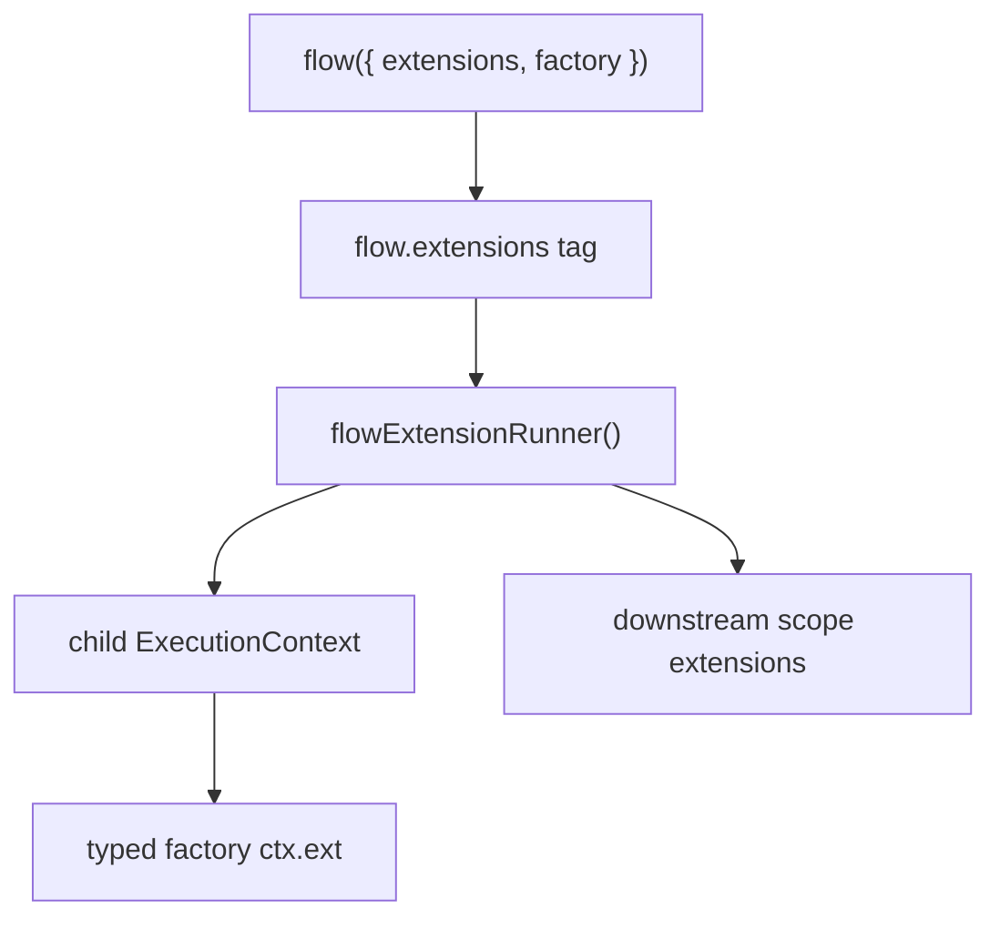

# Flow Extension Notes

Goal: move the spike into core without moving execution policy into core internals.

Layer graph:

Findings:

- Current runtime supports the model without changing `ExecutionContext`: `flow({ extensions })` lowers to a normal flow tag, and `flowExtensionRunner()` reads that tag in `wrapExec`.
- TypeScript models `ctx.ext` shape by intersecting extension outputs into the factory ctx type.
- Runtime ctx shape can be added before dependencies/factory because `wrapExec` runs around `execFlowInternal`.
- Scope extension order matters: if the flow-extension runner is outer, downstream scope extensions can observe the augmented ctx.
- Dedupe should be by glyph key, not object identity. Duplicate uses of one glyph collapse inside one flow execution.
- Extension instances should be created per execution. The glyph/shape is shared; execution state is not.
- Inline extension arrays preserve tuple inference through `const` type parameters on `flow()` overloads; no `as const` needed at call sites.
- Output constraints compose through extension output types. `serializable()` constrains factory output to `Lite.JsonValue` and validates the runtime value.

Spike coverage:

- `packages/lite/tests/flow-extension.test.ts` proves multiple `ctx.ext` shapes, glyph dedupe, fresh instances per exec, downstream extension observation, serializable runtime validation, and inline array inference.
- `packages/lite/tests/type-contracts.ts` proves `ctx.ext` inference, base `flow()` ctx isolation, typed input plus extensions, and serializable output rejection.

Open production decisions:

- Whether duplicate glyphs use first-wins, last-wins, or error.
- Whether flow-level extensions can also alter dependency resolution context, not only factory/extension context.
- Whether agent should become a flow extension glyph while suspense remains the one scope-level runner.
