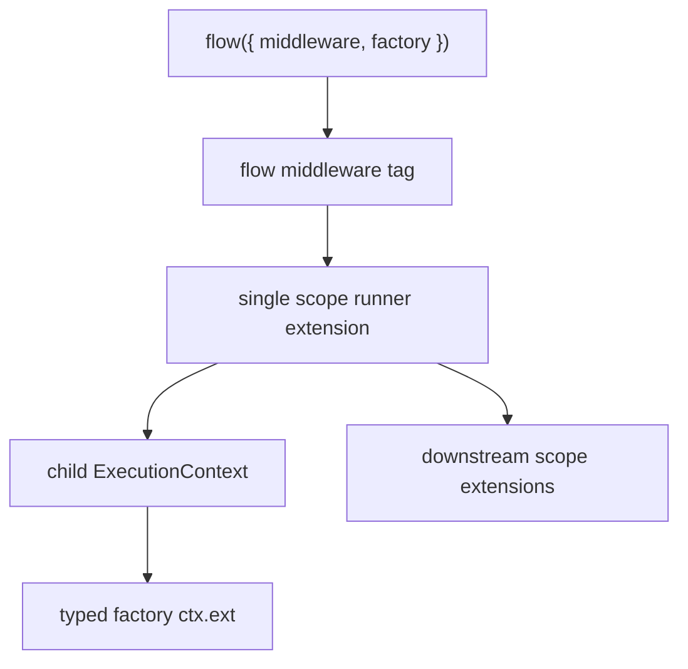

# Flow Middleware Spike

Goal: test whether `flow()` can carry middleware-like definitions that change `ctx.ext` shape while one external scope extension runs the middleware pipeline.

Layer graph:

Findings:

- Current runtime can support the model without new core primitives: a flow tag can carry middleware uses, and one scope extension can read that tag in `wrapExec`.
- TypeScript can model `ctx.ext` shape by intersecting middleware outputs into the factory ctx type.
- Runtime ctx shape can be added before dependencies/factory because `wrapExec` runs around `execFlowInternal`.
- Scope extension order matters: if the flow-middleware runner is outer, downstream scope extensions can observe the augmented ctx.
- Dedupe should be by glyph key, not object identity. Duplicate uses of one glyph collapse inside one flow execution.
- Middleware instances should be created per execution. The glyph/shape is shared; execution state is not.
- Inline middleware arrays preserve tuple inference through a `const` type parameter on the helper; no `as const` needed at call sites.

Spike coverage:

- `packages/lite/tests/flow-middleware-spike.test.ts` proves multiple `ctx.ext` shapes, glyph dedupe, fresh instances per exec, downstream extension observation, inline array inference, and base `flow()` ctx isolation.

Open production decisions:

- Whether this should remain outside core as a helper + tag + scope runner, or later get one tiny core metadata alias.
- Whether duplicate glyphs use first-wins, last-wins, or error.
- Whether flow-level middleware can also alter dependency resolution context, not only factory/extension context.
- Whether agent should become a flow middleware glyph while suspense remains the one scope-level runner.
