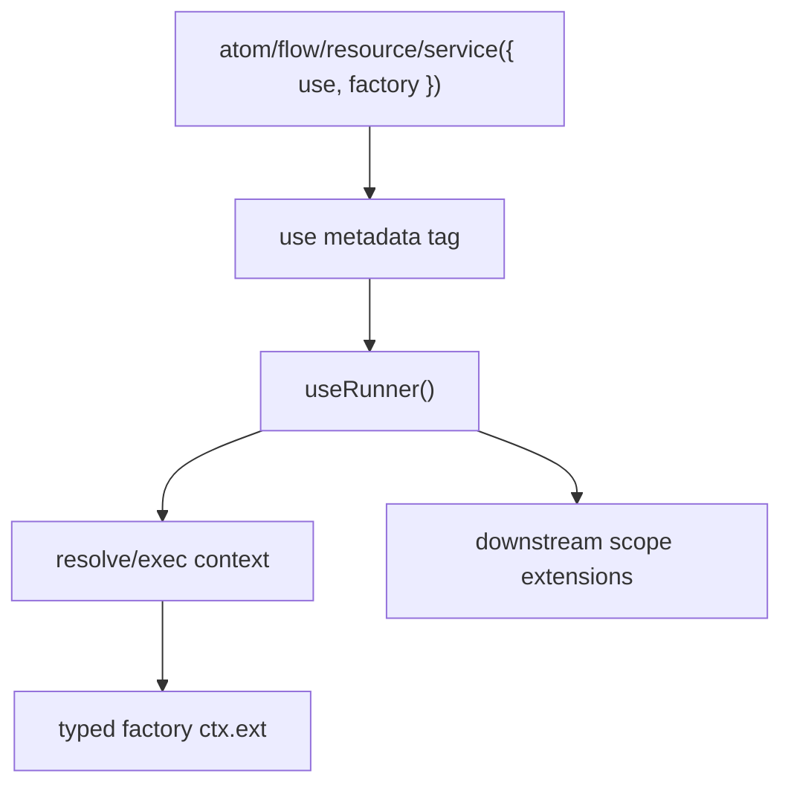

# Primitive Use Notes

Goal: move the spike into core for main primitives without moving execution policy into core internals.

Layer graph:

Findings:

- Current runtime supports the model without changing base context interfaces: `use` lowers to normal primitive tags, and `useRunner()` reads those tags in `wrapResolve`/`wrapExec`.
- TypeScript models `ctx.ext` shape by intersecting use outputs into the factory ctx type.
- Runtime ctx shape can be added before dependencies/factory because scope hooks wrap primitive factories.
- Scope extension order matters: if `useRunner()` is outer, downstream scope extensions can observe the augmented ctx.
- Dedupe should be by glyph key, not object identity. Duplicate uses of one glyph collapse inside one primitive resolve/exec.
- Use instances should be created per resolve/exec. The glyph/shape is shared; execution state is not.
- Inline use arrays preserve tuple inference through `const` type parameters on primitive overloads; no `as const` needed at call sites.
- Output constraints compose through use output types. `serializable()` constrains factory output to `Lite.JsonValue` and validates runtime values.

Spike coverage:

- `packages/lite/tests/use.test.ts` proves `ctx.ext` shape on `flow`, `atom`, `service`, and `resource`, glyph dedupe, fresh instances per exec, downstream extension observation, and serializable runtime validation.
- `packages/lite/tests/type-contracts.ts` proves `ctx.ext` inference, base `flow()` ctx isolation, typed input plus use, and serializable output rejection.

Open production decisions:

- Whether duplicate glyphs use first-wins, last-wins, or error.
- Whether use can also alter dependency resolution context, not only factory/extension context.
- Whether agent should become a use glyph while suspense remains the one scope-level runner.
