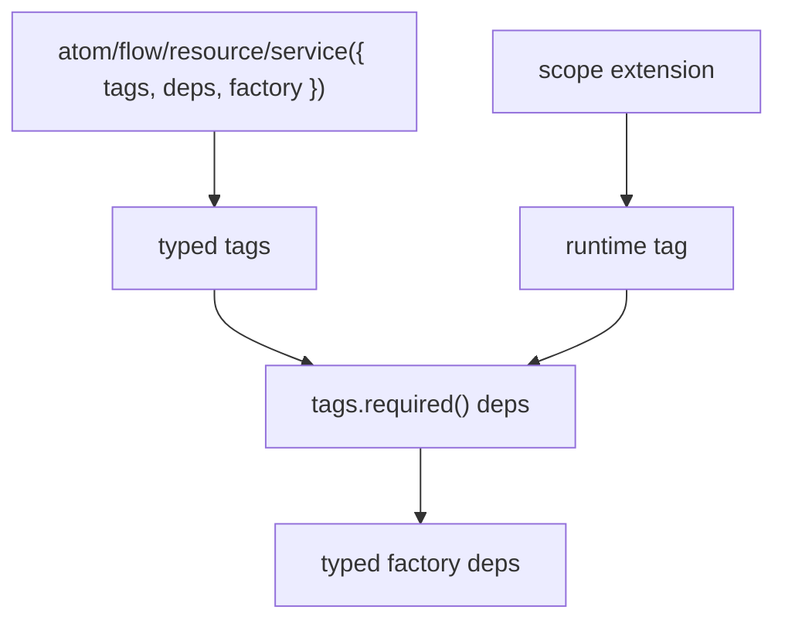

# Tag Runtime Contract Notes

Goal: keep primitive APIs small while still letting extensions provide typed runtime contracts.

Layer graph:

Findings:

- Tags are sufficient for both metadata and injection contracts.
- Extensions can set runtime tags before dependency resolution, so required tag deps fail before factories run when an extension is missing.
- Flow tags and exec tags already provide per-primitive and per-call configuration without a second composition surface.
- Registry-like runtime config should be a normal tag, for example `workers(registry)`.
- Factory context shape stays stable; extension-provided shape enters through typed deps.
- Serializability and sync policy belong in dedicated extensions, not lite core.

Production decision:

- Remove the experimental primitive `use` surface. Keep `flow`, `atom`, `resource`, and `service` explicit through `tags`, `deps`, and scope `extensions`.
